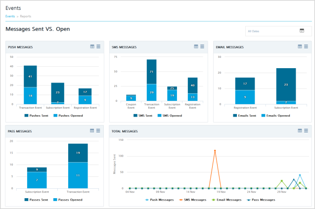
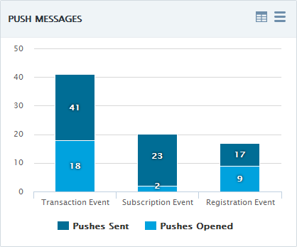
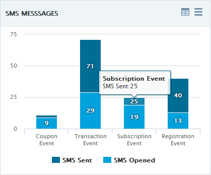
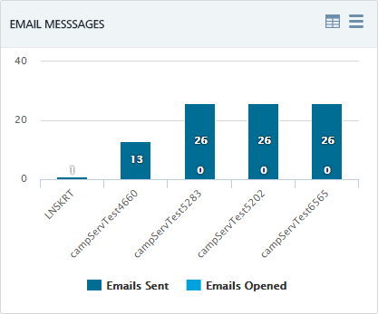
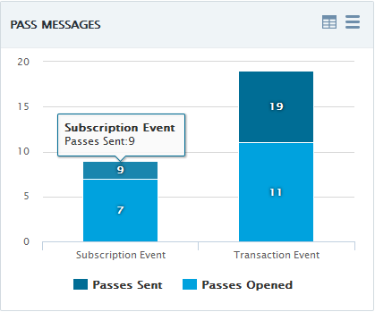
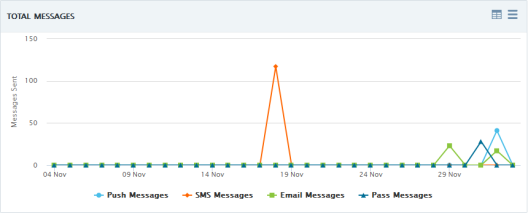

                             

Viewing Events Reports
======================

Click the **Reports** button on the **Events** home page to view event reports. On the **Events Reports** page, you can see the number of event messages sent versus opened for all the configured channels, since the **Engagement** services console is configured and used.

To view event reports, follow these steps:

1.  Under **Engagement**, click **Events**.
2.  On the **Events** page, click the **Reports** button.
    
    The system displays the **Events Reports** page with all the reports under the **Messages Sent Vs. Open** header. You can view the following event reports:
    
    *   [Push Messages](#push-messages)
    *   [SMS Messages](#sms-messages)
    *   [Email Messages](#email-messages)
    *   [Pass Messages](#pass-messages)
    *   [Total Messages](#total-messages)
    
    Push Messages
    -------------
    
    The **Push Messages Sent versus Opened** graph shows the number of pushes sent and the number of pushes opened for the events. The default view shows the total number of pushes sent versus opened for the events since **Engagement** services console is configured and used.  
    For example, the subscription push event messages in the following graph show that over a period of 20 days, the system sent 23 push messages, and the user opened two push messages.
    
    
    
    SMS Messages
    ------------
    
    The **SMS Messages Sent versus Opened** graph displays the number of SMS sent versus the number of SMS opened for the various events. The default view presents the total number of SMS sent versus opened since **Engagement** services console is configured and used.
    
    
    
    Email Messages
    --------------
    
    The **Email Messages Sent versus Opened** graph displays the number of emails sent versus emails opened for various events. The default view presents the total number of emails sent versus opened since **Engagement** services console is configured and used.
    
    
    
    Pass Messages
    -------------
    
    The **Pass Messages Sent versus Opened** graph displays the number of passes sent and the number of passes opened for various events. The default view presents the total number of passes sent versus opened since **Engagement** services console is configured and used.
    
    
    
    Total Messages
    --------------
    
    The **Total Messages** graph displays the total number of messages - push (native and web), SMS, Email, and Pass sent over last 30 days. The Y axis represents the sent messages while the X axis represents the dates on which the messages were sent.
    
    
    

> **_Note:_** For more details about reports, see [Dashboard](../Dashboard/Dashboard.md)
