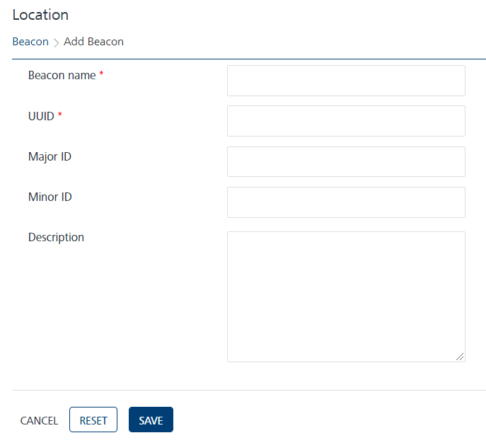

                            

Adding Beacons
==============

To add a Beacon, follow these steps:

1.  Click the **New Beacon** button on the **Beacon** screen.
    
    The **Add Beacon** screen appears.
    
    
    
2.  Enter the details for the following fields:
    *   **Beacon name**: Enter an appropriate name for the beacon.
    *   **UUID**: Enter the universally unique identifier (UUID) assigned to the beacon. The UUID contains 32 hexadecimal digits, which are split into into five groups and separated by dashes. For example, f7826da6-4fa2-4e98-8024-bc5b71e0893e
    *   **Major ID**: Enter the major ID assigned to the beacon. The major ID is the key identifier of a beacon.
    *    **Minor ID**: Enter the minor ID assigned to the beacon. The minor ID is a minor identifier of a beacon.  
        The Major ID and the Minor ID fields accept inputs in number format only. If you enter an invalid input, the system displays a warning message to enter a valid number.
        
        The following example shows how the Major ID and Minor ID work for a beacon. A museum has 1,000 beacons. All 1,000 beacons use the same UUID, which tells users that the beacons are owned by the museum.
        
        Currently, the museum has five exhibitions. The museum assigns a major value of one through five to identify beacons assigned to a particular exhibit. There are five groups of beacons with an assigned major value of one, two, three, four, or five.
        
        There are 200 paintings within each exhibition. All the exhibits are assigned a beacon to deliver unique information about each piece. Use the minor value to distinguish between each beacon. There are now five groups with 200 beacons each, and each beacon is assigned a minor value of one through 200.
        
        > **_Important:_**  
        \- Based on Apple standards, the major and the minor values for a beacon should range from 0 to 65535.
        
    *   **Description**: Enter an appropriate description about the beacon.
3.  Click **Cancel** if you do not want to save the entered details. The **Beacon** screen appears.
4.  Click **Reset** to clear all the entry fields.
5.  Click **Save**.
    
    The newly created beacon appears in the **Beacons** list view.
