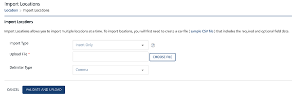
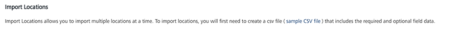
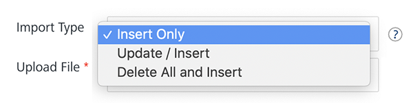
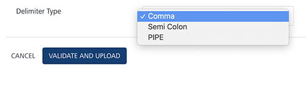
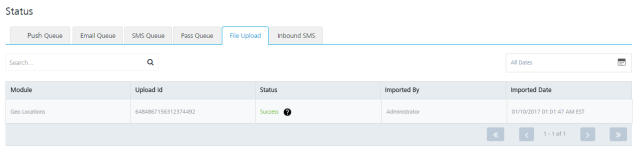
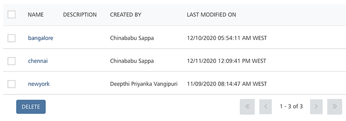
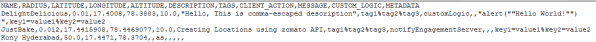

                             

Importing Geofences
===================

You can add geofences into Engagement services by using the **Import Geofence** button. The feature helps you do a bulk import of geofences.

To import geofences, follow these steps:

1.  On the **Location** page, click the **Import Geofence** button to navigate to the **Import Locations** page.
    
    The **Import Locations** page appears.
    
    
    
    > **_Important:_** You can import any number of geofences by using the sample .`CSV` file or create a file similar to the .`CSV`file, including all the mandatory fields.
    
2.  Click the link (sample `CSV` file) below the **Import Location** header to use the `sample.CSV` file. The `sample.CSV` file is downloaded to your local system.
    
    
    
3.  If you create a `.CSV`  file, the data entered in the `.CSV`  file should have all the mandatory fields. For example, NAME, RADIUS, LATITUDE, LONGITUDE, and DESCRIPTION. You can also use alphanumeric and special characters to fill in the data.
4.  **Import Type**: Select the desired option from the drop-down list. There are three options to import geofences in bulk.
    *   **Insert Only**: By default, the **Import Type** option is set to Insert Only. The option reads the data in the file and inserts geofences in the Engagement server. If insert fails, the system displays an error.
    *   **Update/Insert**: The option reads the data in the file and tries to update each record first. If the record update fails, the system inserts the new records.
    *   **Delete All and Insert**: The option deletes existing geofences data and inserts new data in the Engagement server. As a prerequisite, you need to take backup of your data before selecting the option.
        
        
        
5.  **Delimiter Type**: Select the type of delimiter from the **Delimiter Type** drop-down list, such as **Comma** (,), and **Semicolon** (;) or **PIPE**. By default, the feature is set to comma.
    
    
    
6.  If you do not want to upload the `.CSV` file, click the **Cancel** button to exit from the window without saving any information.
7.  **Upload File**: Click the **Choose File** button to locate your `.CSV` file, and then click the **Open** button. The `.CSV` file name appears in the **Upload File** field.
8.  Click the **Validate and Upload** button to validate the `.CSV` file.
    
    If the file upload is successful, the system displays the confirmation message that the file uploaded successfully and import is underway. The system also displays the assigned request ID.
    

> **_Note:_** If there are error notifications, you need to modify the information in the relevant fields in your `.CSV` file and re-validate the file. The following error messages may appear:  
\- If the selected file format is not correct, the system displays a warning message to  upload a .`CSV` file.  
\- If any of the required attributes (in the header) are missing in the uploaded file, the system displays a warning message.  

To view the current status of file uploaded, click the request ID. Clicking the request ID navigates you to the **Settings** > **Status** > **File Upload** page.

Updating Imported Geofences
---------------------------

You can update an existing geofence in the **Engagement** server by providing the same name in the `.CSV` file. For example, you import the geofence - Griffith Observatory with the following parameters:

NAME,RADIUS,LATITUDE,LONGITUDE,ALTITUDE,DESCRIPTION,TAGS,CLIENT\_ACTION,MESSAGE,CUSTOM\_LOGIC,  
METADATA

Here NAME, RADIUS, and LATITUDE, LONGITUDE, ALTITUDE, and DESCRIPTION are the required parameters. You can provide a empty value for the optional parameters. For example, for the CUSTOM\_LOGIC parameter, an empty value is passed.

Griffith Observatory,50.0,36.1193,-119.3002,90, Griffith Observatory Los Angeles CA 90027 USA, Telescope%Solar%Eclipse,localNotification, Welcome to Griffith Observatory,,key1=Lunar%key2=cycle

### Required Parameters

The table displays the assigned values to the required parameters:

  
| NAME | RADIUS | LATITUDE | LONGITUDE | ALTITUDE | DESCRIPTION |
| --- | --- | --- | --- | --- | --- |
| Griffith Observatory | 50.0 | 36.1193 | \-119.3002 | 90 | Observatory Los Angeles CA 90027 USA |

### Optional Parameters

The table displays the assigned values to the optional parameters:

  
| TAGS | CLIENT\_ACTION (MESSAGE) | CLIENT\_ACTION (CUSTOM\_LOGIC) | METADATA |
| --- | --- | --- | --- |
| Telescope%Solar%Eclipse | Welcome to Griffith Observatory | Null value | key1=Lunar%key2=cycle |

  
The imported geofence appears in the list-view.

Next, you update the **RADIUS** parameter value from 50.0 miles to 51.0 miles.

Griffith Observatory,51.0,36.1193,-119.3002,90, Griffith Observatory Los Angeles CA 90027 USA, Telescope%Solar%Eclipse,localNotification, Welcome to Griffith Observatory,,key1=Lunar%key2=cycle

When you upload the updated geofence, the system displays the confirmation message that the file uploaded successfully and import is in progress. The system also displays the assigned request ID to view the current status of the file upload.

Preparing a .CSV file for importing or updating Geofences
---------------------------------------------------------

Here is a checklist to consider when you prepare .`CSV` file to import or update locations.

*   Ensure that the data provided in the .`CSV` file is properly escaped for the delimiter in use. For example, you want to include a text message with a comma in the .`CSV` file. You need to enclose the text message in double quotes to escape the comma (delimiter).
    
    The following .`CSV` file displays the use of comma and double quotes to escape delimiters.
    
    
    
    The examples from the above .`CSV` file are as follows:
    
    *   `“Hello, This is comma – escaped description”` : An example for escaping the comma with double quotes.
    
    *   `“ alert (“” Hello World!””)”`: An example for escaping double quotes with double quotes.
*   You should not keep a string value with a double open quotes as it is a special escape character for .CSV parsing.
    
    *   Example: The following example with a double open quote throws an error.  
        `Rodeo Drive hosts high-class events ranging from” luxurious jewellery festivals to holiday specials…`
    
    To avoid the error wrap the text in double quotes and also escape the double quotes with another double quotes.
    
    *   `“Rodeo Drive hosts high-class events ranging from”” luxurious jewellery festivals to holiday specials…”`
