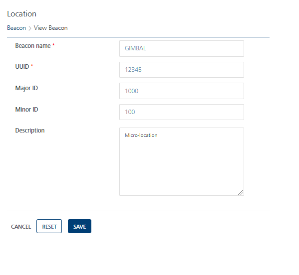

                             

Modifying Beacons
=================

Based on your requirement, you can modify beacons in the Engagement server.

**To modify a Beacon, follow these steps:**

1.  On the **Beacons** screen, click the required beacon name under the **Beacon Name** column in the beacons list view.
    
    The **View Beacon** screen appears.
    
    
    
2.  Based on your requirement, update the following fields:
    
    | Beacons Element | Description | Modification Allowed |
    | --- | --- | --- |
    | Beacon Name | A name assigned to the beacon | Yes |
    | UUID | Universally unique identifier (UUID) assigned to the beacon | Yes |
    | Major ID | The major ID assigned to a beacon | Yes |
    | Minor ID | The minor identifier of a beacon. | Yes |
    | Description | Information about a beacon, such as Bluetooth Low Energy Beacons | Yes |
    
3.  Click **Cancel** if you do not want to save the updated fields. The **Beacons** page appears.
4.  Click **Reset** to clear all the entry fields.
5.  Click **Save**.
    
    The updated beacon appears in the beacons list view. The system displays a confirmation message that the beacon is updated successfully.
