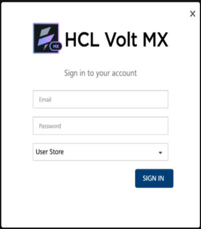
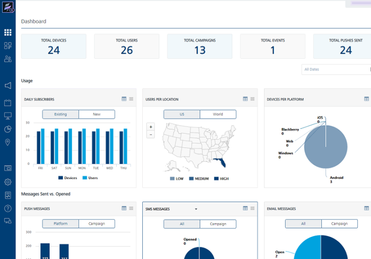

                            

You are here: Engagement Services User Interface

Log in to Volt MX Foundry Engagement Services
============================================

Volt MX  Foundry Engagement Services allows its users, who have appropriate permissions, to log in to the console to perform different operations.

> **_Important:_** A user can be anyone who has authorized access to perform different roles in the console. For example, an employee, a campaign manager, an administrator, or a developer.

To log into Volt MX Foundry Engagement Services, follow these steps:

1.  Open an Internet browser.
2.  Enter the Volt MX Foundry Engagement Services URL in the **Address** field in the browser, Volt MX Foundry Engagement Services console URL is http://<servername>:<serverport>/vpns
    
    Example: http://localhost:8080/vpns
     
3.  Press the **Enter** key. The Volt MX Foundry Engagement Services Login screen appears.
    
    
    
4.  Enter the user name in the **Username** field.
5.  Enter the password in the **Password** field.
6.  Click the **Sign in** button. The **Dashboard** page appears as the landing page in the console.
    
    > **_Note:_** After successful installation of Volt MX Foundry Engagement Services, the default user with the Username _admin_ and the Password as admin are created automatically.    
    **admin** is the default Administrator with permissions to perform all functionalities of Volt MX Foundry Engagement Services.
    

Volt MX  Foundry Engagement Services User Interface
-------------------------------------------------

The user interface for Volt MX Foundry Engagement Services is comprised of five panes:

*   The left-pane displays a list of available modules within the console. The list is organized by the three sections: **Overview**, **Engagement**, and **Settings**.
    
      
    The left-pane is available on every console page. If you click the link for any module, the console displays the appropriate page of the module.  
    
*   The right-pane is to view and fill the details in the console.

> **_Important:_** As a user, you must have at least one of permissions to log into Volt MX Foundry Engagement Services. However, when you want to perform different tasks, such as adding applications, adding campaigns, you must have suitable permissions to access the respective screens in console.  
  
A user or a group can be anyone who has authorized to perform different roles with the given permissions in console. For example, an employee, a campaign manager, an administrator, or a developer.  
  
By default, the **Dashboard** screen appears in the console when you (all users) log in to Volt MX Foundry Engagement Services.  

Following are the list of modules organized in to three sections as follows:

**VoltMX Foundry Engagement Services**

**Overview**

*   Dashboard
*   Apps
*   Subscribers

**Engagement**

*   Campaigns
*   Events
*   Adhoc
*   Segments
*   Location

**Settings**

*   Templates
*   Configuration
*   Status
*   API Help
*   Admin Access

Advantages of using the Volt MX Foundry Engagement Services
----------------------------------------------------------

The advantages of using the Volt MX Foundry Engagement Services include:

*   **Ease of use**: You can use a single interface to send push notifications to numerous devices running on various platforms. You can also choose to send push notifications to custom IDs instead of the identifier from the push notification service provider.
*   **No platform specific formatting**: Volt MX Foundry Engagement Services allows you to control all the features available on individual platforms such as iPhone, Android, Windows, and Web without any platform specific formatting requirements.
*   **Reliable**: Automatically performs a specified number of retries on push failure.
*   **Extensible**: Volt MX Foundry Engagement Services supports all the platforms that support Push Notifications, for example, Apple, Android, and Windows, and Web. You can avail support to any new platform that will support in future with upgrade to Volt MX Foundry Engagement Services.
*   **Scalable**: Volt MX Foundry Engagement Services supports clustering and is thereby scalable and can handle large number of requests.
*   **Robust**: Volt MX Foundry Engagement Services performs multiple levels of validations and reduces the resource utilization for invalid or improper requests.
*   **Ease of integration**: Volt MX Foundry Engagement Services accepts requests in XML and JSON (only for Engagement Services) or Key-value parameter formats for push notification API and thereby provides an easy integration.
*   **Modular**: Volt MX Foundry Engagement Services is divided into Subscription, Messaging and Query. These modules can be used independently and are not interdependent. This allows modular integration for ease of use.
