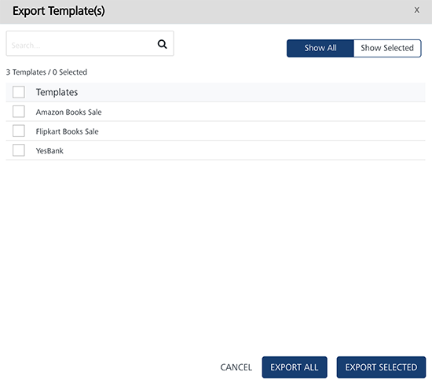
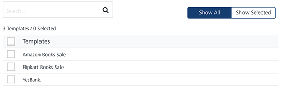
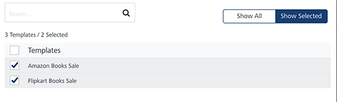
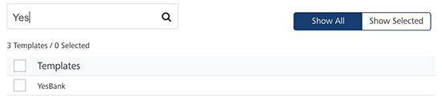

                           

Exporting Push Templates
========================

You can export push templates from Engagement services using the **Export Template** button. The feature enables you to do bulk export of push templates at a time.

To export push templates, follow these steps:

1.  In the **Push Template** screen, click the **Export Template** button.
    
    The **Export Template(s)** window appears.
    
    
    
2.  The Export Templates(s) window displays the following details:
    *   **Show All**: The **Show All** tab displays all the push templates in the list-view. By default, the **Show All** tab is set to active.
        
        
        
    *   **Show Selected**: The **Show Selected** tab displays the selected push templates in the list-view. Select the check-box next to the **Templates** header to select all the push templates.
        
        
        
    *   **Search** field: Enter a key-word in the search field to search for a particular push template.
        
        The required push template appears in the list-view.
        
        
        
    *   **Export All**: Helps you export all the push templates present in the Engagement server to a zip file.
    *   **Export Selected**: Helps you export selected push templates present in the Engagement server to a zip file.
    *   **Cancel**: Click **Cancel** to close the window.
3.  Based on your requirement, click **Export All** or **Export Selected**.
    
    The system downloads push templates in a zip file format on your system.
