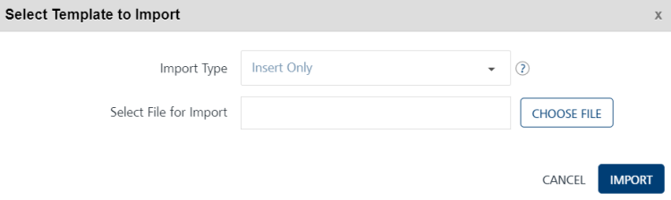
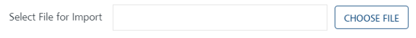
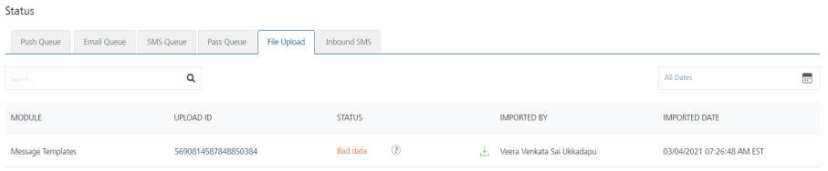

                           

Importing Push Templates
========================

You can add push templates into Volt MX Engagement services by using the **Import Template** button. The feature helps you do a bulk import of push templates.

To import push templates, follow these steps:

1.  On the **Templates** page, click the **Import Template** button.
    
    The **Select Template to Import** window appears.
    
    
    
2.  Click the **Choose File** button to select the push template zip file from your system.
    
    
    
3.  **Import Type**: Select the desired option from the drop-down list. There are three options to import push templates in bulk.
    
    *   **Insert Only**: By default, the Import Type option is set to Insert Only. The option reads the data in the file and inserts push templates in the Engagement server. If insert fails, the system displays an error.
    *   **Update/Insert**: The option reads the data in the file and tries to update each record first. If the record update fails, the system inserts the new records.
    *   **Delete All and Insert**: The option deletes existing Push template data and inserts new data in the Engagement server. As a prerequisite, you need to take backup of your data before selecting the option.
    
    If the file upload is successful, the system displays the confirmation message that the file uploaded successfully and import is underway. The system also displays the assigned request ID. The uploaded push templates appears in the Push Templates list-view on the Templates page.
    
    File Status
    -----------
    
    1.  You can use the request ID supplied with the confirmation message to view the current status of the uploaded push template files under the Settings > Status section.
    2.  If the template files are not uploaded successfully, you can view the file status as bad data under the Status column. Hover the mouse over bad data to view the error message. Based on the error message, you can take the necessary action and import push templates successfully.
        
        
