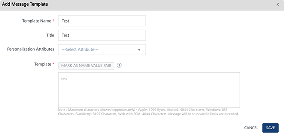
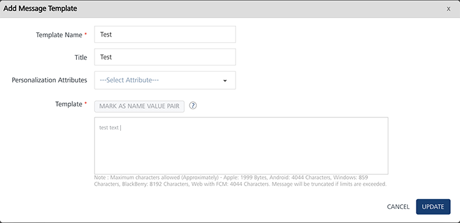

                            

Modifying Push Templates
========================

The feature allows you to view and change the push templates. For example, you want to modify the personalization attributes.

**To view or modify a push template, follow these steps:**

1.  In the **Push Template** home page, under the **Template Message** column in the list view, click the **Edit** button to edit the required push template.
    
    The **Add Push Template** window appears. It displays all the personalization attributes, name-value pairs, and the push text message.
    
    
    
2.  You can update the following fields:
    
    | Push Template Element | Description | Modification Allowed |
    | --- | --- | --- |
    | Template Name | Push template name | Yes |
    | Template Title | Title of the template to be used. | Yes |
    | Personalization Attributes | There are default personalization attributes: First name, Last name, Email, Mobile number, Country, and State | Yes |
    | Mark as Name Value Pair | A key-value pair is a set of two linked data items: a key, which is a unique identifier for a data type, and its value: the data such as, county:Iowa, state: wisconsin | Yes |
    
    The added details appears in the message box window.
    
    
    
3.  Click the **Cancel** button to exit from the window without saving any information.
4.  Click the **Update** button to save the modifications.
    
    The updated push template appears in the list-view. The system displays the confirmation message that the template updated successfully.
