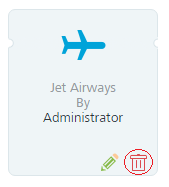

                           

Deleting Passbook Templates
===========================

You can delete only those passes that are not used in **Campaigns**, **Events** and also the **General** passes.

**To delete a Passbook Template, follow these steps:**

1.  Click the **Delete** icon on the required template on the **Passbook Template** screen.
    
    
    
2.  The **Confirm Delete** dialog appears with the warning message, asking if you really wants to delete the templates.
3.  If you do not want to delete the template, click **Cancel** to close the **Confirm Delete** dialog.
4.  Click **Ok** to continue.
    
    The system displays the confirmation message that pass template deleted successfully. The deleted template is no longer displayed on the **Passbook Template** screen.
