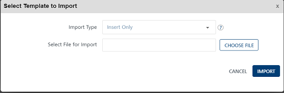
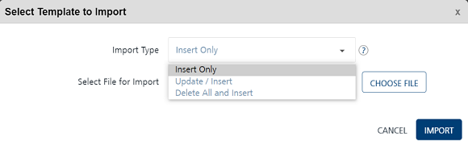

                           

Importing Passbook Templates
============================

You can import pass templates from Engagement services using the **Import Template** button. The feature enables you to do bulk import of pass templates at a time.

To import pass templates, follow these steps:

1.  In the **Pass Template** screen, click the **Import Template** button.
    
    The **Select Template to Import** window appears.
    
    
    
2.  Click the **Choose File** button to select the pass template zip file from your system.
    
    
    
3.  **Import Type**: Select the desired option from the drop-down list. There are three options to import Pass templates in bulk.
    
    *   **Insert Only**: By default, the **Import Type** option is set to Insert Only. The option reads the data in the file and inserts Pass templates in the Engagement server. If insert fails, the system displays an error.
    *   **Update/Insert**: The option reads the data in the file and tries to update each record first. If the record update fails, the system inserts the new records.
    *   **Delete All and Insert**: The option deletes existing Pass templates data and inserts new data in the Engagement server. As a prerequisite, you need to take backup of your data before selecting the option.
    
    
    
    The system displays a request ID with the confirmation message: The file uploaded successfully and the file import is in progress. The uploaded pass templates appears in the pass templates list-view on the **Templates** page.
    

File Status
-----------

You can use the request ID supplied with the confirmation message to view the current status of the uploaded pass template files under the **Settings** > **Status** section.

If the template files are not uploaded successfully, you can view the file status as bad data under the **Status** column. Hover the mouse over bad data to view the error message. Based on the error message, you can take the necessary action and import pass templates successfully.
