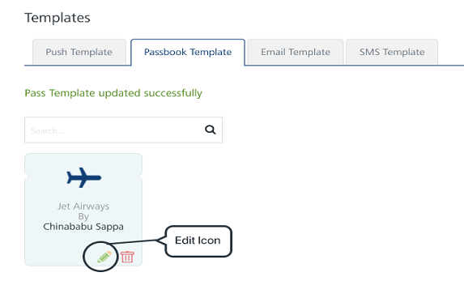
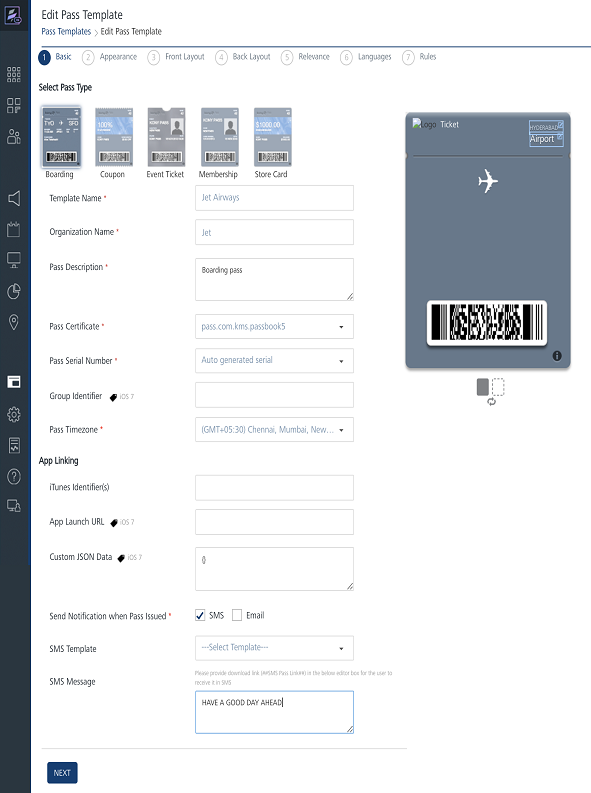

                           

Modifying Passbook Templates
============================

To modify a Passbook Template, follow these steps:

1.  Click the **Edit Template** icon on the required template on the **Passbook Template** screen.
    
    
    
    The **Edit Pass Template** window appears.
    
    
    
2.  Do the required changes in the **Passbook Template**. For more details refer, [Adding a Passbook Template](Add_passbook.md)
3.  Click **Submit** to save the details.
    
    The updated template appears on the **Passbook Template** screen. The system displays the confirmation message that the template updated successfully
