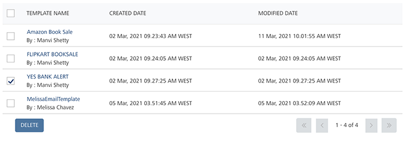

                           

Deleting SMS Templates
======================

Based on your requirements, you can delete an SMS template.

**To delete an SMS Template, follow these steps:**

1.  Select the checkbox next to the SMS template name you want to delete.
2.  Click the **Delete** button. You can select any one SMS template or all the SMS templates and delete them.
    
    
    
    The system displays the **Confirm Delete** dialog, asking if you want to delete the template.
    
3.  Click **Cancel** if you do not want to delete the SMS template.
4.  Click **Ok** to continue.
    
    The system displays the confirmation message stating that SMS template deleted successfully. The deleted template is no longer displayed in the grid view.
