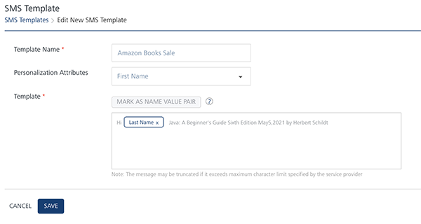

                            

Modifying SMS Templates
=======================

**To modify a SMS Template, follow these steps:**

1.  In the **SMS Template** home page, under the **Template Name** column, click the required template.
2.  The **SMS Template** > **Edit New SMS Template** page appears.
    
    
    
3.  You can update details for the following fields:
    
    | SMS Message Template Element | Description | Modification Allowed |
    | --- | --- | --- |
    | Template Name | SMS template name | Yes |
    | Personalization Attributes | There are default personalization attributes: First name, Last name, Email, Mobile number, Country, and State | Yes |
    | Mark as Name Value Pair | A key-value pair is a set of two linked data items: a key, which is a unique identifier for a data type, and its value: the data such as, county:Iowa, state: wisconsin | Yes |
    
4.  Click the **Cancel** button to exit from the window without saving any information.
5.  Click **Save** to continue.
    
    The updated template appears in the list-view. The system displays the confirmation message that SMS template updated successfully.
