                           

Use Case Scenario: Five
=======================

A user receives best offers after entering a shopping mall.

Solution
--------

You need to load the Engagement server with the iBeacon information located in the mall stores and run a campaign that use these iBeaons. When a user qualifies for the campaign, the Engagement server will trigger the campaign for the user.

Description
-----------

Lisa serves as a customer service manager for **Nordstrom Rack Woodbury City Place** in Los Angeles, CA. Lisa wants that a user should get an alert about sales offers and discounts when entering the store.

Mary works as an IT professional in Los Angeles. During a weekend shopping trip to **Nordstrom Rack Woodbury CityPlace** at 315, Radio Drive, Mary received an enticing alert on her iPad: an offer for a $20 discount on a formal office costume.

The alert arrived at an appropriate time, pinging as Mary neared the entrance of the Nordstrom Rack Woodbury CityPlace. After looking in to the offer, Mary confirmed her decision to buy the costume after all. But the timing was no coincidence. The app that Mary downloaded from Volt MX Marketplace used beacon technology, an innovative addition to location-based advertising, to pinpoint her location while sending the discount offer.

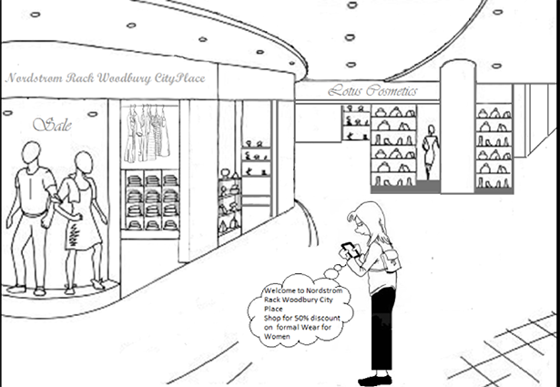

Prerequisites
-------------

The following prerequisites should be fulfilled before sending a beacon notification to customers:

*   [Adding Applications in the Engagement Server](#adding-applications-in-the-engagement-server)
*   [Adding Subscribers (devices and users) in the Engagement Server](#adding-subscribers-devices-and-users-in-the-engagement-server)
*   [Adding Campaign Types in the Engagement Server](#adding-campaign-types)
*   [Adding Beacons in the Engagement Server](#adding-beacons)
*   [Connecting Beacons with Subscribers](#connecting-beacons-with-subscribers)
*   [Adding Segments in the Engagement Server](#adding-segments)
*   [Adding Campaigns](#adding-campaigns)
    
    > **_Note:_** The following topics are already covered in the Use Case Scenario: One  
    \- Adding Email Configuration  
    \- Adding SMS Configuration  
    \- Adding Pass Configuration  
    \- Adding Templates (push, SMS, email, and pass)
    

Adding Applications in the Engagement Server
--------------------------------------------

Lisa needs an app to connect with beacons and send notifications. The app should be developed cross platform so the campaign (including a segment with beacon users) can be received on all the devices (Android, Web, Windows, and iOS). In this section Lisa learns how to create an app in the Engagement server and enable it to send campaigns to customers. There are two basic steps to create an app.

*   [App Info](#app-info)
*   [Settings](#settings)

### App Info

Lisa enters a name for the app such as **Woodbury** and select the app category from the drop-down list. Lisa clicks **Generate** to auto generate the **Application ID**.

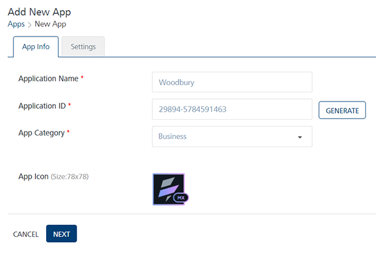

### Settings

Under the **Settings** section, Lisa needs to choose Apple, Android, Windows or Web platform to save and publish the **Woodbury** app successfully.

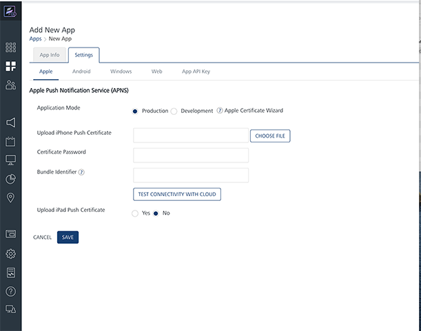

After entering the required platform details, Lisa saves the app. The default status of a newly added app in the Engagement server is unpublished. Lisa needs to publish the app as only published apps can be used for sending messages to customers.

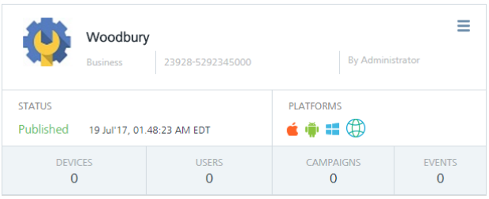

For more details about how to add a new app, refer to [Adding Apps](../../../../Foundry/vms_console_user_guide/Content/Apps/Adding_an_Application.md)

Adding Subscribers (devices and users) in the Engagement Server
---------------------------------------------------------------

Lisa needs to subscribe user devices with the Woodbury app to receive the beacon messages. For more details about how to add new subscribers refer to, [Adding new Subscribers](../../../../Foundry/engagement_api_guide/Content/REST_API_Subscribers/Create_New_Subscriber.md)

Adding Campaign Types
---------------------

The campaign type is set when a new campaign is created and the name is commonly used to refer the specific campaign. Lisa adds a new campaign type as Woodbury.

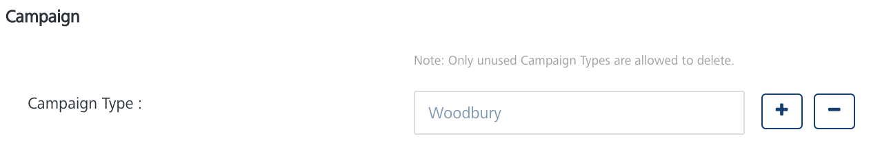

For more details about how to add a new campaign type refer to, [Adding new Campaign Types](../../../../Foundry/vms_console_user_guide/Content/Administration/General_-_Settings.md#Campaign)

Adding Beacons
--------------

In this section, Lisa learns how to create beacons. Lisa visits the **Location** page and clicks **New Beacon** to open the **Add Beacon** page. The **Add Beacon** procedure includes the following steps:

Lisa needs to enter the following information on the **Add Beacon** page:

*   **Beacon Name**: Lisa needs to enter the beacon name in the **Beacon Name** field such as Woodbury.
*   **UUID**: Lisa enters the universally unique identifier (UUID) of the beacon. The UUID contains 32 hexadecimal digits, which are split into five groups and separated by dashes. For example, `f7826da6-4fa2-4e98-8024-bc5b71e0893e`.
*   **Major ID**: Lisa enter the major ID of the beacon. The major ID is the key identifier of a beacon.
*   **Minor ID**: Lisa enter the minor ID of the beacon. The minor ID is a minor identifier of beacon.
*   **Description**: Lisa enter an appropriate description of the beacon.
    
    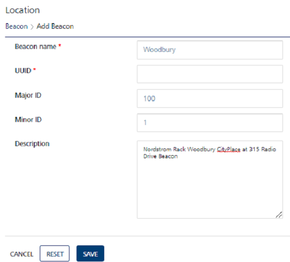
    
    For more information about how to add new beacons, refer to [Adding Beacons](../../../../Foundry/vms_console_user_guide/Content/Geolocation/Add_beacons.md)
    

Connecting Beacons with Subscribers
-----------------------------------

Lisa needs to connect Woodbury beacon with Woodbury app so a user can receive notifications when reaching in the boundary of the beacon. For more information about how to connect Woodbury beacon with Woodbury app, refer to [Connecting Beacons with Subscribers](../../../../Foundry/engagement_api_guide/Content/REST_API_Beacon/Update_List_of_Beacons_for_a_Device.md)

Adding Segments
---------------

In this section, Lisa learns how to create a simple yet powerful segment to associate with Woodbury campaign. In Engagement Services creating a segment involves two basic steps:

*   [Segment Information](#segment-information)
*   [Define Conditions](#define-conditions)

### Segment Information

*   **Name** (mandatory): Lisa enters the name for the segment as **Woodbury Customers List**. Lisa receives a warning message, if a segment name is already defined. This warning is only a reminder that the segment is in use and Lisa needs to enter another name to define a segment.
    
    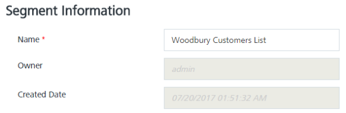
    

### Define Conditions

For the **Woodbury Campaign**, Lisa needs to add users who are associated with **Woodbury beacon**. So, Lisa chooses appropriate conditions to include users in the segment.

1.  **Conditions**: Lisa clicks **Add** to add a new condition row. A new condition is added with a condition number under the **Conditions** column in the grid. The condition numbers are the references to the user attributes that are associated with that condition. The numbered conditions can be used to define different combinations for a segment definition.
2.  **Attributes**: Under the **Attributes** column, Lisa selects the beacon attribute from the drop-down list.
3.  **Operator**: Under the **Operators** column, Lisa selects the operator as **Contains** from the drop-down list. Lisa can compare a user attribute with a value by using a specified operator such as **Contains**, **Equal**, or **NotEqual**.
4.  **Execute Conditions by**: Lisa can select the execute condition as **Match all conditions** or **Match any condition**, from the drop-down list. Based on the fulfilled conditions, the system inserts the number of users that qualify for the segment under the **Users** column. Here, the users who have installed Woodbury app on their devices and connected with Woodbury beacon appears in the **Users** list view.
    
    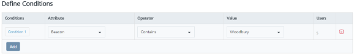
    
    For more details about how to create a segment refer to, [Defining Segments](../../../../Foundry/vms_console_user_guide/Content/Segments/Adding_a_Segment.md)
    

Adding Campaigns
----------------

In this section Lisa learns how to create and send a campaign to customers. Lisa visits the **Campaigns** page and clicks **Add Campaign** to open the **Add Campaign** page. The **Add Campaign** procedure includes three basic steps:

*   [Campaign Information](#campaign-information)
*   [Select Users](#select-users)
*   [Define Messages](#define-messages)

### Campaign Information

Lisa needs to enter the following information on the **Add Campaign** page:

1.  **Campaign Name**: Lisa needs to enter an apt name for the campaign. The campaign name is displayed to the customers who receive push, email, SMS or pass notifications.
2.  **Campaign Type**: Lisa needs to select suitable campaign type from the drop-down list.
3.  **Campaign Start Date**: When Lisa creates a new campaign, she can control how long it runs. If Lisa selects the start date as today, the campaign starts once the status is updated from pending to running.
4.  **Campaign End Date**: Lisa can set the campaign end date. This setting determines how long campaign is to run. When the campaign's end date and time arrives, the campaign stops running.
    
    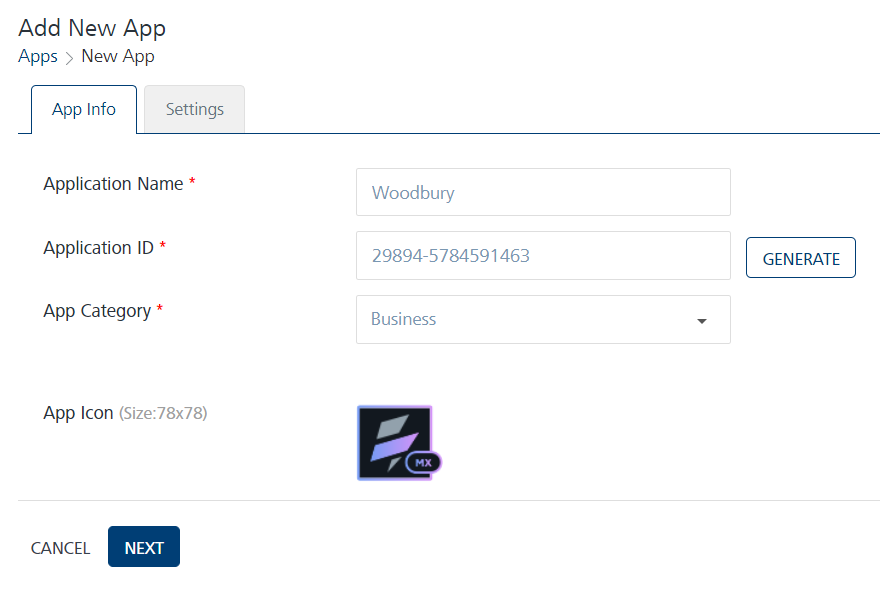
    

There may be times when Lisa creates a campaign but do not want it to start right away. For those times, Lisa can set campaign's start and end dates under the **Campaign Information** section for a later date and time.

### Select Users

**Segments**: Lisa selects the **Woodbury Customers List** segment from the **Select a Segment** drop-down list. Thus all the customers from the **Woodbury Customers List** are added under the **Segment Users** column.

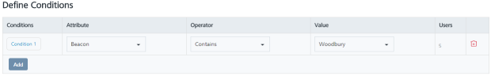

For more details about how to select users refer, [Selecting Users](../../../../Foundry/vms_console_user_guide/Content/Campaigns/Adding_a_Campaign.md#Select)

### Define Messages

Lisa can choose push message, email, SMS or passbook notification channel to send the campaign message text for the **Woodbury** campaign.

To define messages, Lisa can choose an existing template or create a new template. If Lisa selects an existing template, can change the content without affecting the template. Thus any changes in the template are saved for this campaign only and do not change the default template. So Lisa can use the same template multiple times without worrying about changes from campaign to campaign.

To know more about Templates, refer to, [Adding Templates (push, SMS, email and pass)](../../../../Foundry/vms_console_user_guide/Content/Scenarios/Campaigns_Scenarios_One.md#adding-templates-push-sms-email-and-pass)

Lisa can also set channel priority to send messages to users through the Settings button available on the **Define Message** page. The **Settings** button becomes active when Lisa selects at least two channels. The channel priority in fact does not overwhelm users.

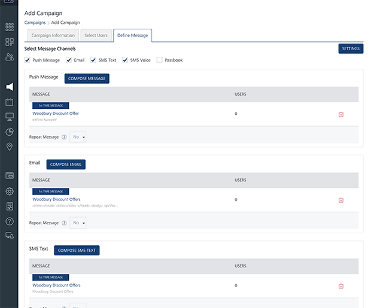

Many companies send repeat messages to make their brand well-known to customers. Lisa can send repeat campaign message to customers and set repeat message duration in hours, days or weeks.

For more details about how to define campaign message refer, [Defining Campaign Messages](../../../../Foundry/vms_console_user_guide/Content/Campaigns/Adding_a_Campaign.md#Define)
