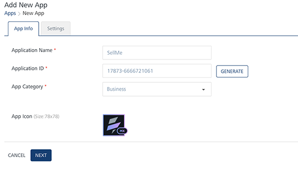
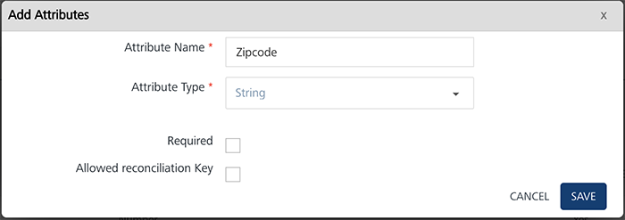
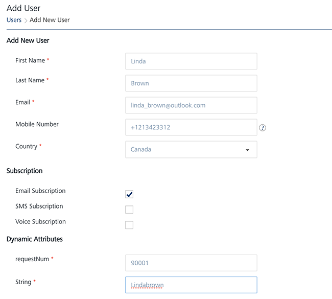
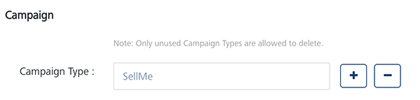
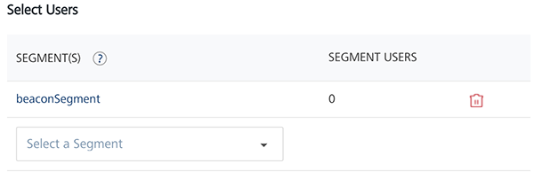
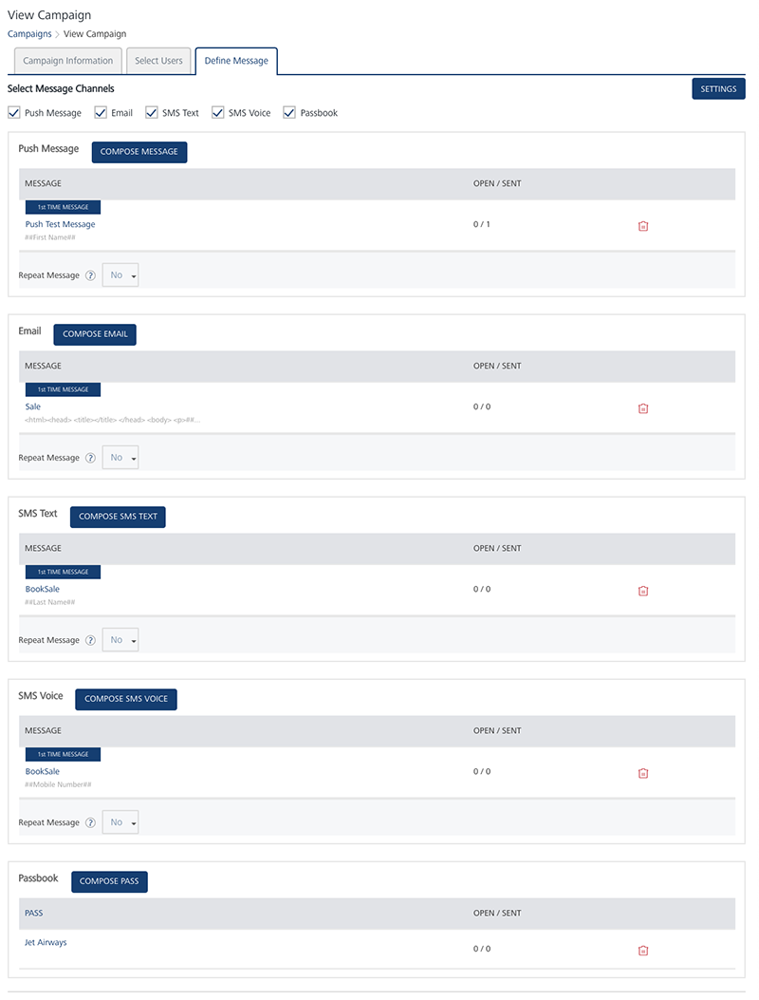

                           

Use Case Scenario : One
=======================

SellMe Inc. wants to send festive offers or discount sale information to their customers, in a particular zip code, periodically through push, email, SMS or pass notifications.

Solution
--------

You need to set up a campaign that triggers notifications when customers matching with the zip code are added in the Engagement server.

Description
-----------

Lisa serves as a sales manager in SellMe Inc. and wants to send festive offers or discount sale information to customers in Los Angeles County, CA with zip code as 90001. Lisa knows that by promoting mobile campaigns, SellMe can quickly start engaging customers on their mobiles.

Prerequisites
-------------

The following prerequisites should be fulfilled before sending a campaign to customers:

*   [Adding Applications in the Engagement Server](#adding-applications-in-the-engagement-server)
*   [Defining User Attributes](#defining-user-attributes)
*   [Adding Subscribers (devices and users) in the Engagement Server](#adding-subscribers-devices-and-users-in-engagement-server)
*   [Adding Campaign Types](#adding-campaign-types)
*   [Adding Segments](#adding-segments)
*   [Adding Email Configuration](#adding-email-configuration)
*   [Adding SMS Configuration](#adding-sms-configuration)
*   [Adding Pass Configuration](#adding-pass-configuration)
*   [Adding Templates (push, SMS, email and pass)](#adding-templates-push-sms-email-and-pass)
*   [Adding Campaigns](#adding-campaigns)

Adding Applications in the Engagement Server
--------------------------------------------

Lisa needs an app to add new customers, and send campaigns through push messages. The app should be developed cross platform so the campaign can be received on all the devices (Android, Web, Windows, and iOS). In this section Lisa learns how to create an app in the Engagement server and enables it to send campaigns to customers. There are two basic steps to create an app.

*   [App Info](#app-info)
*   [Settings](#settings)

### App Info

Lisa enters a name for the app like **SellMe** and select the app category from the drop-down list. Lisa clicks **Generate** to auto generate the **Application ID**.

### Settings

Under the **Settings** section, Lisa needs to choose Apple, Android, Windows or Web platform to save and publish the **SellMe** app successfully.

After entering the required platform details, Lisa saves the app. The default status of a newly added app in the Engagement server is unpublished. Lisa needs to publish the app as only published apps can be used for sending messages to customers.

For more details about how to add a new app refer,  [Adding Apps](../../../../Foundry/vms_console_user_guide/Content/Apps/Adding_an_Application.md)

Defining User Attributes
------------------------

User attributes are the properties of the user entity. The data about a user entity is stored in the form of attributes, such as, First Name, Last Name, Email, Mobile Number, Country, State, Location, Beacon, Last Active Date, and any dynamic user attribute type. Lisa can create custom user attributes by using the **User Attributes** section under **Configuration**.

In this section, Lisa learns how to create custom user attributes. Lisa needs to create a custom user attribute as Zip Code to send campaigns to customers from Los Angeles County (zip code: 90001).

On **User Attributes** home page, Lisa clicks **Add Attributes** to open **Add Attributes** window. Lisa enters the attribute name as **Zip Code** and selects the attribute type as string from the drop-down list. Lisa can define zip-code as a required attribute by selecting the **Required** check box. Lisa clicks **Save** to save the custom user attribute.

For more details about how to add custom user attributes refer, [Defining User Attributes](../../../../Foundry/vms_console_user_guide/Content/Administration/Adding_Attributes_to_Audience.md)

Adding Subscribers (Devices and Users) in Engagement Server
-----------------------------------------------------------

In this section, Lisa learns how to add users from Los Angeles County with zip code as 90001 in the Engagement server. The added users receive **SellMe** discount offers and promotional campaigns through the **SellMe** app installed on their devices.

### Adding New Users

In Engagement Services, adding a user involves following details:

*   Add New User
*   Dynamic Attributes

Lisa enters first name, last name, email, mobile number of the new user. Next, Lisa selects the country as United States and state as California from the drop-down list. By default, the user subscription is set to email and SMS channels.

Lisa enters the zip code value as 90001 under **Dynamic Attributes** and saves the user details.

### Adding Devices

Lisa needs to subscribe user devices with **SellMe** app to receive campaign messages. So Lisa sends an email to the all the users that are already existing in the system to download the application from the app store and create a subscription. The following table displays that the **Demo Device** of Linda Brown, a resident of Los Angeles County is subscribed to **SellMe** app.

For more details about how to add a new subscribers refer, [Adding new Subscribers](../../../../Foundry/engagement_api_guide/Content/REST_API_Subscribers/Create_New_Subscriber.md)

Adding Campaign Types
---------------------

The campaign type is set when a new campaign is created and the name is commonly used to refer the specific campaign. Lisa adds a new campaign type as **SellMe**.

For more details about how to add a new campaign type refer, [Adding new Campaign Types](../../../../Foundry/vms_console_user_guide/Content/Administration/General_-_Settings.md#Campaign)

Adding Segments
---------------

In this section, Lisa learns how to create a simple yet powerful segment to associate with SellMe campaign. In Engagement Services creating a segment involves two basic steps:

*   [Segment Information](#segment-information)
*   [Define Conditions](#define-conditions)

### Segment Information

**Name (mandatory)**: Lisa enters the name for the segment as **SellMe Buyers List**. Lisa receives a warning message, if a segment name is already defined. This warning is only a reminder that the segment is in use and Lisa needs to enter another name to define a segment.

### Define Conditions

For the SellMe Campaign, Lisa needs to add users who are resident of Los Angeles County, CA with zip code as 90001. So, Lisa chooses appropriate conditions to include users in the segment.

1.  **Conditions**: Lisa clicks **Add** to add a new condition row. A new condition is added with a condition number under the **Conditions** column in the grid. The condition numbers are the references to the user attributes that are associated with that condition. The numbered conditions can be used to define different combinations for a segment definition.
2.  **Attributes**: Under the **Attributes** column, Lisa selects the Zip Code attribute from the drop-down list.
3.  **Operator**: Under the **Operators** column, Lisa selects the operator as **Contains** from the drop-down list. Lisa can compare a user attribute with a value by using a specified operator such as **Contains**, **Equal**, or **NotEqual**.
4.  **Value**: Lisa enters the value as 90001. The total number of users from the Los Angeles County with zip code as 90001 appear under the **Users** column in the list-view.
5.  **Execute Conditions by**: Lisa can select the execute condition as **Match all conditions** or **Match any condition**, from the drop-down list. Based on the fulfilled conditions, the system inserts the number of users that qualify for the segment under the **Users** column.
    
    
    
    For more details about how to create a segment refer, [Defining Segments](../../../../Foundry/vms_console_user_guide/Content/Segments/Adding_a_Segment.md)
    

Adding Email Configuration
--------------------------

Lisa needs to configure the email settings in the Engagement server to send email notifications to customers. To configure the email account, Lisa needs to know the protocol to connect, the port number, and the security mode to enable secure connections.

For more details about how to configure the email account, refer: [Adding Email Configuration](../../../../Foundry/vms_console_user_guide/Content/Administration/Email_Configuration.md)

Adding SMS Configuration
------------------------

Lisa needs to configure a SMS service to be able to send SMS notifications to customers. Currently, SMS aggregators like Clickatell, Nexmo and Twilio can be integrated with the Engagement server. The Engagement server uses the credentials provided by the SMS service provider to connect to the specific SMS service.

For more details about how to configure the SMS service provider's account, refer: [Adding SMS Configuration](../../../../Foundry/vms_console_user_guide/Content/Administration/SMS_Configuration.md)

Adding Pass Configuration
-------------------------

As a prerequisite, Lisa will need to upload a pass certificate in this example to send pass notifications. A pass certificate is used for pass signing and sending pass updates to customers.

For more details about how to configure passes, refer: [Adding Pass Certificates](../../../../Foundry/vms_console_user_guide/Content/Administration/Pass_Configuration.md)

Adding Templates (push, SMS, email and pass)
--------------------------------------------

A Template is a pre-set layout, which can be used to send campaigns quickly with standardized content to all the targeted customers. There are four channels (sms, email, push and passes) available to send campaign to the customers. In this section, Lisa learns how to create templates for all the channels to send campaigns to customers.

### Push Message

Lisa knows that a user may review products on the SellMe site while using the SellMe app but not necessarily buy it. So Lisa wants to be able to send a push notification whenever there is a discount or price reduction on the product. Lisa wants an eye-catching campaign with glossy images and text messages to attract customers buy online. Also Lisa wants to use tailor-made push templates for SellMe.

Lisa can create two types of push templates in the Engagement server.

*   **Basic Push Message**: The Basic push template does not includes an image and or a rich text message.
    
    
    
*   **Rich Push Message**: The Rich push template includes an image with a rich text message content.
    
    
    

For more details about how to add push templates refer, [Adding Push Template](../../../../Foundry/vms_console_user_guide/Content/Message_Template/Adding_Message_Templates.md)

### SMS Message

SMS is a really simple and accessible way of engaging customers. Usually customers receive text messages on a daily basis and are aware of this notification mechanism. So Lisa feels that SMS is a direct way to communicate SellMe discounts and promotional offers to customers. Lisa can use tailor-made SMS message template that are supported by the Engagement server, to cater SellMe requirements.

For more details about how to add SMS message templates refer, [Adding SMS Template](../../../../Foundry/vms_console_user_guide/Content/SMS_Template/SMS_Template.md#Adding)

### Email Message

Emails are a good notification option to send festive offers or messages from discount sale campaigns, but it needs some precision while used as a notification channel in a campaign. Lisa wishes that in the email campaign:

*   The email should be rendered properly in multiple browsers.
*   The subject line should be concise and instantly appealing to get customers open the email campaign message.
*   Email notifications are not sent too often.
*   By analysing the market trend, discount campaigns should be sent to customers.

Lisa can use a tailor-made email message template to send attractive email campaigns to customers.

For more details about how to add email message templates refer, [Adding Email Templates](../../../../Foundry/vms_console_user_guide/Content/Email_Template/Email_Template.md#Adding)

Pass Message (Event)
--------------------

Lisa can also promote campaigns through mobile passes. Lisa can send promotional coupons, event tickets, membership cards, and store cards to lots of iOS users who use Apple devices to manage their digital passes.

Lisa can do pass updates on customers’ devices and intensify SellMe offers when it really counts. Lisa can also use tailor-made pass templates to send attractive pass campaigns to customers.

For more details about how to create Pass message templates refer, [Adding Pass Templates](../../../../Foundry/vms_console_user_guide/Content/PassBook_Template/Passbook_Template.md#dding_a_Passbook_Template)

Adding Campaigns
----------------

In this section Lisa learns how to create and send a campaign to customers. Lisa visits the **Campaigns** page and clicks **Add Campaign** to open the **Add Campaign** page. The **Add Campaign** procedure includes three basic steps:

*   [Campaign Information](#campaign-information)
*   [Select Users](#select-users)
*   [Define Messages](#define-messages)

### Campaign Information

Lisa needs to enter the following information on the Add Campaign page:

1.  **Campaign Name**: Lisa needs to enter an apt name for the campaign. The campaign name is displayed to the customers who receive push, email, SMS or pass notifications.
2.  **Campaign Type**: Lisa needs to select suitable campaign type from the drop-down list.
3.  **Campaign Start Date**: When Lisa creates a new campaign, she can control how long it runs. If Lisa selects the start date as today, the campaign starts once the status is updated from pending to running.
4.  **Campaign End Date**: Lisa can set the campaign end date. This setting determines how long campaign is to run. When the campaign's end date and time arrives, the campaign stops running.

There may be times when Lisa creates a campaign but do not want it to start right away. For those times, Lisa can set campaign's start and end dates under the Campaign Information section for a later date and time.

For more details about how to define campaign information refer, [Adding Campaigns](../../../../Foundry/vms_console_user_guide/Content/Campaigns/Adding_a_Campaign.md#Campaign)

### Select Users

**Segments**: Lisa selects the **SellMe Buyers List** segment from the **Select a Segment** drop-down list. Thus all the customers from the Los Angeles county with zip code as 90001 are added under the **Segment Users** column.

For more details about how to select users refer, [Selecting Users](../../../../Foundry/vms_console_user_guide/Content/Campaigns/Adding_a_Campaign.md#Select)

### Define Messages

Lisa can choose push message, email, SMS or passbook notification channel to send the campaign message text for SellMe campaign.

To define messages, Lisa can choose an existing template or create a new template. If Lisa selects an existing template, can change the content without affecting the template. Thus any changes in the template are saved for this campaign only and do not change the default template. So Lisa can use the same template multiple times without worrying about changes from campaign to campaign.

To know more about Templates, refer [Adding Templates (push, SMS, email and pass)](#adding-templates-push-sms-email-and-pass)

Lisa can also set channel priority to send messages to users through the **Settings** button available on the **Define Message** page. The **Settings** button becomes active when Lisa selects at least two channels. Channel priority in fact does not overwhelm users.

Many companies send repeat messages to make their brand well-known to customers. Lisa can send repeat campaign message to customers and set repeat message duration in hours, days or weeks.

For more details about how to define campaign message refer, [Defining Campaign Messages](../../../../Foundry/vms_console_user_guide/Content/Campaigns/Adding_a_Campaign.md#Define)
