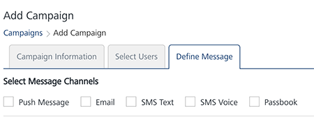

                           

Use Case Scenario: Two
======================

Sellscart runs a campaign to sell electronic goods at a discount price for a certain period and then pause it to resume again at a later time.

Solution
--------

You need to setup a campaign in the Engagement server that runs for a certain period and ends. You can restart such campaigns again as needed.

Description
-----------

Lisa serves as a sales manager in Sellscart and wants to run a campaign to sell electronic goods for a week, and pause it to resume again at a later time. Lisa knows that by promoting mobile campaigns, Sellscart can quickly start engaging customers on their mobiles.

Prerequisites
-------------

Following prerequisites should be fulfilled before sending a campaign to customers:

*   [Adding Applications in Engagement Server](#adding-applications-in-engagement-server)
*   [Adding Campaign Types](#adding-campaign-types)
*   [Adding Segments](#adding-segments)
*   [Adding Templates (push, SMS, email and pass)](#adding-templates-push-sms-email-and-pass)
*   [Adding Campaigns](#adding-campaigns)

> **_Note:_** Following topics are already covered in the Use Case Scenario: One  
\- Adding Email Configuration  
\- Adding SMS Configuration  
\- Adding Pass Configuration  

Adding Applications in Engagement Server
----------------------------------------

Lisa needs an app to add new customers, and send campaigns through push messages. The app should be developed cross platforms so the campaign can be received on all the devices (Android, Web, Windows, and iOS). In this section, Lisa learns how to create an app in Engagement server and publish it to send campaigns to customers. There are two basic steps to create an app.

*   [App Info](#app-info)
*   [Settings](#settings)

### App Info

Lisa enters a name for the app, such as, **Sellscart** and selects the app category from the drop-down list. Lisa clicks **Generate** to auto-generate the **Application ID**.

### Settings

Under the **Settings** section, Lisa needs to choose at least one platform (Apple, Android, Windows or Web) to save and publish the **Sellscart** app successfully.

After entering the required platform details, Lisa saves the app. The default status of a newly added app in Engagement server is unpublished. Lisa needs to publish the app as only published apps can be used for sending messages to customers

For more details about how to add a new app, refer: [Adding Apps](../../../../Foundry/vms_console_user_guide/Content/Apps/Adding_an_Application.md)

Adding Campaign Types
---------------------

The campaign type is set when a new campaign is created and the name is commonly used to refer the specific campaign. Lisa adds a new campaign type as **Sellscart**.

For more details about how to add a new campaign type refer, [Adding Campaign Types](../../../../Foundry/vms_console_user_guide/Content/Administration/General_-_Settings.md#Campaign)

Adding Segments
---------------

In this section, Lisa learns how to create a simple yet powerful segment to associate with Sellscart campaign. In Engagement Services creating a segment involves two basic steps:

*   [Segment Information](#segment-information)
*   [Define Conditions](#define-conditions)

### Segment Information

**Name (mandatory)**: Lisa enters a name for the segment as **Sellscart Buyers List.** Lisa receives a warning message, if a segment name is already defined. This warning is only a reminder that the segment is in use and Lisa needs to enter another name to define a segment.

### Define Conditions

Lisa wishes to run the Sellscart campaign in California State. As a prerequisites, Lisa first selects the attribute as Country and then State. The State attribute is co-dependent on Country attribute.

1.  **Conditions**: By default, the conditions column has **Condition One** set to the **First Name** attribute. The condition numbers are the references to the user attributes that are associated with that condition. The numbered conditions can be used to define different combinations for a segment definition.
2.  **Attributes**: Under the attributes column, Lisa selects the **Country** attribute from the drop-down list.
3.  **Operator**: Under the Operators column, Lisa selects the operator as **Contains** from the drop-down list. Lisa can compare a user attribute with a value by using a specified operator such as **Contains**, **Equal**, or **NotEqual**.
4.  **Value**: Under the **Value** column, Lisa selects United States from the drop-down list. The number of users appear under the **Users** column in the list view.
5.  **Conditions**: Lisa clicks **Add** to add a new condition row. A new condition is added with a number under the Conditions column in the grid.
6.  **Attributes**: Under the **Attributes** column, Lisa selects the **State** attribute from the drop-down list.
7.  **Operator**: Lisa selects the operator as **Contains** from the drop-down list.
8.  **Execute Conditions by**: Lisa can select the execute condition as **Match all conditions** or **Match any condition**, from the drop-down list. Based on the fulfilled conditions, the system inserts the number of users that qualify for the segment under the **Users** column.
    
    
    
    For more details about how to create a segment, refer: [Defining Segments](../../../../Foundry/vms_console_user_guide/Content/Segments/Adding_a_Segment.md)
    

Adding Templates (push, SMS, email and pass)
--------------------------------------------

A Template is a pre-set layout, which can be used to send campaigns in a short span with standardized content to all the targeted customers. There are four channels available to send campaigns to the customers. In this section Lisa learns how to create templates for all the channels to send campaigns to customers.

### Push Message

Lisa knows that a user may review products on the Sellscart site while using the Sellscart app but not necessarily buy it. So Lisa wants to be able to send a push notification whenever there is a discount or price reduction on the product. Lisa wants an eye-catching campaign with glossy images and text messages to attract customers buy online. Also Lisa wants to use tailor-made push templates for Sellscart.

Lisa can create two types of push templates in the Engagement server.

*   **Basic Push Message**: The Basic push template does not include an image or a rich text message.
    
    
    
*   **Rich Push Message**: The rich push template includes an image with a rich text message.
    
    
    
    For more details about how to create push template, refer: [Adding Push Template](../../../../Foundry/vms_console_user_guide/Content/Message_Template/Adding_Message_Templates.md)
    

### SMS Message

SMS is a really simple and accessible way of engaging customers. Most people send and receive text messages on a daily basis. So Lisa feels that SMS is a direct way to communicate Sellscart discounts and promotional offers to customers. Lisa can use tailor-made SMS message template to cater Sellscart requirements.

For more details about how to create SMS message template, refer: [Adding SMS Templates](../../../../Foundry/vms_console_user_guide/Content/SMS_Template/SMS_Template.md#Adding)

### Email Message

Emails are a good notification option to send festive offers or messages from discount sale campaigns, but it needs some precision while used as a notification channel in a campaign. Lisa wishes that in the email campaign:

*   The email should be rendered properly in multiple browsers.
*   The subject line should be concise and instantly appealing to get customers open the email campaign message.
*   Email notifications are not sent too often.
*   By analysing the market trend, discount campaigns should be sent to customers.

Lisa can use a tailor-made email message template to send attractive email campaigns to customers.

For more details about how to create Email message template, refer [Adding Email Templates](../../../../Foundry/vms_console_user_guide/Content/Email_Template/Email_Template.md#Adding)

### Pass Message (Coupon)

Lisa can also promote campaigns through mobile passes. Lisa can send promotional coupons, event tickets, membership cards, and store cards to lots of iOS users who use Apple to manage their digital passes.

Lisa can do pass updates on customers’ devices and intensify Sellscart offers when it really counts . Lisa can also use tailor-made pass templates to send attractive pass campaigns to customers.

For more details about how to create pass message templates, refer: [Adding Pass Templates](../../../../Foundry/vms_console_user_guide/Content/PassBook_Template/Passbook_Template.md#dding_a_Passbook_Template)

Adding Campaigns
----------------

In this section Lisa learns how to create and send a campaign to customers. Lisa visits the Campaigns page and clicks **Add Campaign** to open the **Add Campaign** page. The **Add** **Campaign** procedure includes three basic steps:

*   [Campaign Information](#campaign-information)
*   [Select Users](#select-users)
*   [Define Messages](#define-messages)

### Campaign Information

Lisa needs to enter the following information on the **Add Campaign** page:

1.  **Campaign Name**: Lisa needs to enter an apt name for the campaign. The campaign name is displayed to the customers who receive push, email, SMS or pass notifications.
2.  **Campaign Type**: Lisa needs to select suitable campaign type from the drop-down list.
3.  **Campaign Start Date**: When Lisa creates a new campaign, she can control how long it runs. If Lisa selects the start date as today, the campaign starts once the status is updated from pending to running.
4.  **Campaign End Date**: Lisa can set the campaign end date. The setting determines how long campaign is to run. When the campaign's end date and time arrives, the campaign stops running.

There may be times when Lisa creates a campaign but do not want it to start right away. For those times, Lisa can set campaign's start and end dates under the **Campaign Information** section for a later date and time.

For more details about how to define campaign information, refer: [Adding Campaigns](../../../../Foundry/vms_console_user_guide/Content/Campaigns/Adding_a_Campaign.md#Campaign)

### Select Users

**Segments**: Lisa selects the **Sellscart Buyers List** segment from the **Select a Segment** drop-down list. Thus all the customers from the California State can receive the Sellscart campaign.

For more details about how to select users, refer: [Selecting Users](../../../../Foundry/vms_console_user_guide/Content/Campaigns/Adding_a_Campaign.md#Select)

### Define Messages

Lisa can choose push message, email, SMS or passbook notification channel to send the campaign message text for the Sellscart campaign.

To define messages, Lisa can choose an existing template or create a new template. If Lisa wishes to select an existing template, can change the content without affecting the template. Thus any changes in the template are saved for this campaign only and do not change the default template. So Lisa can use the same template multiple times without worrying about changes from campaign to campaign.

To know more about Templates, refer [Adding Templates (Push, SMS, Email and PASS)](#adding-templates-push-sms-email-and-pass)

Lisa can also set channel priority to send messages to users through the **Settings** button available on the **Define Message** page. The **Settings** button becomes active when Lisa selects at least two channels. Channel priority in fact does not overwhelm users.

Many companies send repeat messages to make their brand well-known to customers. Lisa can send repeat campaign message to customers and set repeat message duration in hours, days or weeks.

For more details about how to define campaign messages, refer: [Defining Campaign Messages](../../../../Foundry/vms_console_user_guide/Content/Campaigns/Adding_a_Campaign.md#Define)

### Campaign statuses

There are three campaign statuses:

*   **Start**: A newly created campaign status is pending. Lisa needs to start the campaign manually from the Engagement services console.The campaign status as active indicates that the campaign is running normally.
    
    For more details about how to start campaign, refer: [Pending Campaigns](../../../../Foundry/vms_console_user_guide/Content/Campaigns/Pending_Campaigns.md)
    
*   **Pause**: Lisa can pause the campaign for varied reasons, such as:
    *   Lisa can have multiple campaigns running simultaneously. Based on priority, Lisa can pause some campaigns and resume them when paused campaigns are relevant again.
        
    *   Lisa can evaluate the customer data, who are visiting the Sellscart campaign to view products. When resuming the campaign, Lisa can use this data to target new customers with specific interest.
    *   Is the campaign able to generate interest in product among customers? If not, Lisa can revamp the campaign to suit the customers’ demands. Lisa can resume the campaign after modifications.
        
        For more details about how to pause a campaign, refer: [Pausing Campaigns](../../../../Foundry/vms_console_user_guide/Content/Campaigns/Pausing_a_Campaign.md)
        
    *   **Resume**: Lisa can resume a paused campaign again. The resumed campaign runs till the end date.
        
        For more details about how to resume a campaign, refer: [Resuming Campaigns](../../../../Foundry/vms_console_user_guide/Content/Campaigns/Resuming_a_Campaign.md)
        
        
