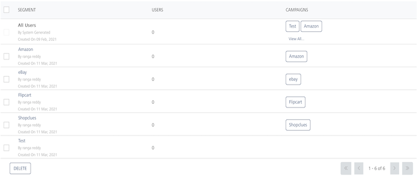
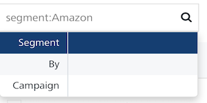
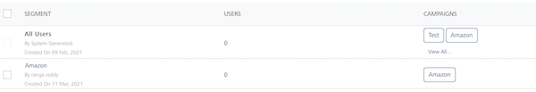
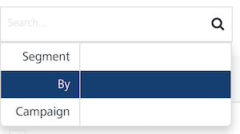
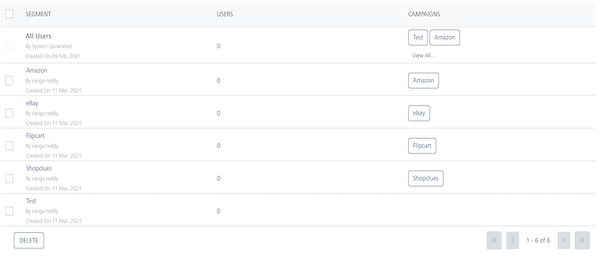
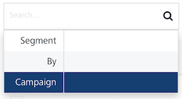
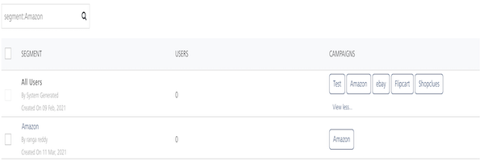
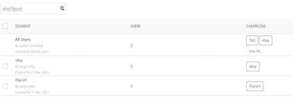

                             

Segments
========

A segment is obtained from different condition sets based on a user's attributes (First Name, Last Name, Email, Mobile Number, Country, State, Location, Beacon, Country, State, and any user defined attribute) and the OS of the device (Android or iOS). For example, the **Discount-Offers** **segment** includes users who live in the USA (user attribute – Country) and residents of California (user attribute – State). A segment is added in a campaign and used to send messages to users. For example, the **Discount-Offers campaign** includes the Discount-Offers segment to send discount offers to users from California State.

> **_Important:_** As a user, you must have the following permissions to access the Segments home page and perform different tasks based on the role.  
  
    - ROLE\_SEGMENTS\_ALL  

From the **Engagement** section, click **Segments** from the left panel. The **Segments** home page appears.

> **_Important:_** By default, the Segment column displays **All Users** segment. The All Users segment includes all the users present in Volt MX Engagement Services. The All Users segment can be used in campaigns and adhoc messages.

The **Segments** home page displays the following details:

*   **Add Segment** button: Helps you add new segments to the list.
*   **Search** field: Click in the **Search** field to view options to search for a segment. You can search segments based on the following search criteria:
    
    *   **Segment**: Enter the segment name in the **Search** field and click **Enter**.
        
        
        
        The segment appears in the list view.
        
        
        
    *   **By:** Enter the name of the creator who creates the segment.
        
        
        
        The segment appears in the list view.
        
        
        
    *   **Campaign**: Enter a name of the campaign connected with the segment.
        
        
        
        The segment appears in the list view.
        
        
        
        > **_Note:_** To clear your search result, click in the Search field to view the Segments page.
        
    *   **Searching without Labelling with Multiple Parameters**: Enter the required parameters with a space in the **Search** field. For example, the following image displays search results for two segments based on the entered parameters.
        
        
        
    
    The **Segments** list view displays the following details:
    
    | Segment Elements | Description |
    | --- | --- |
    | Segment | The column displays the segment name. The following details are displayed below the segment name:- Name of the owner who added the segments- Date on which the segment is created |
    | Users | The column displays the number of users who are linked with the segment |
    | Campaigns | The column displays the number of campaigns associated with the segment |
    | Delete button | The button helps you delete added segments from the list |
    | Display Controls | By default, the number range is set to 20 so that only 20 segments are displayed in the grid. You can view more segments through the forward arrow icon. You can navigate back through the backward arrow icon. |
    

You can do the following tasks from the **Segments** page:

*   [Adding Segments](Adding_a_Segment.md)
*   [Modifying Segments](Modifying_a_Segment.md)
*   [Deleting Segments](Deleting_a_Segment.md)
