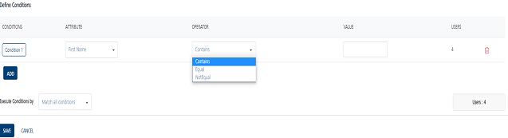
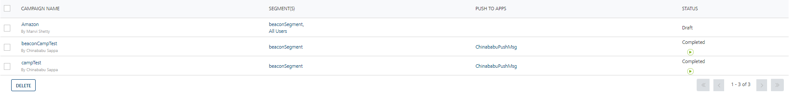
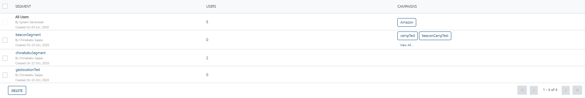
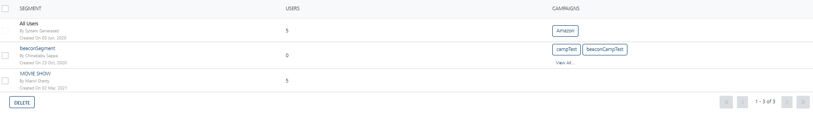
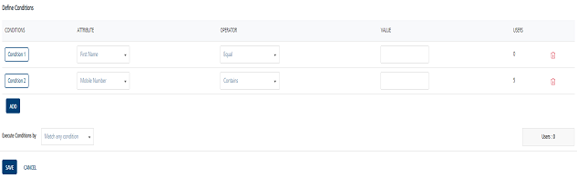
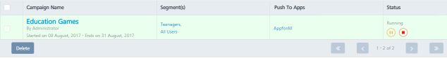
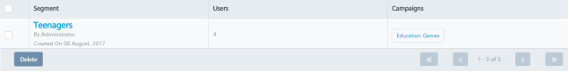
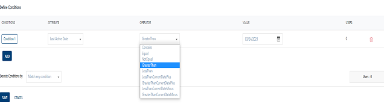
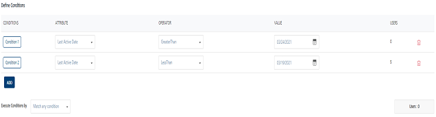

                            

Attribute type - Date (Dynamic User Attribute)
==============================================

In Engagement Services, the **Campaign** execution revolves around time. Now with newly introduced date operators, you can segment users based on relative time.

The segments with user attribute type as **Date** are useful to send campaign notifications to users based on various criteria. For more information about how to add Date attribute, see [Adding User Attributes](../../../../Foundry/vms_console_user_guide/Content/Administration/Adding_Attributes_to_Audience.md)

Use Case Scenarios
------------------

The following use case scenarios explain the newly introduced operators.

*   [Use Case Scenario : One](#use-case-scenario-one)
*   [Use Case Scenario : Two](#use-case-scenario-two)
    

### Use Case Scenario : One

The Admin runs a campaign **Movie-Show** to notify about the upcoming movie show to users. The campaign starts from **August 1, 2017** and ends on **August 31, 2017**. The campaign sends a notification to the users one day prior to their movie show day. The users who are added with user attribute type as **Date** in the segment and satisfying the date operator condition receive the campaign notification.

The following users are added in Volt MX Engagement Services with user attribute type - Date named as **Movie Show Date**.

  
| User Name | User Attribute Type - Date (Movie Show Date) |
| --- | --- |
| User One | 08/06/2017 |
| User Two | 08/07/2017 |
| User Three | 08/08/2017 |
| User Four | 08/09/2017 |
| User Five | 08/10/2017 |
| User Six | 08/11/2017 |

  
The Admin uses the following date operators:  
\- LessThan CurrentDate + {days}  
\- GreaterThan CurrentDate – {days}

### LessThan CurrentDate + {days}

\- The selected Date operator is: `LessThan CurrentDate + {days}`  
\- The current date is August 7, 2017.  
\- In the **Define Conditions** grid, under the **Value** column, you enter the value as 2 days.  
\- The attribute type **Date** condition is satisfied for the Use One, User Two, and User Three. The system displays three users under the **Users** column.

### GreaterThan CurrentDate - {days}  

\- The selected Date operator is: `GreaterThan CurrentDate + {days}.`  
\- The current date is August 7, 2017.  
\- In the **Define Conditions** grid, under the **Values** column, you enter the value as 0 days.  
\- The attribute type **Date** condition is satisfied for the Use Three, User Four, User Five and User Six and the system displays four users under the **Users** column.

When Admin selects the **Match all conditions** option, the system displays one user who satisfies the segment definition and receives the movie show notification before one day of the show. The recipient user is the User 3.

The following image displays that the campaign **Movie-Show** is connected with the segment **Movie-Show**.

The following image displays that the segment **Movie-Show** includes one user and connected with the campaign **Movie-Show**.

 

Thus, as the campaigns continues to run till August 31, 2017, new users who satisfy the campaign segment criteria receive the campaign notifications. For example, on August 10, 2017 only the User 6 satisfies the segment criteria and receives the movie show notification.

### Use Case Scenario : Two

The Admin runs a campaign **Education Games** for the teens in the age group of 15 to 19 to buy electronic learning games online. The campaign sends a promotion message to users to make them aware about several interactive electronic learning games. The campaign starts from **August 1, 2017** and ends on **August 31, 2017**. The users who are added with user attribute type as **Number** in the segment and satisfying the operator condition receive the campaign notification.

The following users are added in Volt MX Engagement Services with user attribute type - **Number** named as **Age**.

  
| User Name | User Attribute Type - Number (Age) |
| --- | --- |
| User Seven | 18 years |
| User Eight | 17 years |
| User Nine | 19 years |
| User Ten | 19 years |

  
The Admin uses the following number operators:

\- LessThan

\- GreaterThan

### LessThan

\- The selected Number operator is: `LessThan`.  
\- In the **Define Conditions** grid, under the **Value** column, you enter the value as 20 years.  
\- The attribute type **Number** condition is satisfied for the Use Seven, User Eight, User Nine, and User Ten. The system displays four users under the **Users** column.

### GreaterThan

\- The selected Number operator is: `GreaterThan`.  
\- In the **Define Conditions** grid, under the **Value** column, you enter the value as 15 years.  
\- The attribute type **Number** condition is satisfied for the Use Seven, User Eight, User Nine, and User Ten. The system displays four users under the **Users** column.

When Admin selects the **Match all conditions** option, the system displays four users who satisfy the segment definition and receive the Education Games campaign.

The following image displays that the campaign **Education Games** is connected with the segment **Teenagers**.

The following image displays that the segment **Teenagers** includes four users and connected with the campaign **Education Games**.

Last Active Date
----------------

By default, the **Recent Activity** timestamp is associated with a user. The new feature is introduced in the Engagement Services release 8.0. The timestamp is generated when a user is created for the first time either using the UI or the API. The timestamp is displayed on the **User Details** page along with the other user attributes. The release 8.0 introduces the Recent Activity timestamp as **Last Active Date** user attribute. You can use the Last Active Date attribute (attribute type - date) to create segments.

Let us understand how to create a segment using Last Active Date Attribute. The following users are added in to Volt MX Engagement Services.

  
| User Name | User Attribute Type – Last Active Date |
| --- | --- |
| User Five | 08/17/2017 |
| User Six | 08/17/2017 |
| User Seven | 08/23/2017 |
| User Eight | 08/24/2017 |

  
The Admin uses the following date operators:  
\- GreaterThan  
\- LessThan  

### GreaterThan

\- The selected Date operator is: `GreaterThan`.  
\- In the **Define Conditions** grid, under the **Value** column, you select the date as August 16, 2017.  
\- The attribute type **Date** condition is satisfied for the Use Five, User Six, User Seven, and User Eight. The system displays four users under the **Users** column.

### LessThan

\- The selected Date operator is: `LessThan`.  
\- In the Define Conditions grid, under the Value column, you select the date August 25, 2017.  
\- The attribute type **Date** condition is satisfied for the Use Five, User Six, User Seven, and User Eight. The system displays four users under the **Users** column.

When Admin selects the **Match all** conditions option, the system displays four users who satisfy the segment definition.

