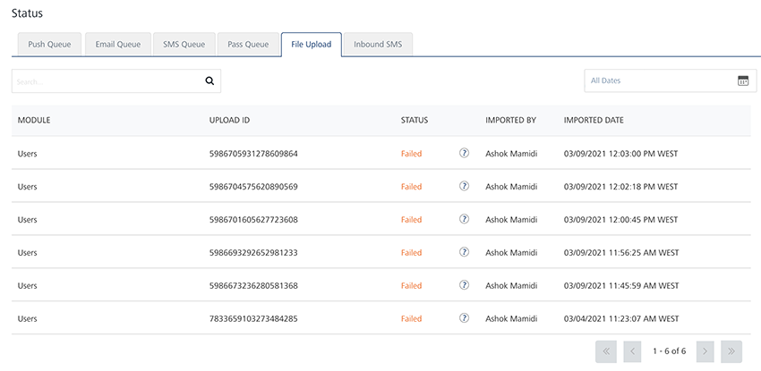
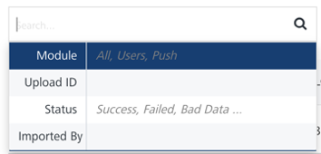
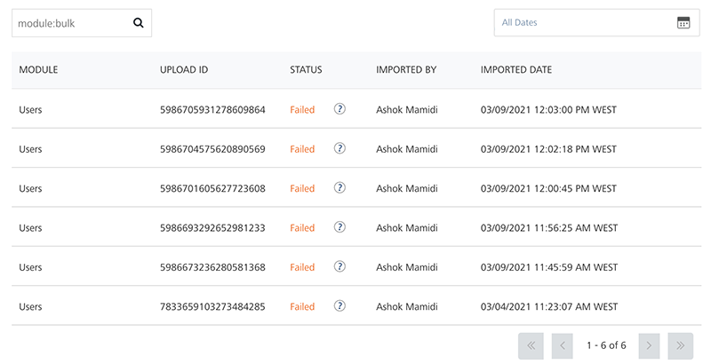
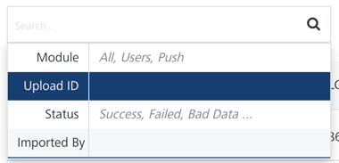
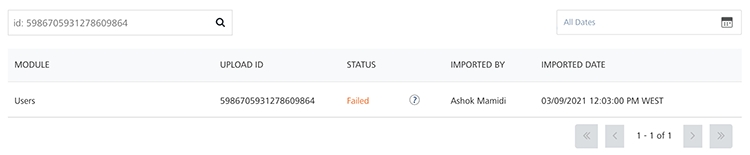
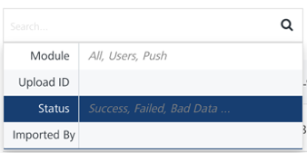
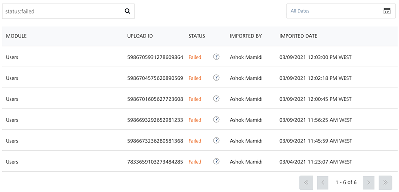
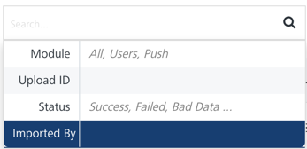
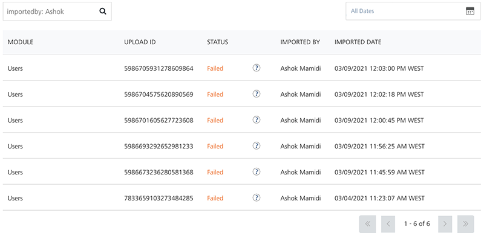

                            

File Upload
===========

The **File Upload** home page displays the file upload status for **Geofence**, **Users**, **Events**, and the **Templates** (push, email, SMS, and pass) modules.

The **File Upload** page displays the following details:

*   **All Dates** calendar: To use **All Dates**, see [All Dates](../Dashboard/Dashboard.md#All_Dates)
*   **Search** field: Click in the **Search** field to view options to search an uploaded file. You can search the uploaded files based on the following criteria:
    *   **Module**: Enter the module name in the **Search** field and click **Enter**.
        
        
        
        The uploaded file details appears in the list-view.
        
        
        
    *   **Upload ID**: Enter the upload ID in the search field and click **Enter**.
        
        
        
        The uploaded file details appears in the list-view.
        
        
        
    *   **Status**: Enter the file uplad status as **Bad data**, **Success** or **Failed** in the **Search** field and click **Enter**.
        
        
        
        The uploaded file details appears on the home page.
        
        
        
    *   **Imported By**: Enter the name of the person who imported the file and click **Enter**.
        
        
        
        The uploaded file details appears in the list-view.
        
        
        
        > **_Note:_** To clear your search result, click in the Search field to view the **File Upload** page.
        

The **File Upload** **Status** list-view contains the following details:

  
| File Upload Elements | Description |
| --- | --- |
| Module | The column displays the file upload details for the specific module, such as Geolocation, User, and Events |
| Upload ID | The column displays the unique id that is associated with the upload |
| Status | The column displays the current status of the file upload |
| Imported By | The column displays the user name who imported the files |
| Imported Date | The column displays the time stamp details of when file was imported |
