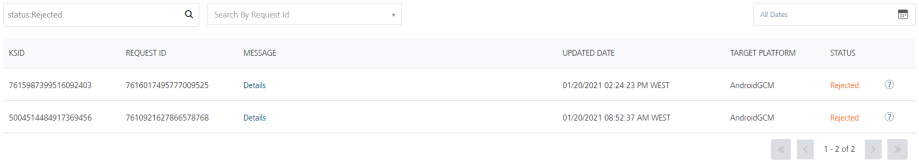

                              

Push Queue
==========

The **Push Queue** page displays the status of a push message for every single subscriber. The **Status** column displays the message status as submitted, initial or rejected. Under the **Status** column, hover over an icon next to the message status to view more details. For example, you can view reasons for the **Undelivered**, **Rejected** and **Cancelled** push messages. For more details, see [Status Messages](#Status).

By default, the **Push Queue** tab is set to active.

The **Push Queue** page displays the following details:

*   **Cancel Message**: Click the **Cancel Message** button to cancel a message. For more details, see [Cancel Messages](#cancel-messages-for-cloud).

> **_Note:_** This feature is only available on Volt MX Foundry Cloud Environment.

*   **Date** calendar: The default date is set to the current date. To use **All Dates**, see [All Dates](../Dashboard/Dashboard.md#All_Dates).
*   **Message** column: Click the **Details** link to view the push message details. The **Json Structure** message box displays the push notification in JSON format.
    
    
    
    Click **Close** to close the window.
    
*   **Search** field: Click in the **Search** field to view options to search a message. You can search messages based on the following criteria:
    
    *   **KSID**: Enter the **KSID** in the **Search** field and click **Enter.**
        
        
        
        The message appears in the list view.
        
        
        
    *   **Request ID**: Enter the request ID in the **Search** field and click **Enter**.
        
        
        
        The message appears in the list view.
        
        
        
    *   **Target Platform**: Enter the platform name in the **Search** field and click **Enter**.
        
        
        
        The message appears in the list view.
        
        
        
    *   **Status**: Enter the status in the **Search** field as **Submitted**, **Rejected** or **Initial** and click **Enter**.
        
        
        
        The message appears in the list view.
        
        
        
    
    > **_Note:_** To clear your search result, click in the Search field to view the Status page.
    
    The **Message** list view displays the following details:
    
    | Message Element | Description |
    | --- | --- |
    | KSID | The column displays **VoltMX Subscription Identification** number of the application. Volt MX Engagement services generates the identification serial number based on your request for a subscription, such as an application ID, a device ID, and a SID. |
    | Request ID | The column displays the unique ID assigned to push messages. |
    | Message | The column displays a link (Details). Click the link to view a push message details. |
    | Updated Date | The column displays the last updated time stamp details. This can be the timestamp when a message is sent, a message updated, or a message opened. |
    | Target Platform | The column displays the targeted platforms to which the message is sent |
    | Display controls | By default, only 20 messages are displayed in the list view. You can view more screens by navigating through the forward arrow icon. You can move back through the backward arrow icon. |
    

*   **Status**: The column displays the current status of the push message. You can use the filter from the **Search** drop-down list to sort the push messages based on the status. The following table explains the status messages:

  
| Status | Description |
| --- | --- |
| **Initial** | The Engagement Services has initiated the message to be sent. |
| **Submitted** | The Engagement Services has sent the message to the cloud platform. |
| **Undelivered** | The Engagement Services tried to send a message, but it is undelivered to cloud platform due to any possible reasons. |
| **Rejected** | The Engagement Services tried to send a message, but it is rejected by cloud platform. For example, GCM key is expired. |
| **Canceled** | The Engagement Services did not try to send the push message as it is cancelled. |
| **Opened** | Subscriber of the application opened the message sent by the Engagement Services. |
| **Not Attempted** | The Engagement Services did not try to send the message because the cloud platform details are missing. |
| **Not Applicable** | The Engagement Services did not try to send the message because the Web Subscriptions are selected as part of Silent Push. |

Cancel Messages (for Cloud)
---------------------------

> **_Note:_** This feature is only available on Volt MX Foundry Cloud Environment.

The **Cancel Messages** page opens up when you click on the **Cancel Message** button. You can select the messages you want to cancel.

> **_Note:_** You can only cancel messages that are in the **Initial** state.

The **Cancel Messages** page displays the following details:

*   **All Request ID** list: It displays a list of messages based on the Request IDs.
*   **Date** calendar: The default date is set to the current date. To use **All Dates**, see [All Dates](../../../../Foundry/vms_console_user_guide/Content/Dashboard/Dashboard.md#reports)
*   **Cancel**: Select the messages you want to cancel by selecting the checkbox against the message. Then click **Cancel**.

The **Message** list view displays the following details:

  
| Message Element | Description |
| --- | --- |
| Request ID | The column displays the unique ID assigned to push messages. |
| Message | The column displays a link (Details). Click the link to view the details of a push message. |
| Created Date | The column displays the time stamp details of the time when the push message is created. |
| Start Date | The column displays the time stamp details of the time when the push message is to be sent |
| Expiry Date | The column displays the time stamp details of the time when the push message will expire. |
| Message Status | The column displays the current status of the push message. By default, the Message Status is Initial (since you can only cancel messages that are in the Initial state). |
| Display controls | By default, only 25 messages are displayed in the list view. You can view more screens by navigating through the forward arrow icon. You can move back through the backward arrow icon. |
