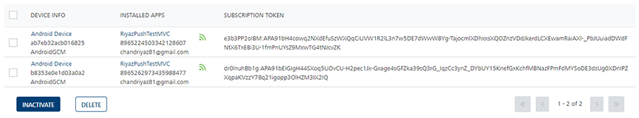
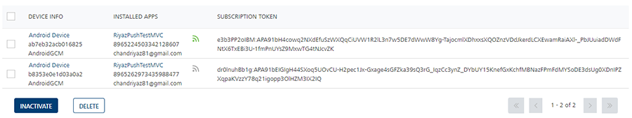
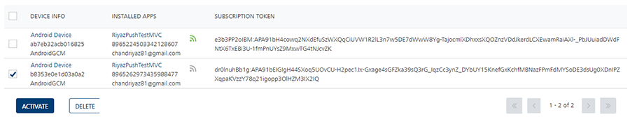

                           

Deleting a Subscription
=======================

Based on your requirement you can delete a subscription from **Engagement** server. Before deleting a subscription, you need to inactivate the subscription.

**To delete a subscription, follow these steps:**

1.  In the **Devices** list view, under the **Device Info** column, select the check box next to the subscription name, you want to delete.
    
    
    
2.  Click the **Inactivate** button.
    
    The system displays the **Notification** dialog box with a warning message asking if you want to unsubscribe the selected subscribers.
    
3.  Click **Cancel** if you do not want to inactivate the subscription. The **Notification** dialog box closes without deleting the subscription.
4.  Click **Yes** to continue.
    
    The system displays the confirmation message that the subscriber status updated successfully. The icon of the installed app turns to gray under the **Installed Apps** column. The subscription is unsubscribed and cannot receive notifications.
    
    
    
5.  Select the checkbox of the inactivated subscription under the **Device Info** column.
    
    The **Delete** button turn into active.
    
    
    
6.  Click the **Delete** button.
    
    The system displays the **Notification** dialog box with a warning message asking if you want to delete the selected subscribers.
    
7.  Click **Cancel** if you do not want to delete the subscription. The **Notification** dialog box closes without deleting the subscription.
8.  Click **Yes** to continue.
    
    The system displays the confirmation message that the subscriber deleted successfully. The deleted subscription is no longer displayed in the list view.
