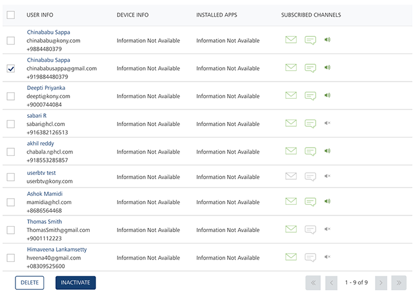

                           

Deleting a User
===============

As an administrator, you can delete any user as required.

To delete a user, follow these steps:

1.  In the **Users** list view, under the **User Info** column, select the check box next to the user name you want to delete.
    
    
    
2.  Click the **Delete** button. You can either select a single user or select all the listed users to delete in a single click of the **Delete** button.
    
    The system displays the **Delete User** dialog box asking if you want to delete the selected users.
    
3.  Click **Cancel** if you do not want to delete the user. The **Delete User** dialog box closes without deleting the user.
4.  Click **Yes** to continue.
    
    The system displays the confirmation message that the user is deleted successfully. The deleted user is no longer displayed in the list view.
