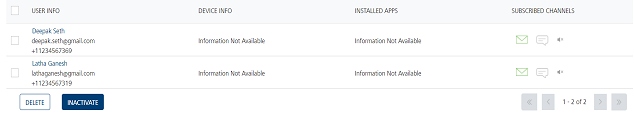
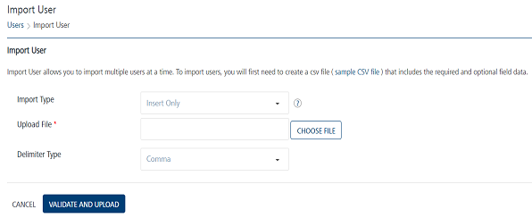
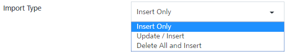
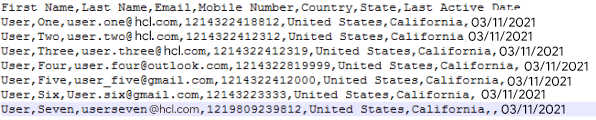
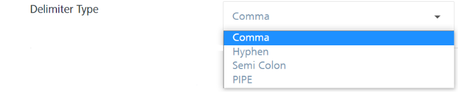
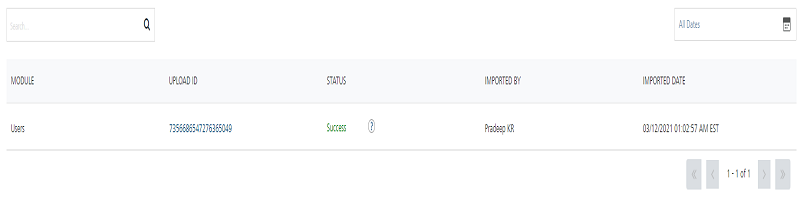

                           

Importing Users
===============

You can add users into **Engagement** Services by using the **Import Users** button. The feature enables you to do a bulk import of users.

When you set the **Mobile Number** as the reconciliation key, the **Mobile Number** becomes the mandatory field. When you import users without specifying the mobile number, the system displays the **Bad Data** error under the **Settings** > **Configuration** > **Status** > **File Upload** list view > **Status** column. For example, the following **Download Errors** file displays the error message that the mobile number is required.

To import users successfully, specify the mobile number of the user (Deepak Seth). The user is imported successfully. You can view the user Deepak Seth in the Users list view.

To import users, follow these steps:

1.  On the **Users** page, click the **Import Users** button to navigate to the **Import User** page.
    
    The **Import User** page appears.
    
    
    
    > **_Important:_** You can import any number of users either by using the sample .`CSV` file or creating a .`CSV` file that contains all the mandatory fields.  
    
2.  To use the sample .`CSV` file, click the link: `sample.CSV` file.
    
    The system downloads the `sample.CSV` file on your local system.
    
3.  **Import Type**: Select the desired option from the drop-down list. There are three options to import users in bulk.
    *   **Insert Only**: By default, the Import Type option is set to Insert Only. The option reads the data in the file and inserts users in the Engagement server. If insert fails, the system displays an error.
    *   **Update**/**Insert**: The option reads the data in the file and tries to update each record first. If the record update fails, the system inserts the new records.  
        
    *   **Delete All and Insert**: The option deletes existing user data and inserts new data in the Engagement server. As a prerequisite, you need to take backup of your data before selecting the option.
        
        
        
4.  **Upload File**: Click the **Choose File** button to locate your .`CSV file`, and click the **Open** button.
    
    The uploaded `.CSV` file name appears in the **Upload File** field.
    
    If you create a .`CSV` file, then data entered in your `.CSV` file should have all the mandatory fields. For example, the **First Name**, **Last Name**, **Email**, **Mobile Number**, **Country**, **State**, and **Last Active Date**. You can use alphanumeric and special characters to fill in the data.
    
    You can either enter the current date in the `CSV` file or ignore it. If you do not specify the date, the system takes the current date as the last active date. For example, the date is not specified for the **User Seven** in the sample `CSV` file displayed below:
    
    
    
5.  **Delimiter Type**: Select the type of delimiter from the **Delimiter Type** drop-down list, such as comma (,), hyphen (-), semicolon (;) or PIPE. By default, the **Delimiter Type** drop-down list is set to **Comma**.
    
    
    
6.  If you do not want to validate and upload the .`CSV` file, click the **Cancel** button to exit from the window without saving any information.  
    
7.  Click the **Validate and Upload** button to check details in the uploaded .`CSV` file.
    
    If the file upload is successful, the system displays the confirmation message that the file uploaded successfully and import is in progress. The system also displays the assigned request ID. You can track the uploaded file status through the request ID under the **Settings** > **Status** > **File Upload** section.
    
    > **_Important:_** If you see any error notifications, you need to correct those fields in your `.CSV` file and re-validate the file. You may encounter the following error messages:  
    1\. If the selected file format is not correct, the system displays the warning message to upload a .`CSV` file.  
    2\. If some required attributes (in the header) are missing in the uploaded file, the system displays a warning message to check if the delimiter or the selected delimiter types are missing.
    
8.  To view the current status of user import, click the request ID.
    
    The **Settings** > **Status** > **File Upload** page appears. You can view the uploaded file status under the **Status** column.
    
    
