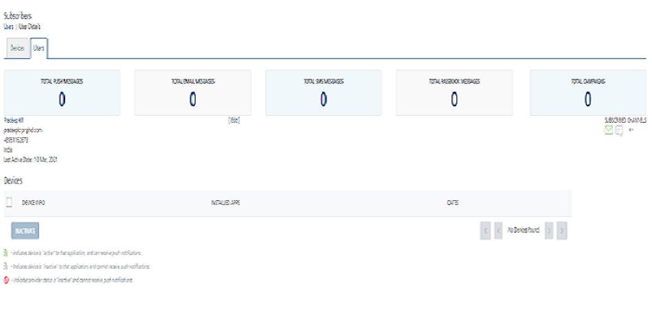
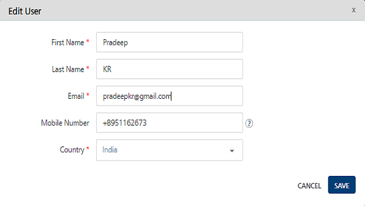

                            

Modifying a User
================

You may need to modify a user's details, such as updating the email address or mobile number.

To view or modify a user, follow these steps:

1.  On the **Users** home page, under the **User Info** column, click the user you want to view or edit. The **User Details** page appears.
    
    
    
2.  Click the **Edit** button next to the user name.
    
    The **Edit User** window appears.
    
    
    
3.  In the **Edit User** window, you can update the following user details:
    
    | User Element | Description | Modification Allowed |
    | --- | --- | --- |
    | First Name | First (given) name of the user | Yes |
    | Last Name | Last name (surname) of the user | Yes |
    | Email | Email address of the user | Yes |
    | Mobile Number | Mobile phone number of the user | Yes |
    | Country | Country to which the user belongs | Yes |
    | State | State (United States of America) to which the user belongs | Yes |
    
4.  Click **Cancel** if you do not want to update the user details. The window closes and returns to the **User Details** page.
5.  Click **Save**. The updated user details appear on the **User Details** page. The system displays the confirmation message that the user details saved successfully.
