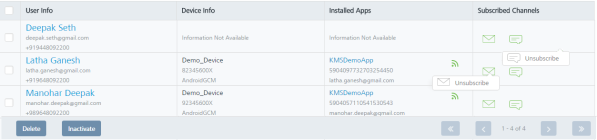
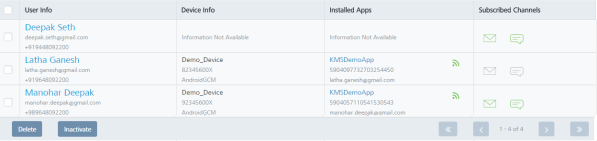
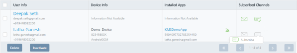
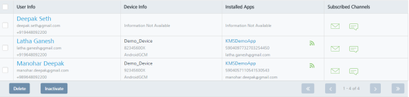

                           

Subscribing or Unsubscribing a Channel
======================================

An administrator can subscribe or unsubscribe a specific notification channel for a user. When a user is unsubscribed for a channel, the user does not receive messages from that channel.  
You can also subscribe or unsubscribe a channel through **Audience** API. The **Audience** API helps you pull user information and present it on the app, and gives an option to update the data.

**To unsubscribe a channel, follow these steps**:

1.  Navigate to the **Users** list view. Under the **Subscribed Channels** column:
    
    *   Click the text dialog icon to unsubscribe SMS.
    *   Click the envelope icon to unsubscribe emails
    
    The **Unsubscribe** link appears.
    
    
    
2.  Click the **Unsubscribe** link.
    
    The system displays the **Unsubscribe** dialog box with the warning message asking if you want to unsubscribe.
    
3.  Click **Cancel** if you do not want to unsubscribe the user. The **Unsubscribe** dialog box closes without unsubscribing the user.
4.  Click **Yes** to continue.
    
    The system displays the confirmation message that the user status is updated. The user is unsubscribed for the specific channel. The green icons turns gray.
    
    
    

**To subscribe to a channel, follow these steps**:

1.  Navigate to the **Users** list view. Under the **Subscribed Channels** column, click the envelope icon or the text dialog icon to subscribe.
    
    The system displays the **Subscribe** dialog box with the warning message asking if you want to subscribe.
    
    
    
2.  Click **Cancel** if you do not want to subscribe the user. The **Subscribe** dialog box closes without subscribing the user.
3.  Click **Yes** to continue.
    
    The system displays the confirmation message that the user status is updated successfully. The user is subscribed for the specific channel. The gray icon turns green.
    
    
