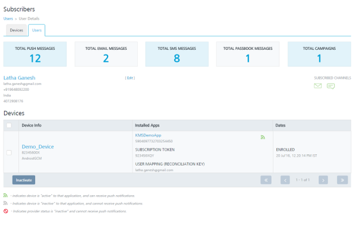

                           

Viewing a User
==============

You can view statistics for an individual user.

To view statistics for an individual user, follow these steps:

1.  Under **Overview**, click **Subscribers**.
    
    The **Subscribers** page appears. The **Subscribers** page includes two tabs: **Devices** and **Users**.
    
2.  Click the **Users** tab.
    
    The **Users** home page appears.
    
3.  Click the desired user from the list view to view the data.
    
    The **Users Details** page appears.
    
    
    
    Label
    -----
    
    On the **User Details** page, you can view the following labels:
    
    *   **Total Push Messages**: Displays the total number of pushes sent to a user's device.
    *   **Total Email Messages**: Displays the total number of emails sent to a user from the **Engagement** server.
    *   **Total SMS Messages**: Displays the total number of SMS sent to a user from the **Engagement** server.
    *   **Total Passbook Messages**: Displays the total number of passbook messages sent to a user.
    *   **Total Campaigns**: Displays the total number of campaigns associated with a user.
    
    User
    ----
    
    Below labels, you can view the user name, user email ID, mobile number (if provided), country, state (if selected country is United States), and the **Recent Activity** timestamp. If dynamic attributes are added, the section also displays the dynamic attributes, for example, Social Security Number.
    
    
    
    Devices
    -------
    
    The Devices list view displays the following details:
    
    *   **Device Info**: The Device Info column displays the device name, the device ID, and the corresponding platform of each device associated with the user.
    *   **Installed Apps**: The Installed Apps column displays the app name, KSID, subscription token, and the reconciliation key of every app that is installed on the device of the user.
    *   **Dates**: Displays the date and time when the application is installed on the device.
