                           

Demo App QuickStart Guide (for Android Devices): Configuration of the Geoboundaries in the Engagement Sever

Configuration of the Geoboundaries in the Engagement Sever
==========================================================

The section discusses the creation and the configuration of the geoboundaries which are used in the geoboundary monitoring of the Engagement demo application. The steps for the creation and configuration of the Engagement server are as follows:

1.  Log in to the Engagement Services console. Under **Engagement**, click **Location**. The **Location** home page appears.
    
    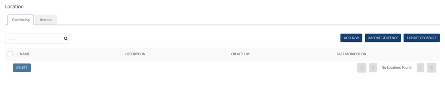
    
2.  Click the **Add New** button to create a new geoboundary.
3.  The **Add Location** page appears.
    
    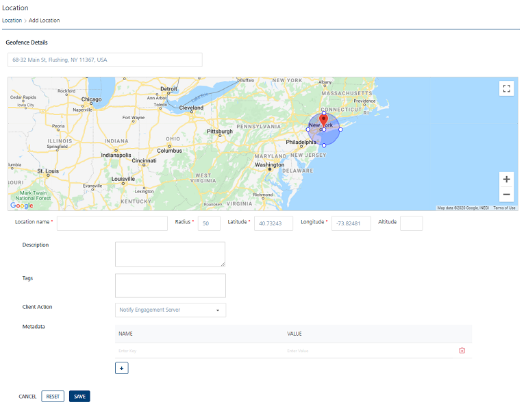
    
4.  Enter details for the following fields:
    
    *   Enter the Address of the location (where the geoboundary needs to be set up) in the Address field under the **Geofence** header.
        
        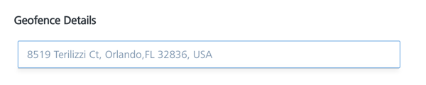
        
        The Google map displays the location with a red icon.
        
        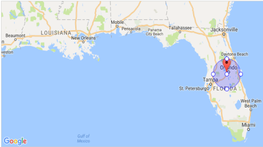
        
    *   **Location Name**: Enter the location name as **TestWithNotifyEngagement** in the Location Name field.You can enter alphanumeric characters only.
    *   **Radius**: Enter the radius as 0.1 mile. The **Latitude** and **Longitude** values will be prepopulated based on the address entered.
        
        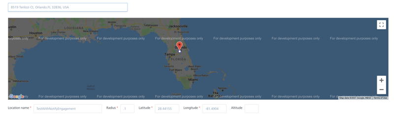
        
        > **_Important:_** The Location Name, Radius, Latitude, and Longitude are the mandatory fields. If you do not enter the details, the system displays an error message that information is required. The altitude option is used only with a pass.
        
    *   **Description**: Enter a description for the geoboundary in the **Description** field such as **OrlandoLocation**.
    *   **Tags**: Enter a tag value such as **OrlandoLocation**.
    *   **Client Action**: The client action is a drop-down list with three options. Choose the client action as **Notify Engagement Server** from the drop down list.
        
        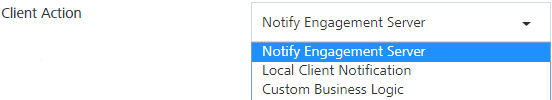
        
        The client action as **Notify Engagement Server** means that the client application needs to update its location when the application/device enters the geoboundary.
        
        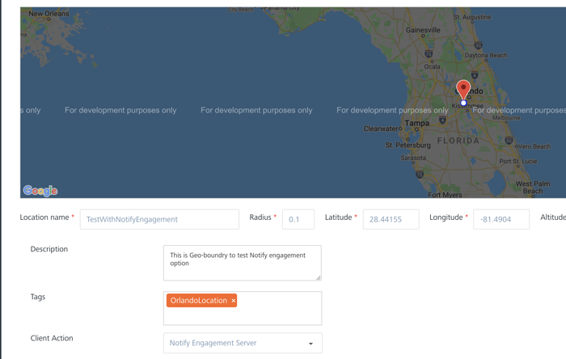
        
    *   **Metadata**: The **Metadata** section allows you to enter metadata associated with the geoboundary. In the example, **storeOpenTime** and **storeCloseTime** are are entered as metadata fields.
        
        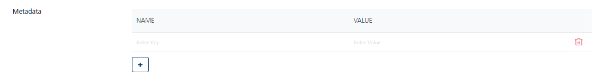
        
    *   Click **Cancel** to close the window.
    *   Click **Reset** to reset the entry fields.
    *   Click **Save**. The newly added geofence appears in the Geofencing list view. A confirmation message appears stating that the location is saved successfully.
    
    ### Second Geoboundary
    
5.  Next create another geoboundary with a different client action. Enter the same address of the location where the geoboundary needs to be set up. Enter the name as **TestWithLocalClientNotification**, with radius value as 0.1 mile. The Latitude and longitude values are prepopulated based on the address entered.
6.  Enter a description for the geoboundary in the **Description** field. Enter a tag value. In this example, it is called as **OrlandoLocation**. Choose the client action as **Local Client Notification** from the drop- down list. You also enter the local notification message to be displayed.The client action as **Local Client Notification** means that the client application needs to display the local notification when the application/device enters the geoboundary.
7.  Enter the local notification message. Create two metadata fields as **StoreOpenTime** and **StoreCloseTime** to be associated with the geoboundary.
    
    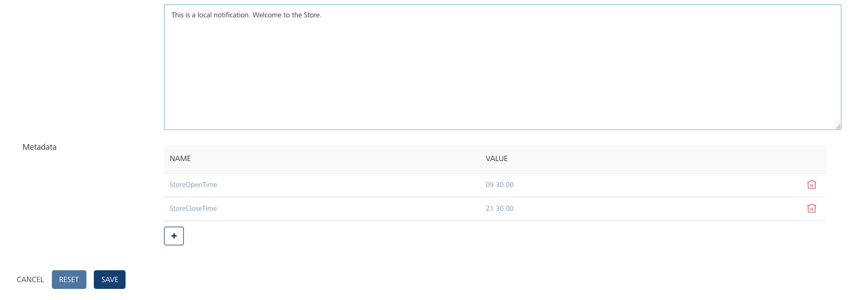
    
8.  Click **Save** to save the geoboundary.
    
    ### Third Geoboundary
    
9.  Next create another geoboundary with a different client action. Enter the same address of the location where the geoboundary needs to be set up.
10. Enter the name as **TestWithCustomBusinessLogic**, with radius as 0.1 mile. The Latitude and Longitude values are prepopulated based on the address entered.
11. Enter a description for the geoboundary in the **Description** field. Enter a tag value. In this example, it is called as **OrlandoLocation**. Choose the client action as **Custom Business Logic** from the drop- down list. Enter any java script to execute.
    
    The client action of **Custom Business Logic** means that the client application needs to execute the java script associated with the geoboundary when the application/device enters the geoboundary.
    
    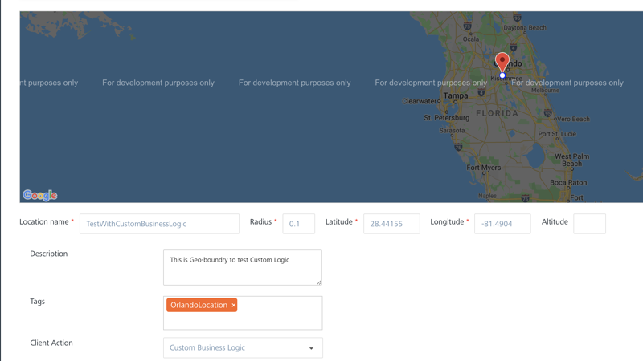
    
12. The following images displays the custom java script to be executed on the client application. The image displays a sample java script to display a welcome message with a coupon when the user visits the store when it is open. If the user visits the store when it is closed, then a message when the store will be opened is displayed.
    
    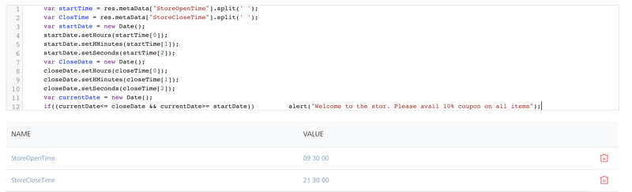
    
13. Enter the metadata fileds and click **Save** to save the geoboundary.
    
    Now you have created three geoboundaries with three different client actions.
