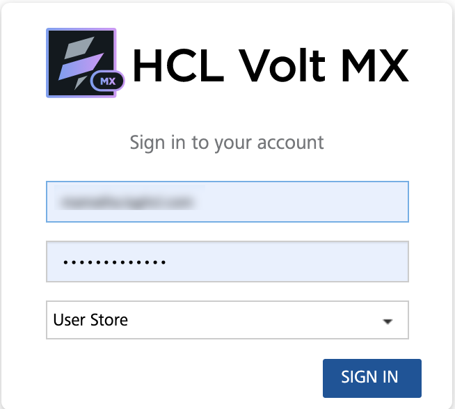
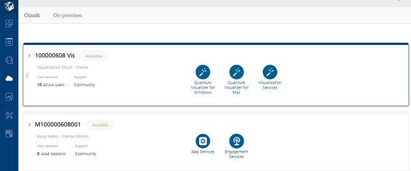

                           

Demo App QuickStart Guide (for Android Devices): Configuring Email and SMS Service Providers Using Engagement Services Console

Configuring Email and SMS Service Providers Using Engagement Services Console
=============================================================================

The section explains how to configure email and SMS service providers using the Engagement Services console to send email and SMS notifications to users and subscribers.  
  
**To configure email and SMS service providers, follow these steps**:

1.  Open an Internet browser.
2.  Enter the URI: _manage.hclvoltmx.com_ in the address field and press the **Enter** key.
    
    The **Sign in to your HCL Account** page appears.
    
    
3.  Enter your email address and password. Click **Sign in** to continue.
    
    The system displays the **VoltMX Foundry** homepage.
    
    
4.  **VoltMX Foundry** home page: Click **Environments** in the left panel.
    
    The **Clouds** page appears.
    
    
    
5.  Click the **Engagement Services** tab.
    
    The **Engagement Services** home page appears.
    
6.  Under **Engagement** services in the left panel, click **Configuration** under the **Settings** section.
    
    The **Configuration** page appears.
    
7.  In the **Configuration** homepage, click the **Email Configuration** tab.
    
    The system displays the **Email Configuration** page. The **Email Configuration** page includes the two sections: **Email Configuration** and **Custom Properties**.
    
    
    
8.  To set **Email Configuration**, follow these steps:
    *   **Email Configuration**: For email configuration, enter details for the following fields:
        1.  **Protocol**: Select the Protocol as SMTP (Simple Mail Transfer Protocol) or SMTPS (Simple Mail Transfer Protocol Secure). By default, the protocol is set to SMTP.
        2.  **Host Name**: Enter the host name details. This host name is used for communication on the network, for example xxxxx.xxxxx.net.
        3.  **Port**: Enter the port number for the outgoing mail server.
        4.  **Default Sender ID**: Enter your email ID. When sending emails, the default sender email ID in **Email Configuration** is used, for example xxxxx@xxx.com.
        5.  **Security Mode**: Based on your requirement, select the security mode from the drop-down as None, SSL (Secure Sockets Layer) or TLS (Transport Layer Security).
        6.  **Allow Unsubscribe**: By default, the **Allow Unsubscribe** option is set to true. Based on your requirement, select the option as **Yes** or **No**. If the Allow Unsubscribe option is set to false, the users who receive the email notifications, do not have an option to unsubscribe from emails received through Volt MX Engagement Services.
        7.  **Authentication Required**: Based on your requirement, select the option button as **Yes** or **No**. By default, the option is set to **No**.
            
            If you select the option button as Yes, the **Username** and **Password** fields appear.
            
            *   **Username**: Enter your name in the **Username** field.
            *   **Password**: Enter the password in the **Password** field.
    *   **Custom Properties**: You can add mail server specific custom properties to provide additional features. The custom properties can also be used to configure number of emails to be sent in one connection, for example:
        
        `Key: batchSize.sendEmail`
        
        `Value: integer, defaults to 30`
        
9.  Click the **SMS Configuration** tab. Choose **Twilio** as the SMS service provider.
    
    You need to sign up with **Twilio** for a free trial or a paid account so that the **Account SID**, **Auth Token**, **Account Name**, and the **Host URL** are provided. The **SMS Configuration** screen can vary based on the SMS service provider chosen. The screen below assumes that **Twilio** is chosen as the service provider.
    
    
    
    *   For TWILIO, enter details for the following fields:
        1.  **Account SID**: TWILIO provides you a unique Account SID for your account. Enter the Account SID in the Account SID field.
        2.  **Auth Token**: TWILIO provides you a unique Auth Token for your account. Enter the Auth Token in the Auth Token field.
        3.  **From**: Enter the phone number or client identifier that initiated the call. The phone numbers are formatted with a + sign and a country code, such as +16175551212. The client identifiers begin with the client URL scheme. For example, for a call from a client named xxxx, the From parameter is `client:xxxx`.
        4.  **Host URL**: Based on a selected provider, the field is populated with the Host URL details.
        5.  **Header Content Type**: Based on a selected provider, the field is populated with the header content type as `application/x-www-form-urlencoded`.
        6.  **Maximum Character Limit**: Based on a selected provider, the field is populated with the maximum number of characters allowed in a SMS message.
        7.  **Enable Inbound Security**: Select the check box, if you want to enable inbound security. Inbound security is applicable only for HTTP and not for SMPP. For SMPP, the request origin is always from a trusted source.
        8.  Click **Test Connection** to check if the connectivity is successful. The system displays the notification that connection is successful. Click **OK** to continue.
