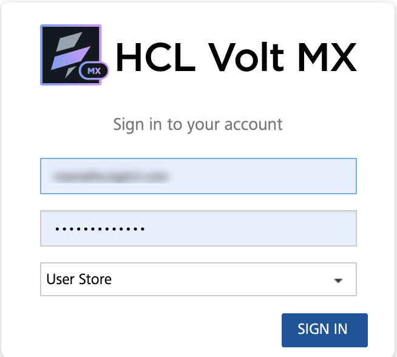
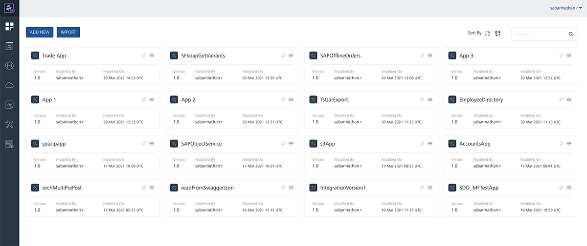
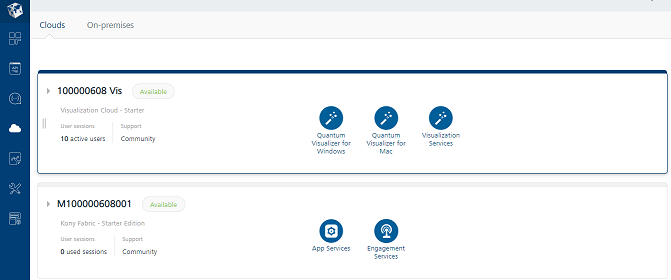
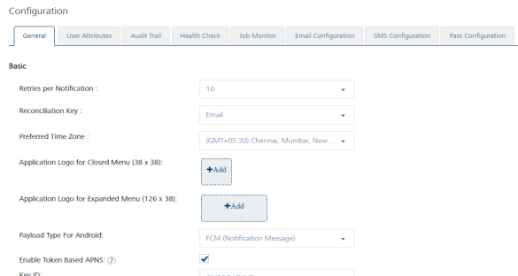
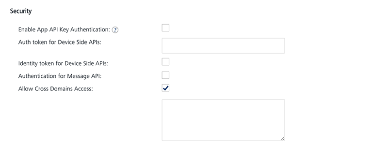
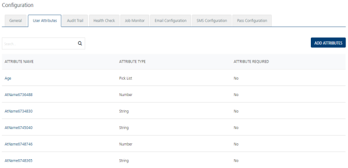

                           

Demo App QuickStart Guide (for Android Devices): Configuring the Security Settings of Engagement Server

Configuring the Security Settings of Volt MX Foundry Engagement Server
=====================================================================

The section explains how to configure security setting for **Engagement Demo Application** on **Engagement** server.

To configure the security settings, follow these steps:

1.  Open an Internet browser.
2.  Enter the URI: manage.hclvoltmx.com in the address field and press the **Enter** key.
    
    The **Sign in to your HCL Account** page appears.
    
    
    
3.  Enter your email address and password. Click **Sign in** to continue.
    
    The system displays the **VoltMX Foundry** homepage.
    
    
    
4.  **VoltMX Foundry** home page: Click **Environments** in the left panel.
    
    The **Clouds** page appears.
    
    
    
5.  Click the **Engagement Services** tab.
    
    The **Engagement Services** home page appears.
    
6.  **Engagement** services: In the left panel, click **Configuration** under the **Settings** section to view the configuration of your cloud environment. The **Configuration** page appears.
    
    
    
7.  **Configuration** > **General** > **Security**: Ensure that the **Identity Token for Device side APIs** and **Authentication for Message API** are not checked.
    
    
    
8.  **Configuration** > **User Attributes**: On the **Configuration** page, click the **User Attributes** tab.
    
    The **User Attributes** page appears.
    
    
    
9.  **User Attributes** page: Ensure that none of the user defined attributes are required in the list-view. If user-defined attributes are not defined, then this step can be skipped.
