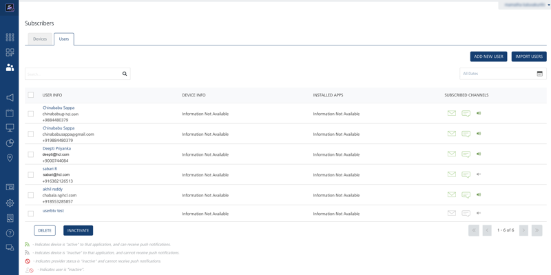
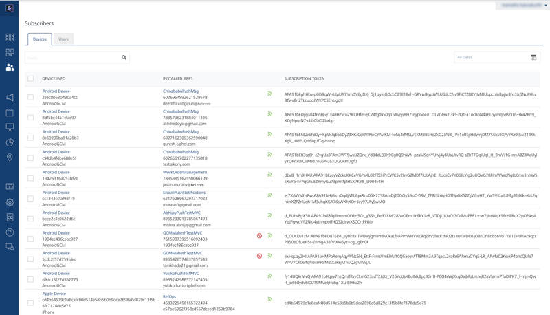

                            

Sending Adhoc Email, SMS and Push Notifications
===============================================

**Sending Adhoc Email, SMS and Push Notifications** section describes the necessary steps to execute so that the demo application on the Android device can receive adhoc push, email and SMS messages after the subscription is complete.

1.  Log in to Volt MX Foundry cloud and click **Overview** > **Subscribers** > **Users**.
2.  TheUsers screen displays the details of the user who subscribed using the application installed on the device.
    
    
    
3.  Next, click **Overview** > **Subscribers**\> **Devices** to view the list of all devices, their device ids and the applications on those devices that are subscribed.
    
    
    

Sending Adhoc Push Notifications
--------------------------------

Push message is one of the most important features of Volt MX Foundry Engagement server.The Push message feature allows to configure and send push messages based on the preferences and personalization attributes for the targeted subscribers or segments. Push messages are sent only to the subscribed apps that are active and installed on mobile devices.

### Sending Adhoc Push Notifications to Subscribers

This section describes the necessary steps to configure the push notifications to be sent to the individual subscribers.

1.  From the **Engagement** section, click **Adhoc** from the left panel. The **Adhoc** screen appears with the four channel type options including **Push Message**, **Email Message**,**SMS Message** and **Pass Message**. By default, the **Push Message** screen is set to active.
2.  In **Associated Applications** section, select the **VMSDemoApp** from the **Published Applications** drop-down list to display the subscriptions for this application.
3.  In **Define Message Target** section, select Subscribers as message audience.
    
    
    
4.  Based on a selected application, associated subscribers are populated in the **Define Message Target** grid. For the selected application, select the subscribers to whom you need to send the the push message.
    
    
    
5.  In the **Message** section, enter the **Message Title** and **Message** for the push notification. From the **Set Start and Expiry Time** section, select **Now** and click **Send**.This action sends the notification.
    
    
    

Sending Adhoc Email Notifications
---------------------------------

The **Email Message** feature allows to configure and send email messages based on the preferences and personalization attributes for the targeted subscribers or segments. Email messages are sent only to the subscribed apps that are active and installed on mobile devices.

### Sending Adhoc Email Notifications to Subscribers

1.  From the **Engagement** section, click **Adhoc** from the left panel. The **Adhoc** screen appears with the four channel type options including **Push Message**, **Email Message**, **SMS Message** and **Pass Message**. By default, the **Push Message** screen is set to active.
2.  Select the channel type as **Email Message**.
    
    
    
3.  In the **Define Message Target** section, you can choose **Users** or predefined **Segments** to send an email. Out of the TO, CC and BCC options, you need to selct only the To option for the **VMSDemoApp** for the selected audience member. Choose the required audience members to send the email notifications.
    
    
    
4.  Enter the Sender Name, Sender Email in the corresponding fields at the end of Defining Message Target section if needed. Enter the notification message in the **Compose Email** along with the **Email Subject** and click Send. This action sends the notification to the provided email address.
    
    
    

Sending Adhoc SMS Notifications
-------------------------------

The SMS message feature allows the user to configure and send SMS messages based on the preferences and personalization attributes for the targeted subscribers or segments. SMS messages are sent only to the subscribed apps that are active and installed on mobile devices.

### Sending Adhoc SMS Notifications to Subscribers:

1.  From the **Engagement** section, click **Adhoc** from the left panel. The **Adhoc** screen appears with the four channel type options including **Push Message**, **Email Message**, **SMS Message** and **Pass Message**. By default, the **Push Message** screen is set to active.
2.  Select the channel type as **SMS Message**.
    
    
    
3.  On the same page, in the Define Message Text section, choose the Users option. Select the required user to send the text message.
    
    
    
4.  In the Message section, enter the message in the message box, choose the **Set Start and Expiry Time** as **Now** and and click Send. This action sends the SMS message.
    
    
    
      
    | Rev. | Author | Edits |
    | --- | --- | --- |
    | 7.1 | AU | AU |
