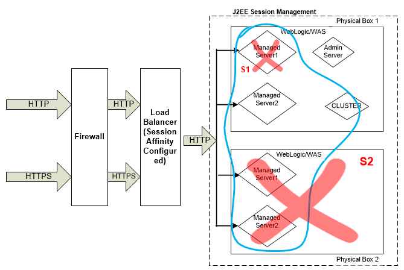

Volt MX Foundry Deployment Guide: Overview

# Deployment Guide

Guidelines for deploying Volt MX Foundry on-premises.

Volt MX Foundry is an enterprise-grade mobile backend as a service (MBaaS). How you set up Volt MX Foundry depends your application requirements and the number of users of your applications. You can set up Volt MX Foundry on-prem in many configurations with component servers that are configured on single or multiple physical and virtual hosts.

- [Software Requirements](#software-requirements)
- [Deployment Topology](#deployment-topology)
- [Development Topology](#development-topology)
- [App Server Sizing](#app-server-sizing)
- [Database Growth Sizing](#database-growth-sizing)
- [Session Management](#session-management)

Volt MX Foundry Deployment Glossary

| Term                  | Definition                                                                                                                                                                                   |
| --------------------- | -------------------------------------------------------------------------------------------------------------------------------------------------------------------------------------------- |
| presentation tier     | The top-most level of an application, the user interface.                                                                                                                                    |
| application tier      | The business logic, or logic tier, it controls the functionality of an application.                                                                                                          |
| J2EE                  | Java Platform, Enterprise Edition                                                                                                                                                            |
| EC2                   | Amazon Elastic Compute Cloud (Amazon EC2) is a web service that provides resizable compute capacity in the cloud.                                                                            |
| RDS                   | Amazon Relational Database Service (Amazon RDS) is a web service that makes it possible to set up, operate, and scale a relational database in the cloud.                                    |
| VM                    | A virtual machine (VM) is an emulation of a particular computer system.                                                                                                                      |
| UAT                   | User acceptance testing.                                                                                                                                                                     |
| high availability     | A system or component that is continuously operational for a desirably long length of time.                                                                                                  |
| separation of concern | A design principle for separating a computer program into distinct sections, such that each section addresses a separate concern.                                                            |
| payload               | The part of the transmitted data that is the actual intended message. Payload does not include information sent with it such as headers or metadata, sometimes referred to as overhead data. |
| A-series, Dv2-series  | Sizes and options for the Azure virtual machines.                                                                                                                                            |
| session affinity      | Enables the load balancer to bind a user's session to a specific instance. This ensures that all requests from the user during the session are sent to the same instance.                    |

## Software Requirements

The following are the underlying software requirements for Volt MX Foundry on-premises.

For a complete list operating systems, app servers, databases, and Java Runtime Environment supported by Volt MX Foundry , refer to [Software Requirements by Volt MX Foundry](../../../Foundry/voltmxfoundry_supported_devices_os_browsers/Content/Supported_Config_Server_EnvV9SP2.md).

| Requirement                  | Supported                                       |
| ---------------------------- | ----------------------------------------------- |
| Operating System             | Linux or Windows                                |
| Java Runtime Environment     | JDK 1.8                                         |
| Session/cache management     | Memcached                                       |
| HTTP servers (reverse proxy) | Apache or Microsoft IIS                         |
| Application servers          | JBoss, or Tomcat, or WebLogic                   |
| Database                     | MySQL or MariaDB or Oracle or MS SQL or DB2 LUW |

## Deployment Topology

The following diagram depicts the topology of a typical deployment of Volt MX Foundry in a Production environment. Individual components can vary based on specific requirements.

## Development Topology

A development environment can consist of any or all of the services that form part of Volt MX Foundry. The following diagram depicts the topology of a typical deployment of Volt MX Foundry in a development environment.

### Moving a Volt MX Foundry App to a Different Environment

To move a Volt MX Foundry app from a development environment to a production environment, export the app from the source (dev) environment, and import app in to the new environment – for example, a UAT or Production environment. To learn more about moving a Volt MX Foundry app, see [Exporting and Importing an Application](../../../Foundry/voltmx_foundry_user_guide/Content/Export-Import_Apps.md).

## App Server Sizing

This section provides a guide to sizing and capacity that can help you determine the optimal deployment configurations for your apps and user requirements.

The following table illustrates the sizing for each Volt MX Foundry component, for Tomcat:

| Volt MX Foundry Runtimes | Throughput/Sec                                            | Capacity                        | CORES          | Memory       |
| ------------------------ | --------------------------------------------------------- | ------------------------------- | -------------- | ------------ |
| Integration & Identity   | 35 request/sec (Every request can have a payload of 50kb) | 1-1.25 million session per year | 1 Core per JVM | 3 GB per JVM |
| Engagement               | 35 request/sec                                            | 60-70 pushes/sec                | 1 Core per JVM | 2 GB per JVM |

| Volt MX Foundry Console Components | Throughput/Sec     | Capacity           | CORES          | Memory       |
| ---------------------------------- | ------------------ | ------------------ | -------------- | ------------ |
| Console                            | N/A for production | N/A for production | 1 Core per JVM | 2 GB per JVM |

> **_Note:_** 1 Core and 2 GB is allocated for the operating system on each physical computer. Please note that Metrics and integration admin console Web archives (WARs) are installed as part of integration. The integration admin console provides basic reports. If advance reporting is required, install the [reporting portal based on Jasper (VoltMX Foundry Reporting and Analytics - Installation Guide)](../../../Foundry/voltmx_analytics_reporting/Content/homepage.md).

> **_Note:_**  Metrics should be installed along with Integration services on the same physical computer.

### Sample Hardware Configurations

The following scenarios illustrate a range of hardware configurations for Volt MX Foundry deployment.

#### Scenario A

A company requires Volt MX Foundry Integration to handle 1.25 million sessions/year and Volt MX Foundry Engagement for 80 pushes/sec. To maintain high availability, the customer adds an additional physical computer.

| Hardware Configuration                                              | Volt MX Foundry Java virtual machines                                                                                                                                                                                                                                                                                                                                          |
| ------------------------------------------------------------------- | ------------------------------------------------------------------------------------------------------------------------------------------------------------------------------------------------------------------------------------------------------------------------------------------------------------------------------------------------------------------------------ |
| Physical Computer/VM – 5 core & 12 GB RAM                           | Console, Identity, Integration, Engagement and Sync                                                                                                                                                                                                                                                                                                                            |
| Physical Computer/VM – 4 core & 10 GB RAM                           | Integration, Identity, Engagement and Sync                                                                                                                                                                                                                                                                                                                                     |
| Physical Computer/VM – 2 core & 4-5 GB RAM                          | Sync or Engagement or Integration and Identity                                                                                                                                                                                                                                                                                                                                 |
| Physical Computer/VM – 4 core & 16 GB RAM (applicable for Database) | Database components of the Volt MX Foundry:   &nbsp;&nbsp;&nbsp;&nbsp;• Console (accounts and workspace)   &nbsp;&nbsp;&nbsp;&nbsp;• Identity (authglobaldb and authconfig)   &nbsp;&nbsp;&nbsp;&nbsp;• Integration (voltmxadmin, devicedb, voltmxreports (Metrics))   &nbsp;&nbsp;&nbsp;&nbsp;• Engagement   &nbsp;&nbsp;&nbsp;&nbsp;• Sync  |

> **_Note:_** The Hardware includes the RAM required for Operating System.

#### Scenario B

If you are required to have 250 request/sec, then you need to have 7 instances.

#### Scenario C

A company requires Volt MX Foundry Integration, Identity, Engagement and Reports Portal for handling 1.2 million session/year on Azure Linux cloud with SQL Server.

As an illustration, each Standard tier: Dv2-series – Standard_D3_v2 server can handle 1.25 million sessions per year. Two Standard tier: Dv2-series – Standard_D3_v2 servers are configured for high availability so that the environment can handle any spikes and serve up to 2 million sessions per year. For every additional 1.25 million session /year, you will need an additional Standard tier: Dv2-series – Standard_D3_v2 server.

If high availability is required for Volt MX Foundry Console & Reports Portal, the deployment requires 2 Standard tier: A-series – Standard_A2 servers.

The following tables also include a configuration for AWS that uses EC2 and RDS for MySQL.

For Production

| Azure                                                                                                                     | AWS                                                                                  | Volt MX Foundry JVM’s                    |
| ------------------------------------------------------------------------------------------------------------------------- | ------------------------------------------------------------------------------------ | ---------------------------------------- |
| 2 standard tier Dv2-series – Standard_D3_v2                                                                               | 2 M3 series – m3.xlarge                                                              | Integration & Identity, & Engagement     |
| 2 Standard tier A-series – Standard_A2                                                                                    | 2 T2 series – t2.medium                                                              | Volt MX Foundry Console & Reports Portal |
| Azure SQL Database – Standard S1 (200 eDTU per pool) or 2 Standard tier: Dv2-series – Standard_D3_v2 for MySQL/SQL Server | Amazon RDS for MySQL – db.m4.2xlarge or 2 M3 series – m3.xlarge for MySQL/SQL Server |                                          |

For Development/QA

| Azure                                                                                                                     | AWS                                                             | Volt MX Foundry JVM’s               |
| ------------------------------------------------------------------------------------------------------------------------- | --------------------------------------------------------------- | ----------------------------------- |
| 1 standard tier A-series – Standard_A3                                                                                    | 1 M3 series – m3.xlarge                                         | Integration & Identity, & Messaging |
| Azure SQL Database – Standard S1 (Basic (200 eDTU per pool) or Standard tier: A-series – Standard_a3 for MySQL/SQL Server | Amazon RDS for MySQL – db.m4.2xlarge or 2 M3 series – m3.xlarge |                                     |

> **_Note:_** If separation of concern and high availability of a particular runtime is important, you can configure runtimes on different physical nodes.

For more information about VM sizes and other aspects of performance, see [Sizes for virtual machines in Azure](https://docs.microsoft.com/en-us/azure/databox-online/azure-stack-edge-gpu-virtual-machine-sizes#supported-vm-sizes) and [Amazon EC2 Instance Types](https://aws.amazon.com/ec2/instance-types/).

## Database Growth Sizing

| Database Component              | Data growth Size (GB) per year | Planned Data Growth per year (%) | Estimated Data size for 5 years In GB | Data growth criteria                                                                                                                       |
| ------------------------------- | ------------------------------ | -------------------------------- | ------------------------------------- | ------------------------------------------------------------------------------------------------------------------------------------------ |
| VMS-Engagement                  | 515                            | 5                                | 2846                                  | 0.1 million pushes per day 3000 - devices,                                                                                                 |
| Sync                            | 7                              | 5                                | 38                                    | 10000 sessions per day                                                                                                                     |
| Metrics (Without Events)        | 288                            | 0                                | 1440                                  | 1 Million Application Sessions, 10Million Service Calls, 2 Million Custom Metrics per month                                                |
| Metrics (With Events+geography) | 1980                           | 0                                | 9900                                  | 1 Million Application Sessions, 10Million Service Calls, 2 Million Custom Metrics, 50 M Application Events, Geolocation database per month |
| Admin Server                    | 1                              | 0                                | 1                                     | Mostly static data, excluding Logging feature(which is of trouble shooting data)                                                           |
| Identity/auth                   | 0.6                            | 0                                | 0.6                                   | 10000 users, 50 apps. This data does not grow                                                                                              |
| Waas                            | 1                              | 0                                | 1                                     | For 10 apps or 500 services with 10 operations each, asset size of 2 MB each                                                               |
| Accounts                        | 0.5                            | 0                                | 0.5                                   | Mostly static data, excluding Logging feature(which is of trouble shooting data)                                                           |

## Session Management

Volt MX Foundry server supports Memcache or J2EE in-built session management.

The following lists the session requirements for Memcache and J2EE in-built session management.

| Session Configuration          | Memcache                               | J2EE In-built Session                                         |
| ------------------------------ | -------------------------------------- | ------------------------------------------------------------- |
| Session affinity load balancer | Not required                           | Required                                                      |
| Additional configuration       | Yes, need to install Memcache software | Not required. App servers provides session management         |
| Data replication               | Not Supported                          | Yes, session replication needs to be configured on App Server |

### Memcache Session Management

Memcache is an in-memory key-value store for small chunks of arbitrary data—for example, strings, and objects. Memcache is a high-performance, distributed memory object caching system, generic in nature. Memcache does not support data replication across nodes.

You can configure the Volt MX Foundry Server that is deployed on Tomcat to talk to any number of Memcache nodes. The nodes can be located on the same or different physical machines. All the user sessions are serialized and stored in the Memcache node. This makes it possible to deploy the Volt MX Foundry Server in an environment where session affinity is not available.

The following describes typical scenarios that may occur when you use Memcache and how it handles sessions:

#### Scenario A

Tomcat Instance is Down

In this scenario, there will be no transaction failure as the session data is available in the Memcache node. The request is routed to the other Tomcat instances. The other Tomcat instances will retrieve the session data from the Memcache.

#### Scenario B

Memcache Instance is Down

In this scenario, if the session data is stored in the Memcache instance that is down, there will be a transaction failure. All the users whose session data was stored on the Memcache instance that went down, have to reinitiate the transaction.

#### Scenario C

Physical Computer is Down

In this scenario, if the session data is stored on one of the Memcache instances of the physical computer that is down, there will be a transaction failure. All the users whose session data was stored on the Memcache instances of the failed physical computer, will have to reinitiate the transaction.

The following illustrates the Memcache-Session Management scenario.

### J2EE In-built Session Management

J2EE-based Application servers provide HTTP-based session capabilities by default. The HTTP session is managed via an in-memory key-value store. The HTTP sessions will not survive application server restarts.

The following diagram illustrates this scenario.

The following describes typical scenarios that may occur when you use J2EE in-built session management and how it handles sessions:

#### Scenario A

_WebLogic Instance is Down_

In this scenario, all the users of this instance will have to re-initiate the transaction.

#### Scenario B

_Physical Computer is Down_

In this scenario, all the users of this physical computer will have to re-initiate the transaction.

> **_Note:_** If you configure session replication, the user will not have to re-initiate the transaction for the app server/physical computer restart or breakdown. You can configure session replication for small server farms—for example, 2-10 app server instances. Session replication will require additional CPU and a very high-speed network connection between the app server nodes.
