Volt MX Foundry Deployment Guide: Volt MX Foundry Components Covered

# Security Hardening

Security Hardening section provides prescriptive guidance to customers on how to deploy and operate Volt MX Foundry in a secure manner. This document provides recommendations for improving the security ("hardening") of your Volt MX Foundry installation and to make sure Volt MX Foundry is running securely.

## Volt MX Foundry Components Covered

This section details hardening supported for the following Volt MX Foundry components.

- Installer
- Identity
- Integration
- Sync
- Console

## Secure Server Checklist

### Enable SSL/TLS

Serving web requests over HTTPS is essential to protect data between the client and the application server.  
To make your web application accessible through HTTPS, you must implement SSL certificate.

While installing Volt MX Foundry, ensure that you select HTTPS as a communication protocol and provide valid CA certificates.

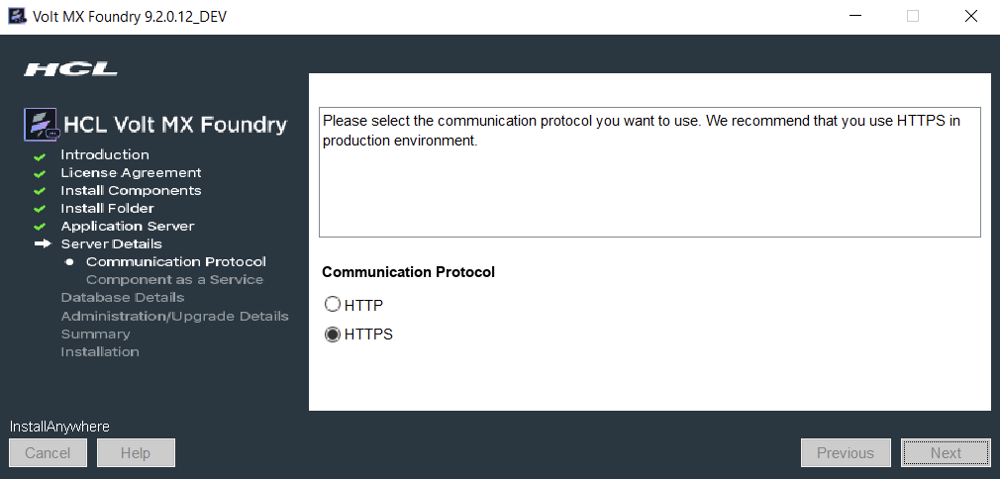

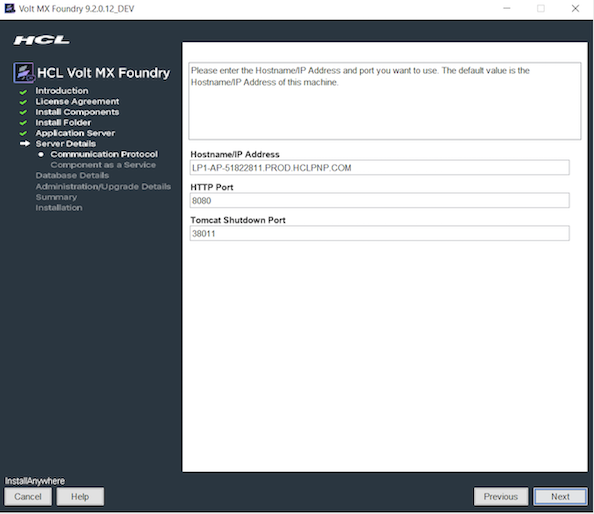

### Disable Weak Ciphers

To achieve greater security, you can configure the server not to use weak ciphers when they communicate using the SSL/TLS protocol. You have to primarily take care of the following three things:

- Disable SSL 2.0 (FUBAR) and SSL 3.01 (POODLE),
- Disable TLS 1.0 compression (CRIME),
- Disable weak ciphers (DES/3DES, RC4), prefer modern ciphers (AES), modes (GCM), and protocols (TLS 1.2).

Make use of [Qualys SSL Server Test](https://www.ssllabs.com/ssltest/) to analyze the server SSL configurations.

### How to Disable Weak Ciphers in Tomcat

To disable weak ciphers, modify the SSL Connector container attribute inside the `server.xml` with the required https `connector` tag details. The `server.xml` is located in the `<Install_Drive>\tomcat\conf` folder.

Here is a sample of the relevant part of the SSL `connector` tag:

```
SSLEnabled="true" sslEnabledProtocols="TLSv1.2" ciphers="TLS_ECDHE_RSA_WITH_RC4_128_SHA, SSL_RSA_WITH_RC4_128_SHA"
```

Here is a sample modified https `connector` tag:

```
<connector port="443" maxhttpheadersize="8192" address="127.0.0.1" enablelookups="false" disableuploadtimeout="true" acceptCount="100" scheme="https" secure="true" clientAuth="false" <mark> SSLEnabled="true" sslEnabledProtocols="TLSv1.2" ciphers="TLS_ECDHE_RSA_WITH_RC4_128_SHA,SSL_RSA_WITH_RC4_128_SHA" </mark> keystoreFile="mydomain.key" keystorePass="password" truststoreFile="mytruststore.truststore" truststorePass="password"/>;
```

> **_Note:_** Upgrade the SSL Cipher list to the latest available versions.

### How to Disable Weak Ciphers in JBoss

To disable weak ciphers, replace the `https-listener` under JBoss `subsystem/undertow`, for example, `<subsystem xmlns="urn:jboss:domain:undertow:3.1">`

Here is a sample `https-listener` tag:

```
<https-listener name="https" socket-binding="connect" security-realm="ApplicationRealm" verify-client="REQUIRED"/>
```

Here is a sample modified `https-listener` tag:

```
<https-listener name="https" enabled-protocols="TLSv1,TLSv1.1,TLSv1.2" enabled-cipher-suites="SSL_RSA_WITH_3DES_EDE_CBC_SHA,SSL_DHE_RSA_WITH_3DES_EDE_CBC_SHA,TLS_DHE_DSS_WITH_AES_128_CBC_SHA, TLS_DHE_RSA_WITH_AES_128_CBC_SHA,TLS_DHE_DSS_WITH_AES_256_CBC_SHA,TLS_DHE_RSA_WITH_AES_256_CBC_SHA, TLS_ECDH_ECDSA_WITH_3DES_EDE_CBC_SHA,TLS_ECDH_ECDSA_WITH_AES_128_CBC_SHA, TLS_ECDH_ECDSA_WITH_AES_256_CBC_SHA,TLS_ECDHE_ECDSA_WITH_3DES_EDE_CBC_SHA, TLS_ECDHE_ECDSA_WITH_AES_128_CBC_SHA,TLS_ECDHE_ECDSA_WITH_AES_256_CBC_SHA, TLS_ECDH_RSA_WITH_3DES_EDE_CBC_SHA,TLS_ECDH_RSA_WITH_AES_128_CBC_SHA, TLS_ECDH_RSA_WITH_AES_256_CBC_SHA,TLS_ECDHE_RSA_WITH_3DES_EDE_CBC_SHA, TLS_ECDH_anon_WITH_3DES_EDE_CBC_SHA,TLS_ECDH_anon_WITH_AES_128_CBC_SHA, TLS_ECDH_anon_WITH_AES_256_CBC_SHA" verify-client="REQUIRED" security-realm="ApplicationRealm" socket-binding="connect"/>
```

> **_Note:_** Upgrade the SSL Cipher list to the latest available versions.

## Use a Hardened database for Volt MX Foundry

Your database is the jackpot that every attacker aims to capture. As attacks get more sophisticated and networks get more hostile, it has become more important than ever to take the following additional steps to harden your database.

- **Set Strong Passwords** (Password must contain at least 8 characters, at most 20 characters, and must include at least one uppercase letter, one lowercase letter, one digit, and one special character)
- **Remove Anonymous Users**
- **Follow the Principle of Least Privilege**
- **Enable TLS** (The Installer does not support databases running TLS, so you must enable it post-installation)

## Users and Account roles

Volt MX Foundry provides a mechanism to create a store of users in Volt MX Foundry Console (locally) or import from Active Directory.

Users listed in the User Management can access Volt MX Foundry Console to create apps.

There are a total of four account roles in Volt MX Foundry:

- **Owner**: An owner has the most privileges and can do the following:

  - Add, modify, and delete an environment.
  - Add, modify, and delete other owners, admins, and members.

- **Admin**: An admin has fewer privileges than an owner and can do the following:

  - Add other admins and members.
  - Modify and delete other admins and members.
  - Grant and deny environment access to other admins and members.

- **Member**: A member has the fewest privileges, which includes creating, editing or deleting new Volt MX Foundry applications or services. A member does not have permissions to invite a new user to the cloud or change the environment access of other members.
- **Developer Portal Only**: This provides access to specific Developer Portals only and does not provide access to the Volt MX Foundry Console.

  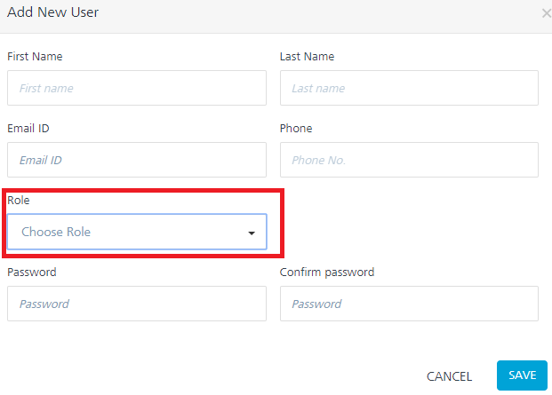

## Default Services and Apps Permissions

You can configure access control for Volt MX Foundry applications and services. By default, all the users have full access rights to create and access apps and services.  
Use the **Apps Console Access Control** page to control access to an application. Use the **Services Console Access Control** page to control access to a service.  
Change the default access permissions for a new service or application according to the company’s access policy. This setting can be found in: **Settings -> Default Services & Apps Permissions**.

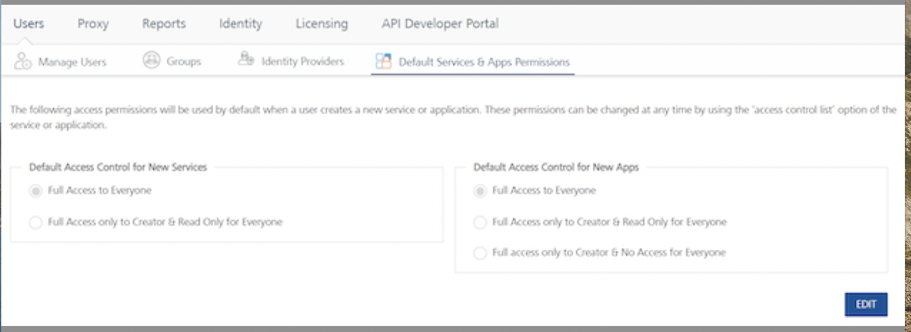

## Operation Security Level for Integration and Orchestration services

Select one of the following security operations in the Operation Security Level field for integration and orchestration services. By default, the field is set to Authenticated App User:

- **Authenticated App User** – indicates that the operation is secured. To use the operation, an app user must be authenticated by an associated identity service.
- **Anonymous App User** – indicates that a user must have the app key and app secret to access this operation.
- **Public** – indicates that the operation requires no special security.

For Integration Services:

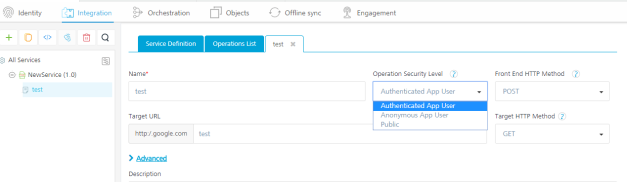

For Orchestration Services:

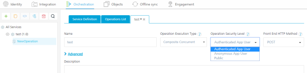

## Verb Security Level for Object Services

The Verb Security Level specifies how the client must authenticate to the verb. You can restrict access to this verb to only authenticated app users who have successfully been authenticated using an Identity service. An anonymous app user verb allows access from a trusted client that has the required App Key and App Secret, but the client does not need to authenticate the user through an identity service.  
Set the security level to **Public** to allow any client to access this verb without any authentication requirement. **Authenticated App User** – indicates that the operation is secured. To use the operation, an app user must be authenticated by an associated identity service.

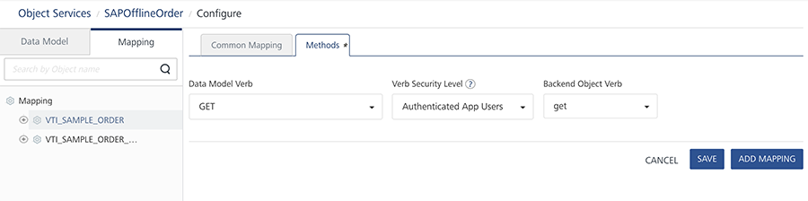

## Pre-requisites

Ensure that you read the [Pre-requisites](../../../Foundry/voltmx_foundry_windows_install_guide/Content/Prerequisites.md) which contains information on Multi-node load balancer setup and other configurations.

### Securing Data Transport between the Device and Volt MX Server

Volt MX uses the traditional 128/256 bit SSL protocol between the device and the Volt MX Server for all the data communication. The mobile device has the native SDKs supporting the HTTPS connection from the mobile device and no additional API or infrastructure investment is required.

## Backend Credentials and Session Security

Volt MX Foundry uses AES-256 algorithm to encrypt backend credentials. The admin does not need to do anything for protecting the backend credentials.

The backend cookies/tokens are stored after being encrypted using the tenant’s data encryption key (AES encryption). Backend tokens are deleted when the session expires, or when the user logs out.

The following are the two types of sessions:

- **Fixed duration** sessions expire when the duration elapses after login.
- **Auto-extending** sessions are defined using an inactivity timeout and max active duration. They expire if there is no activity during an inactivity timeout duration or if the max active duration elapses after login.

If the backend supports refresh, the backend tokens can be refreshed by calling the refresh API from SDK.

## User Credential Security

Volt MX Foundry currently encrypts the user credentials with PBKDF2 with 1000 iterations. The password is salted is 24 random bytes generated using java.security.SecureRandom.

As per NIST, it is recommended to use at least 10,000 iterations. If the user wants PBKDF2, iterations to be increased, he can achieve that by setting a property called 'PBKDF2_ITERATIONS'. but this might AFFECT THE PERFORMANCE. Below are the performance statistics for 1k iterations and 10k iterations.

<table style="mc-table-style: url('Resources/TableStyles/Basic.css');width: 525px;" class="TableStyle-Basic" cellspacing="0"><colgroup><col style="width: 191px;" class="TableStyle-Basic-Column-Column1"> <col style="width: 162px;" class="TableStyle-Basic-Column-Column1"> <col class="TableStyle-Basic-Column-Column1"></colgroup><tbody><tr class="TableStyle-Basic-Body-Body1"><td class="TableStyle-Basic-BodyE-Column1-Body1" style="text-align: center;">No of calculations (loops)</td><td class="TableStyle-Basic-BodyE-Column1-Body1" style="text-align: center;">1K Iterations (in ms)</td><td class="TableStyle-Basic-BodyD-Column1-Body1" style="text-align: center;">10K Iterations(in ms)</td></tr><tr class="TableStyle-Basic-Body-Body1"><td class="TableStyle-Basic-BodyE-Column1-Body1">1000</td><td class="TableStyle-Basic-BodyE-Column1-Body1">3278</td><td class="TableStyle-Basic-BodyD-Column1-Body1">28159</td></tr><tr class="TableStyle-Basic-Body-Body1"><td class="TableStyle-Basic-BodyE-Column1-Body1">2000</td><td class="TableStyle-Basic-BodyE-Column1-Body1">5780</td><td class="TableStyle-Basic-BodyD-Column1-Body1">57280</td></tr><tr class="TableStyle-Basic-Body-Body1"><td class="TableStyle-Basic-BodyE-Column1-Body1">3000</td><td class="TableStyle-Basic-BodyE-Column1-Body1">8634</td><td class="TableStyle-Basic-BodyD-Column1-Body1">91604</td></tr><tr class="TableStyle-Basic-Body-Body1"><td class="TableStyle-Basic-BodyE-Column1-Body1">4000</td><td class="TableStyle-Basic-BodyE-Column1-Body1">12423</td><td class="TableStyle-Basic-BodyD-Column1-Body1">122031</td></tr><tr class="TableStyle-Basic-Body-Body1"><td class="TableStyle-Basic-BodyE-Column1-Body1">5000</td><td class="TableStyle-Basic-BodyE-Column1-Body1">14862</td><td class="TableStyle-Basic-BodyD-Column1-Body1">148167</td></tr><tr class="TableStyle-Basic-Body-Body1"><td class="TableStyle-Basic-BodyE-Column1-Body1">6000</td><td class="TableStyle-Basic-BodyE-Column1-Body1">17967</td><td class="TableStyle-Basic-BodyD-Column1-Body1">179345</td></tr><tr class="TableStyle-Basic-Body-Body1"><td class="TableStyle-Basic-BodyE-Column1-Body1">7000</td><td class="TableStyle-Basic-BodyE-Column1-Body1">20966</td><td class="TableStyle-Basic-BodyD-Column1-Body1">210320</td></tr><tr class="TableStyle-Basic-Body-Body1"><td class="TableStyle-Basic-BodyE-Column1-Body1">8000</td><td class="TableStyle-Basic-BodyE-Column1-Body1">24736</td><td class="TableStyle-Basic-BodyD-Column1-Body1">242198</td></tr><tr class="TableStyle-Basic-Body-Body1"><td class="TableStyle-Basic-BodyE-Column1-Body1">9000</td><td class="TableStyle-Basic-BodyE-Column1-Body1">26720</td><td class="TableStyle-Basic-BodyD-Column1-Body1">266217</td></tr><tr class="TableStyle-Basic-Body-Body1"><td class="TableStyle-Basic-BodyB-Column1-Body1">10000</td><td class="TableStyle-Basic-BodyB-Column1-Body1">30150</td><td class="TableStyle-Basic-BodyA-Column1-Body1">302918</td></tr></tbody></table>

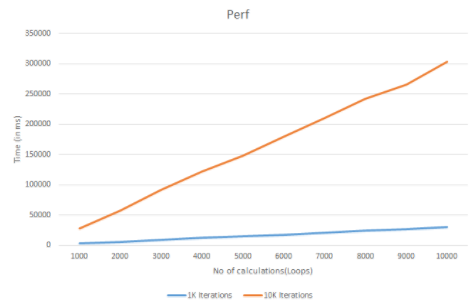

### Example to set property ''PBKDF2_ITERATIONS"

```
Request:  
POST authservice/api/v1/setup/tenants/<tenant-id>/properties  
Headers:  
Authorization: <auth-token>  
Content-Type: application/x-www-form-urlencoded  
Payload:  
name = PBKDF2_ITERATIONS  
value = 10000
```

### Sample request

```
POST /authService/100000002/api/v1/setup/tenants/100000002/properties HTTP/1.1  
Host: example.com  
Authorization: eyAidHlwIjogImp3dCIsICJhbGciOiAiUlMyNTYiIH0.eyAiX2VtYWlsIjogInNhaWtpcmFuLmdvdWRAa29ueS5jb20iLCAiX3ZlciI6ICJ2MS4xIiwgImlzcyI6ICJodHRwOi8vc2VjdXJpdHl0ZXN0dm0ua2l0c3BsLmNvbTo4MDgwL2F1dGhTZXJ2aWNlL2FjY291bnRzIiwgIl9zY29wZSI6ICJnIiwgIl9pc3NtZXRhIjogIi9tZXRhZGF0YS9rNDVRdFcxa0V5SXRsUkg5eG9renZnPT0iLCAiX3Nlc3Npb25faWQiOiAiYTBmYTE1NmQtNDFmNi00NzkxLTgwNmMtOTBhM2FmNmZlZGFlIiwgIl9wdWlkIjogNTA0NDIxMzMzNDk2MSwgIl9pZHAiOiAidXNlcnN0b3JlIiwgImV4cCI6IDE1MTk4OTcwMzAsICJpYXQiOiAxNTE5ODkzNDMwLCAiX3Nlc3Npb25fdGlkIjogImFjY291bnRzIiwgIl9wcm92X3VzZXJpZCI6ICJzYWlraXJhbi5nb3VkQGtvbnkuY29tIiwgImp0aSI6ICI3ODYxYjA1NS0wNmNiLTQwODItOWRkZC04MDFkNTJjY2ExM2QiLCAiX2FjcyI6ICJhY2NvdW50cyIgfQ.nRhGEbfTqzl5aCgEYn85YUPxM3LOMedVFjJX4NlYhlIRzYs_5JkuCH3Yl-p8uVGw2rNOoqzK1x2KUhe3oPRQ8ab4QTVddYnTBfsQt9lFViiGMlOKgbLDI7wn9AGfwsQRB_6fNVJ5HEt2k6kC2C8mHCYGWnXTRjLEKsK-k9Wc5Gaur49yKEjl6_tkH--qoDsqFYuLGHzad4zQHtsRxrxgxfI_z3QuN3VF_DYKoD5Nzsi5rxGSCu-PPH9_gQRO2ED6S-WllJdJTTIal_pa4bGG-JhDtCdOR9GHDPcbBZ6WG1GwTJKWbqDEDzxjrxiKk5VZDOwjUuhwTJwE2cwQJIO-EQ  
Content-Type: application/x-www-form-urlencoded  
Cache-Control: no-cache  
Postman-Token: 745a8e95-171b-204c-a934-37d434054adb  
name=PBKDF2_ITERATIONS&value=1000
```

### Steps to get Auth token and Tenant ID

1.  Login to Volt MX Foundry using Owner account.
2.  Goto <code>http://&lt;VoltMX_host&gt;:8080/mfconsole/accountInfo</code>
<!-- 2.  Goto [http://securitytestvm.kitspl.com:8080/mfconsole/accountInfo](http://securitytestvm.kitspl.com:8080/mfconsole/accountInfo) -->

3.  Note down the tenant id and auth token as shown in below image.

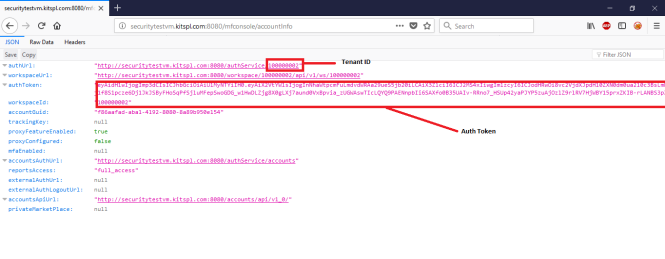

## Idle Session Timeout for Volt MX Foundry App

Volt MX Foundry supports configuring session timeout (idle timeout and fixed timeout) for an app identity session.

You can configure either an idle timeout or fixed timeout for apps in the Applications > Identity page.

- **Idle Timeout**: Specifies the amount of time in minutes that a session can remain idle before Volt MX Foundry automatically terminates the app.

  - Identity Session Idle Timeout: When an app session on a device remains idle for a certain amount of time, the app session expires automatically. The user will need to log in to the app again.
  - Maximum Session Duration: An apps log-in session is active until the maximum session duration time is met.

- **Fixed Timeout**: Specifies the app session’s idle timeout (HH:SS). When the timeout is reached, the session expires automatically, and the user will need to log into the app again.

Volt MX Security Team recommends Identity Session Idle Timeout to be set to 00:05 hours (5 Minutes).

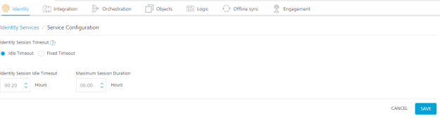

## Password Policy for Volt MX Foundry users

No matter how secure Volt MX Foundry is, Users will eventually choose their own password. Therefore, you should set account policies that define a secure password for your systems.

The default password policy is password must contain at least 8 characters, at most 20 characters and must include at least one uppercase letter, one lowercase letter, one digit and one special character.

An owner of the account can change the password policy by changing “password_regex” property.

```
Request:  
POST authservice/api/v1/setup/tenants/<tenant-id>/properties  
Headers:  
Authorization: <auth-token>  
Content-Type: application/x-www-form-urlencoded  
Payload:  
name = password*regex  
value = ^(?=.*[a-z])(?=._[A-Z])(?=._\\d)(?=._(_|[^\\w])).{8,20}$
```

### Sample Request

```
POST /authService/100000002/api/v1/setup/tenants/100000002/properties HTTP/1.1  
Host: example.com  
Authorization: eyAidHlwIjogImp3dCIsICJhbGciOiAiUlMyNTYiIH0.eyAiX2VtYWlsIjogInNhaWtpcmFuLmdvdWRAa29ueS5jb20iLCAiX3ZlciI6ICJ2MS4xIiwgImlzcyI6ICJodHRwOi8vc2VjdXJpdHl0ZXN0dm0ua2l0c3BsLmNvbTo4MDgwL2F1dGhTZXJ2aWNlL2FjY291bnRzIiwgIl9zY29wZSI6ICJnIiwgIl9pc3NtZXRhIjogIi9tZXRhZGF0YS9rNDVRdFcxa0V5SXRsUkg5eG9renZnPT0iLCAiX3Nlc3Npb25faWQiOiAiYTBmYTE1NmQtNDFmNi00NzkxLTgwNmMtOTBhM2FmNmZlZGFlIiwgIl9wdWlkIjogNTA0NDIxMzMzNDk2MSwgIl9pZHAiOiAidXNlcnN0b3JlIiwgImV4cCI6IDE1MTk4OTcwMzAsICJpYXQiOiAxNTE5ODkzNDMwLCAiX3Nlc3Npb25fdGlkIjogImFjY291bnRzIiwgIl9wcm92X3VzZXJpZCI6ICJzYWlraXJhbi5nb3VkQGtvbnkuY29tIiwgImp0aSI6ICI3ODYxYjA1NS0wNmNiLTQwODItOWRkZC04MDFkNTJjY2ExM2QiLCAiX2FjcyI6ICJhY2NvdW50cyIgfQ.nRhGEbfTqzl5aCgEYn85YUPxM3LOMedVFjJX4NlYhlIRzYs*5JkuCH3Yl-p8uVGw2rNOoqzK1x2KUhe3oPRQ8ab4QTVddYnTBfsQt9lFViiGMlOKgbLDI7wn9AGfwsQRB_6fNVJ5HEt2k6kC2C8mHCYGWnXTRjLEKsK-k9Wc5Gaur49yKEjl6_tkH--qoDsqFYuLGHzad4zQHtsRxrxgxfI_z3QuN3VF_DYKoD5Nzsi5rxGSCu-PPH9_gQRO2ED6S-WllJdJTTIal_pa4bGG-JhDtCdOR9GHDPcbBZ6WG1GwTJKWbqDEDzxjrxiKk5VZDOwjUuhwTJwE2cwQJIO-EQ  
Content-Type: application/x-www-form-urlencoded  
Cache-Control: no-cache  
Postman-Token: ebb17b95-9e44-6ebd-1953-3ad9f1c9019f  
name=password_regex&value=^(?=.*[a-z])(?=._[A-Z])(?=._\\d)(?=._(_|[^\\w])).{8,20}$
```

### Steps to get Auth token and Tenant ID

1.  Login to Volt MX Foundry using Owner account.
2.  Goto <code>http://&lt;VoltMX_host&gt;:8080/mfconsole/accountInfo</code>
<!-- 2.  Goto [http://securitytestvm.kitspl.com:8080/mfconsole/accountInfo](http://securitytestvm.kitspl.com:8080/mfconsole/accountInfo) -->
3.  Note down the tenant id and auth token as shown in below image.


### Version Management

- A policy to periodically install security patches of all software must be in place.
- A mechanism to regularly check for missing security patches must be in place.
- Software should be installed from a central, trusted repository when available.
- Services must display minimal information about the installed version.

### Network security

- Only a minimal set of ICMP packets must be accepted
- Packet rate-limiting must be implemented

## Hardening Volt MX Foundry Integration (Middleware)

In addition to the security best practices followed by the customer as per their internal guidelines, Volt MX makes the following recommendations to reduce the attack surface of their integration server deployments.

1.  **Applying latest patches**  
    The web server, the underlying operating system, the application server and the database server must all have the latest patches applied. This protects the installation against exploits for known vulnerabilities.
2.  **Removing unnecessary services**  
    Every service running on the application server is an additional attack surface especially if the service is listening on a port and is remotely accessible. All services other than the ones that are absolutely required to run the Integration Server (formerly middleware) product must be turned off.
3.  **Use Hardened Application and Database servers**  
    The servers included as part of the Integration Server deployment should be hardened as per the hardening recommendations available from the vendor or independent groups like NSA/SANS who have made such information available publicly.
4.  **Restrict Access to Non- Integration Services**  
    Integration services would typically be made accessible from the intranet or internet. Access to other services on the server can be restricted using IP tables or other host-level firewalls.
5.  **Restrict Access to Admin Console**  
    Admin Console is the administrative interface and it is recommended to restrict access to internal networks only if possible. This can be achieved in two ways:
    - Configure Admin Console and Integration Services to use two different ports and restrict access to the port on which Console is running to only internal users.
    - At the Load Balancer, you can write a filter to block access to the Console part of the application from external users. Restrict Access to Non- Integration Services.
6.  **Application Server Privileges**  
    Integration Server can function effectively when Tomcat is run as the default Tomcat user without any special privileges being granted. It is strongly recommended that the server should be production grade with lesser privileges such as disabling direct access and process request through LB and other HTTP verbs.
7.  **Database Server Privileges**  
    Integration Server installation requires creating new Databases and tables, once the installation is done, it would only **insert**, **query** and **update** entries in the existing tables. Hence it is recommended that only during the installation process a database user with permission to perform creation and deletion privileges is used. Once the installation is done this user account can be deleted and replaced with another user who only has permissions to **Read**, **Insert** and **Update**. Dangerous functions like `system() (MySQL)`, `xp_cmdshell (MS SQL)` must be disabled or permissions to use these functions should not be granted to the admin database account.
8.  **Log Level Recommendation** Volt MX recommendation on log4j Log level is ERROR in production to avoid logging any sensitive information in log files. Make sure the below to change log level to ERROR.
    1.  In middleware-log4j.properties file, All log levels should be ERROR
    2.  In Admin Console Configuration page, Log Level configuration should be selected as ERROR.
9.  **HTTPS mode**. Integration Server works both in HTTP and HTTPS mode. It is recommended to install the server in https mode.
10. **SSL Certificate Type**  
    Recommended using your own existing SSL certificate rather than going with a generated self-signed certificate.

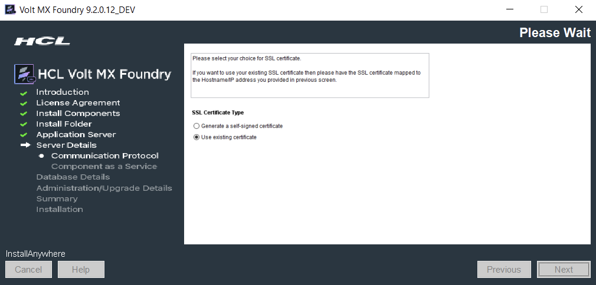

## Hardening Volt MX Foundry Identity

In addition to the security best practices followed by the customer as per their internal guidelines, Volt MX makes the following recommendations to reduce the attack surface of their Volt MX Foundry Identity Deployments.

1.  **Restrict Access to Non-Volt MX Foundry Identity Services**: Volt MX Foundry Identity service would typically be made accessible from the intranet or the internet. Access to other services on the server can be restricted using IP tables or other host-level firewalls.
2.  **Restrict Access to Volt MX Foundry Console**: Volt MX Foundry Console is the administrative interface and it is recommended to restrict access to internal networks only if possible. This can be achieved in two ways:
    - Configure Volt MX Foundry Console and Volt MX Foundry Identity Service to use two different ports and restrict access to the port on which Console is running to only internal users.
    - At the Load Balancer, you can write a filter to block access to the Console part of the application from external users. Restrict Access to Non-Volt MX Foundry Identity Services
3.  **Log Level Recommendation** Volt MX recommendation on log4j Log level is ERROR in production to avoid logging any sensitive information in log files. It is recommended to set the LOG_LEVEL property in authService.properties to ERROR.
4.  **Volt MX Foundry Identity tokens and sessions**: When a user logs in to an identity provider in Volt MX Foundry via an app, the user passes app credentials (Volt MX Foundry app key and secret), and user credentials for the backend identity provider. The Identity service validates the app credentials and sends the user credentials to the backend identity provider for authentication (in case of SAML or OAuth, the user credentials are passed to backend identity provider via client-side browser redirect and not via Volt MX Foundry Identity). The backend authenticates the user and returns a session token (known as the backend token), which can then be used to access the user’s data in the backend. Once the user is successfully authenticated at the backend, Volt MX Foundry Identity creates a session and issues an Identity token linked to the session. The Volt MX Foundry Identity token is a JWT token signed by the tenant’s signing key and contains claims about the authenticated user, app, provider, issuer, and session. The backend tokens are also linked to the identity session.

## Preventing Tomcat Version from Error Pages

When you access Volt MX Foundry V9.x by using a particular URL directly from a browser, the web page displays Tomcat Application Server's version.

For example, the Apache Tomcat server version is disclosed, as shown in the following screen shot:

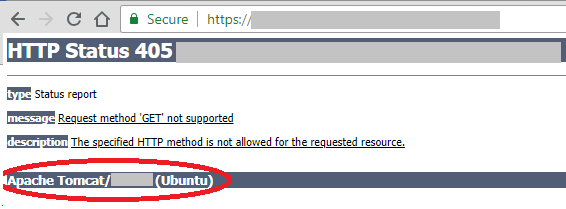

For security reasons, you must disable the server information disclosure for Tomcat application server.

### To prevent disclosure of the Tomcat Application Server version, follow these steps:

1.  Open the Tomcat Server > `server.xml` file.
2.  Add the following:
```
<Valve className="org.apache.catalina.valves.ErrorReportValve"
    showReport="false" 
    showServerInfo="false"/>
```
3.  Save the server.xml.
4.  Restart the server.

## Disable Concurrent Session

If your users are not going to connect to more than one session, it is recommended to disable concurrent sessions.

To disable concurrent sessions, add the following property in the waas_property table of the console db:

- `property_name="DISABLE_CONCURRENT_SESSIONS"`
- `property_value="true"`
- `tenant_name = __global`
- `etag = <Any 36 char guid>`

Alternatively, you can also use the following API to add the property in the waas table:

```
POST <Waas_Base_URL>/api/v1/setup/properties
```

### Headers:

- X-Volt MX-Authorization = <Claims token value>
- Content-Type = application/x-www-form-urlencoded

### Form Data parameters:

- name = DISABLE_CONCURRENT_SESSIONS
- value = true

Sample `Waas_Base_URL = http://localhost:9090/workspace/100000002`

Follow these steps to get the X-Volt MX-Authorization token:

1.  Log on to Volt MX Foundry and go to the accountInfo section

    For example, `http://localhost:9090/mfconsole/accountInfo`

2.  Retrieve the value corresponding to the **authToken** key from the output folder.
3.  Navigate to `authService.war/Web-INF/classes`, edit the `authService.properties` file, and add `DISABLE_CONCURRENT_SESSIONS=true` at the end of the file.
4.  Restart the server.

## Protection against automated attacks

Volt MX Foundry provides a security feature to block users on multiple failed log-in attempts. If a user tries to sign in multiple times using invalid credentials, Volt MX Foundry blocks their account for a certain period called the Blocking Threshold. They can log on only after the blocking threshold elapses.

> **_Note:_** This feature is applicable for On-Premise installations of Volt MX Foundry 9.2 and above.

Volt MX Foundry provides an option to configure the following:

- Number of failed log in attempts before the user is blocked.
- Blocking Threshold

### Configuring User Blocking Feature

You must obtain an **authToken** to configure the number of failed attempts to sign in and blocking threshold time in Identity.  
Follow these steps to get the **authToken**.

- Log on to the Volt MX Foundry Console from a browser and open the `<Volt MX Foundry Url>/mfconsole/accountInfo` API in a new tab.
- The console displays the following response:

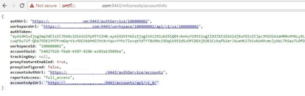

- Copy the **authUrl** and **authToken** from the response.

Invoke the following API to enable User Blocking on multiple failed login attempts.

```
POST <authUrl>/api/v1/setup/tenants/\_\_global/properties
```

### Headers:

- Content-Type: application/json
- X-Volt MX-Authorization: <authToken>

### Request body:

```
{
"name":"MAX_LOGON_FAILED_ATTEMPTS",
"value":"3"
}
```

Specify the value as the maximum number of failed sign in attempts you want to allow. In this scenario, Volt MX Foundry blocks the user after three consecutive failed sign in attempts.

If the user tries to sign in after three failed attempts, the console displays the following message:  
“User account locked due to multiple failed login attempts. Please contact the system administrator.”

Use the following API to set the blocking threshold

```
POST <authUrl>/api/v1/setup/tenants/\_\_global/properties
```

### Headers:

Content-Type: application/json

X-Volt MX-Authorization: <authToken>

### Request body:

```
{
"name":"LOGON_BLOCKING_THRESHOLD_MINUTES",
"value":"15"
}

```

Specify the value of the blocking threshold in the value field. In this scenario, the user is blocked for 15 minutes. After 15 minutes, they can log on to the Console using valid credentials.

### Unblocking the user

The user can sign in after the blocking threshold ends.

A database admin can unblock a user before the blocking threshold ends. To unblock a user, follow the given steps:

1.  Connect to the Identity Config Database <prefix>idconfigdb<suffix> (the <prefix> and <suffix> must be the same as configured at the time of installation)
2.  Issue the following SQL command:

```
set sql_safe_updates = 0;
UPDATE users
SET
user_status = 'active',
login_fail_count = 0
WHERE
userid = '<the blocked userid here>';
set sql_safe_updates = 1;

```

## Restrict Tomcat Manager to Localhost

Follow these steps to secure the tomcat manager to the localhost.

1.  Create an xml file called `manager.xml` in the `/conf/catalina/localhost` path.
2.  write the following code in **manager.xml**:
```
<Context path="/manager" debug="0" privileged="true">
    <Valve className="org.apache.catalina.valves.RemoteAddrValve"
    allow="127.0.0.1"/>
    <!-- Link to the user database we will get roles from
          <ResourceLink name="users" global="UserDatabase"
    type="org.apache.catalina.UserDatabase"/>
    -->
    </Context>

```

## Secure your Cookies (Secure and HttpOnly flags)

### For Tomcat/WebLogic as Web Server

Cookies let websites store data directly on the web browser of a user. Websites primarily use cookies to identify the user session based on their browsing. Cookies contain sensitive data that must be protected.

To make your cookies secure, modify the **web.xml** and **weblogic.xml** files of the webapp for the required components.

- `WebApps > mfconsole` for Volt MX Foundry Console
- `WebApps > admin` for Volt MX Foundry Admin Console
- `WebApps > vpns` for Volt MX Foundry Engagement
- `WebApps > authService` for Volt MX Foundry AuthService

Add the following code in the **web.xml** file:

```
<cookie-config>
<http-only>true</http-only>
<secure>true</secure>
</cookie-config>

```

Add the following code in the **weblogic.xml** file:

```
<session-descriptor>
<cookie-secure>true</cookie-secure>
</session-descriptor>

```\* Restart the Application Server.

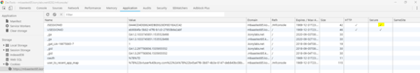

You can use developer tools to verify the changes.

### For JBoss as the Web Server, do the following.

To enable `secure/Http-only` for all deployed applications, you can add a session-cookie config to your undertow subsystem's `servlet-container` section (`domain.xml` file or `standalone-xxx.xml` file). For example, a session-cookie config is as follows:

```
<subsystem xmlns="urn:jboss:domain:undertow:3.1">
...
<servlet-container name="default">
<jsp-config/>
<session-cookie http-only="true" secure="true" /> <!-- added -->
<websockets/>
</servlet-container>
```

### For WebSphere as the Web Server, follow these steps.

1.  Sign in to [Volt MX Foundry Console](https://manage.hclvoltmx.com/).
2.  Select Environments from the left navigation pane.
3.  Go to Admin Console.
4.  In **Application servers**

    1.  Select your server.
    2.  Go to **Session management** > **Cookies**, enable the cookies .

    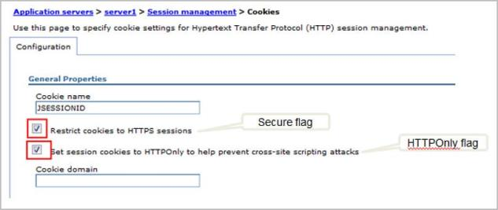

## Redirect Traffic from Non-Secure Protocol (HTTP) to Secure Protocol (HTTPS)

Follow these steps to setup the Tomcat Server to redirect HTTP requests to the HTTPS port to access web applications from both the ports:

1.  Add the following code in the **server.xml** file present in the `TomcatInstallation/conf` path.

```
<security-constraint>
    <web-resource-collection>
    <web-resource-name>securedapp</web-resource-name>
    <url-pattern>/\*</url-pattern>
    </web-resource-collection>
    <user-data-constraint>
    <transport-guarantee>CONFIDENTIAL</transport-guarantee>
    </user-data-constraint>
    </security-constraint>

```

2.  Restart the Application Server.

## Enabling Secure flag for CacheID Cookie

The middleware sets the CacheID to refer to the cached data from Memcached.

Enable the secure flag for the CacheID cookie using the following -D parameter:

1.  Go to `tomcat\bin` in the Installation folder.
2.  Edit **Catalina**.
3.  At the end of the first line, add `-Dis.cacheid.cookie.secure=true`.
4.  Save the changes
5.  Restart the server.

## Configuring OWASP secure headers for SPA/Desktop apps

The OWASP Secure Headers describe the HTTP response headers that your application can use to increase its security. The HTTP response headers can restrict modern browsers from running into easily preventable vulnerabilities. The OWASP Secure Headers Project increases awareness and the use of these headers.

The HTTP headers should include the following headers and their respective values.

- **X-Frame-Options**: SAMEORIGIN
- **X-XSS-Protection**: 1; mode=block
- **X-Content-Type-Options**: nosniff
- **Content-Type**: text.html; charset=utf-8
- **Strict-Transport-Security**: max-age=86400; includeSubDomains

Also, if there no overriding concerns, enable the security settings.

### To set the response header for Volt MX Foundry version V9 SP2 or higher versions, follow these steps.

- To overcome these security issues in Volt MX SPA and Desktop Web applications, add custom filter and filter mapping entry in the **web.xml** file.
- For example:

  ```
public void doFilter(ServletRequest request, ServletResponse response, FilterChain filterChain)
  throws IOException, ServletException {
  HttpServletRequest req = (HttpServletRequest) request;
  HttpServletResponse res = (HttpServletResponse) response;
  res.setHeader (""""X-Content-Type-Options"""", """"nosniff"""");.... // Similarly add your response headers. ... filterChain.doFilter(request, response);
  }

  ```

- Create a jar file using the class that you created.

  ```
<filter>
  <filter-name>XXXFilter</filter-name>
  <filter-class>com.xyz.web.filter.XXXFilter</filter-class>
  </filter>
  <filter-mapping>
  <filter-name>XXXFilter</filter-name>
  <url-pattern>/</url-pattern>
  </filter-mapping>

  ```

- Extract the build application War file and add the mentioned lib and entry in web.xml.
- Volt MX Iris provides an option to add jars and edit the web.xml under `Menu > File > Combine EAR file` option.

> **_Note:_** Usage of the custom filter is the responsibility of the application developer.

### Setting the response header for Volt MX Foundry version V9 SP2 or earlier versions.

### To add OWASP Secure Headers to WebApp Static Files, follow these steps.

1.  Sign in to [Volt MX Foundry Console](https://manage.hclvoltmx.com/).
2.  Select Environments from the left navigation pane.
3.  Select App Services to open the Server Admin Console.
4.  Go to `Settings > Runtime Configuration > Web Apps Configuration > Custom Response Header`.
5.  Add the required header in the following format:

```
[{
    'name': 'X-Content-Type-Options',
    'value': 'nosniff'
    }, {
    'name': 'X-Frame-Options',
    'value': 'DENY'
    }, {
    'name': 'X-XSS-Protection',
    'value': ' 1; mode=block'
    }, {
    'name': 'Strict-Transport-Security',
    'value': 'max-age=86400; includeSubDomains'
    }]
```

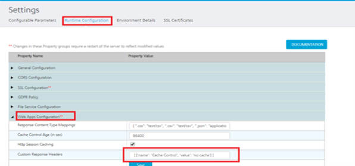

### To add OWASP Secure Headers to Middleware Services, follow these steps.

1.  Write a custom filter that adds the response headers to the response.
2.  Add the following custom filter to preprocessor and postprocessor jar, and publish the app.
```
import java.io.IOException;

    import javax.servlet.Filter;
    import javax.servlet.FilterChain;
    import javax.servlet.FilterConfig;
    import javax.servlet.ServletException;
    import javax.servlet.ServletRequest;
    import javax.servlet.ServletResponse;
    import javax.servlet.http.HttpServletRequest;
    import javax.servlet.http.HttpServletResponse;

    import org.apache.log4j.Logger;

    import com.hcl.voltmx.middleware.common.DCFilter;
    import com.hcl.voltmx.middleware.common.MWConstants;
    import com.hcl.voltmx.middleware.servlet.filters.IntegrationCustomFilter;

    @IntegrationCustomFilter(filterOrder = 101, urlPatterns = MWConstants.ANY)
    public class XYZCustomFIlter implements Filter {
    private static final Logger logger = Logger.getLogger(XYZCustomFIlter.class);
    public void doFilter(ServletRequest request, ServletResponse response, FilterChain chain)
    throws IOException, ServletException {
    // TODO Auto-generated method stub
    chain.doFilter(request, response);
    HttpServletResponse res = (HttpServletResponse) response;
    res.setHeader("Cache-Control", "no-cache,no-store,must-revalidate");
    res.setHeader("Pragma", "no-cache");
    res.setHeader("X-Content-Type-Options", "nosniff");
    res.setHeader("X-Frame-Options", "DENY");
    res.setHeader("X-XSS-Protection", "1; mode=block");
    res.setHeader("Expires", "0");
    }
    public void init(FilterConfig filterConfig) throws ServletException {
    // TODO Auto-generated method stub

        }
        public void destroy() {
            // TODO Auto-generated method stub

        }

    }
```

### Setting the response header for Volt MX Foundry version V9 SP2 or later versions.

### To add the OWASP Secure Header to WebApp Static Files, follow these steps.

1.  Sign in to [Volt MX Foundry Console](https://manage.hclvoltmx.com/).
2.  Select Environments from the left navigation pane.
3.  Select App Services to open the Server Admin Console.
4.  Go to **Settings** > **Runtime Configuration** > **Web Apps Configuration** > **Custom Response Header**.
5.  Add the required header in the following format:

```
[{
    'name': 'X-Content-Type-Options',
    'value': 'nosniff'
    }, {
    'name': 'X-Frame-Options',
    'value': 'DENY'
    }, {
    'name': 'X-XSS-Protection',
    'value': ' 1; mode=block'
    }, {
    'name': 'Strict-Transport-Security',
    'value': 'max-age=86400; includeSubDomains'
    }]
```

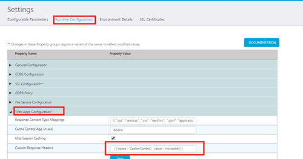

### To add OWASP Secure Headers to Middleware Service, follow these steps.

1.  Sign in to [Volt MX Foundry Console](https://manage.hclvoltmx.com/).
2.  Select Environments from the left navigation pane.
3.  Go to Admin Console.
4.  In Admin Console, select Settings from the left navigation pane.
5.  In **Settings** > **Runtime Configurations** > **General Configuration** > **Service Custom Response Headers**, add the headers in the following format:
```
[{
    "name": "Cache-Control",
    "value": "no-cache,no-store,must-revalidate"
    }, {
    "name": "Pragma",
    "value": "no-cache"
    }, {
    "name": "X-Content-Type-Options",
    "value": "nosniff"
    }, {
    "name": "X-Frame-Options",
    "value": "DENY"
    }, {
    "name": "X- XSS-Protection",
    "value": "1; mode=block"
    }, {
    "name": "Expires",
    "value": "0"
    }, {
    'name': 'Strict-Transport-Security',
    'value': 'max-age=86400;includeSubDomains'
    }]
```

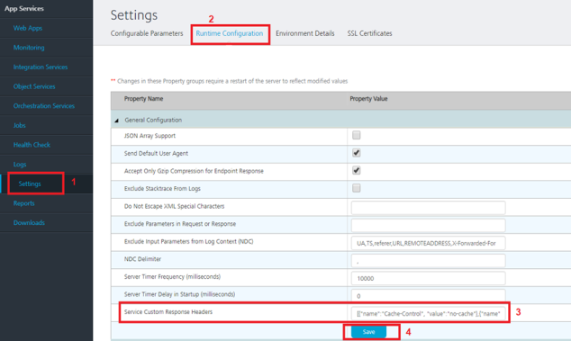

## Disable Caching for Sensitive Middleware Services

Most modern browsers and devices store a local cache copy of content received from web servers, unless restricted. Users can also access Cache content through HTTPS. Users having access to a device can retrieve any sensitive information stored in the local cache by other users.

To avoid storage of sensitive data in cache, applications must contain **caching directives** that instruct browsers to not store local copies of any sensitive data. You can configure the web server to prevent caching for relevant paths within the root directory of the web. Alternatively, most web development platforms allow the user to control the server's caching directives with individual scripts. Ideally, the web server must return the following HTTP headers in all responses that contain sensitive content:

- **Cache-control**: no-store
- **Pragma**: no-cache

### To set the header for Volt MX Foundry version V9 SP2 or earlier versions, do the following:

Use custom filters to add cache-control as a response-header

- **CacheHeaderResponseWrapper** is a response wrapper that adds the header just before it writes the response to the client.
- **CacheHeaderFilter** is the custom filter that uses the **CacheHeaderResponseWrapper** response wrapper and passes it into the filter chain.

The following code is an example for a custom filter.

```
 CacheHeaderResponseWrapper.java
package com.voltmx.custom.filters;

import java.io.IOException;
import java.io.PrintWriter;

import javax.servlet.ServletOutputStream;
import javax.servlet.http.HttpServletResponse;

import org.apache.logging.log4j.LogManager;
import org.apache.logging.log4j.Logger;

import com.hcl.voltmx.middleware.common.KHttpServletResponseWrapper;

public class CacheHeaderResponseWrapper extends KHttpServletResponseWrapper {
private static final Logger LOGGER = LogManager.getLogger(CacheHeaderResponseWrapper.class);

    private ServletOutputStream originalOutputStream;
    private PrintWriter originalWriter;

    private ServletOutputStream customOutputStream;
    private PrintWriter customWriter;

    private HttpServletResponse response;

    public CacheHeaderResponseWrapper(HttpServletResponse response) {
        super(response);
        this.response = response;
    }

    @Override
    public PrintWriter getWriter() throws IOException {
        if (originalWriter == null) {
            LOGGER.debug("Creating a custom writer.");
            originalWriter = super.getWriter();

            customWriter = new PrintWriter(originalWriter) {

                @Override
                public void write(String content) {
                    addCacheControlHeader();
                    super.write(content);
                }
            };
        }
        return customWriter;
    }

    @Override
    public ServletOutputStream getOutputStream() throws IOException {
        if (originalOutputStream == null) {
            LOGGER.debug("Creating a custom servlet output stream.");
            originalOutputStream = super.getOutputStream();

            customOutputStream = new ServletOutputStream() {

                @Override
                public void write(int b) throws IOException {
                    originalOutputStream.write(b);
                }

                @Override
                public void flush() throws IOException {
                    addCacheControlHeader();
                    super.flush();
                }
            };
        }
        return customOutputStream;
    }

    private void addCacheControlHeader() {
        // Add the required response headers here.
        response.setHeader("Cache-control", "no-store, no-cache, must-revalidate");
        response.setHeader("Pragma", "no-cache");

    }

}

CacheHeaderFilter.java
package com.voltmx.custom.filters;

import java.io.IOException;

import javax.servlet.Filter;
import javax.servlet.FilterChain;
import javax.servlet.FilterConfig;
import javax.servlet.ServletException;
import javax.servlet.ServletRequest;
import javax.servlet.ServletResponse;
import javax.servlet.http.HttpServletResponse;

import org.apache.logging.log4j.LogManager;
import org.apache.logging.log4j.Logger;

import com.hcl.voltmx.middleware.common.MWConstants;
import com.hcl.voltmx.middleware.servlet.filters.IntegrationCustomFilter;

@IntegrationCustomFilter(filterOrder = 2, urlPatterns = MWConstants.ANY)
public class CacheHeaderFilter implements Filter {
private static final Logger LOGGER = LogManager.getLogger(CacheHeaderFilter.class);

    @Override
    public void init(FilterConfig filterConfig) throws ServletException {
        LOGGER.debug("Loading CacheHeaderFilter.");
    }

    @Override
    public void doFilter(ServletRequest request, ServletResponse response, FilterChain chain)
    throws IOException, ServletException {
        CacheHeaderResponseWrapper responseWrapper = new CacheHeaderResponseWrapper(
            (HttpServletResponse) response);

        chain.doFilter(request, responseWrapper);

    }

    @Override
    public void destroy() {}

}
```

For more information about how to implement a custom filter, refer to [Custom User Filter Guide](https://support.hcltechsw.com/csm?id=kb_article&sysparm_article=KB0083514).

**Setting the header for Volt MX Foundry version V9 SP2 Hotfix version or later versions.**

**To add response headers to middleware services, follow these steps.**

1.  Sign in to [Volt MX Foundry Console](https://manage.hclvoltmx.com/).
2.  Select Environments from the left navigation pane.
3.  Go to Admin Console.
4.  In Admin Console, select Settings from the left navigation pane.
5.  In **Settings** > **Runtime Configurations** > **General Configuration** > **Service Custom Response Headers**, add the headers in the following format:
```
[{
    "name": "Cache-Control",
    "value": "no-cache,no-store,must-revalidate"
    }, {
    "name": "Pragma",
    "value": "no-cache"
    }, {
    "name": "X-Content-Type-Options",
    "value": "nosniff"
    }, {
    "name": "X-Frame-Options",
    "value": "DENY"
    }, {
    "name": "X- XSS-Protection",
    "value": "1; mode=block"
    }, {
    "name": "Expires",
    "value": "0"
    }, {
    'name': 'Strict-Transport-Security',
    'value': 'max-age=86400;includeSubDomains'
    }]
```

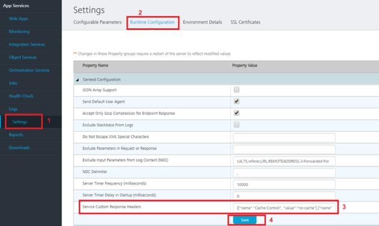

## Security Fixes for the External App Servers

Enable the following headers along with their mentioned values in Foundry App Servers.

| Header                    | Value                                               |
| ------------------------- | --------------------------------------------------- |
| X-Content-Type-Options    | nosniff                                             |
| Strict-Transport-Security | max-age=31536000; includeSubDomains; preload        |
| Cache-Control             | private, no-cache, no-store, max-age=0, notransform |
| Pragma                    | no-cache                                            |
| Expires                   | 0                                                   |
| X-XSS-Protection          | 1; mode= block                                      |
