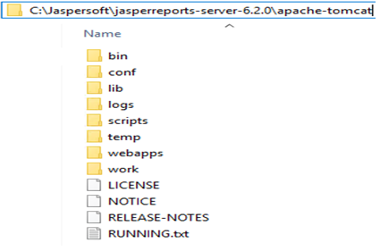
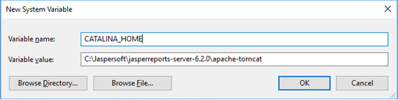
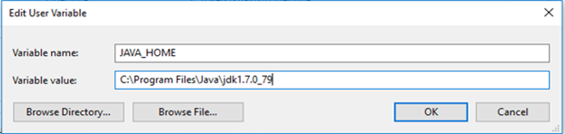
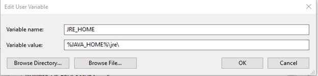
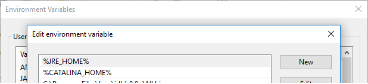
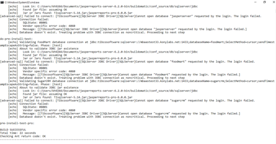
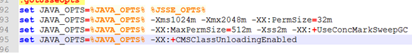
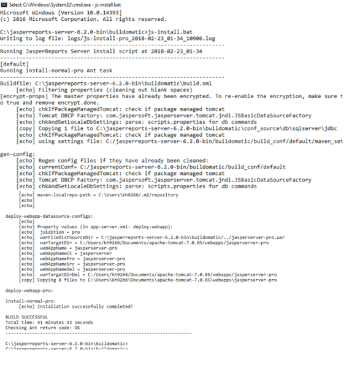
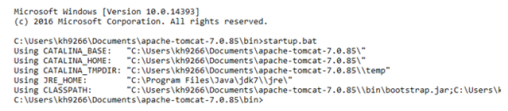
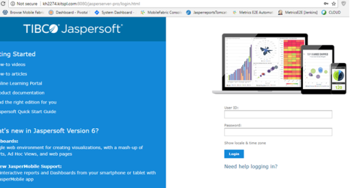

                           

You are here: How to Install JasperReports Server WAR file using js-install Scripts

How to Install the JasperReports Server WAR file using js-install Scripts
-------------------------------------------------------------------------

The following section details how to install JasperReports® Server using the WAR file V6.2 distribution. The steps in this section provide you more details on js-install shell scripts supported on Windows and Linux operating systems.

> **_Note:_** You can perform the following steps to install JasperReports Server WAR file using js-install Scripts for V 7.1 as well.

1.  Install Apache Tomcat 7 application servers from the following link:  
    [https://tomcat.apache.org/download-70.cgi](https://tomcat.apache.org/download-70.cgi)
    
    > **_Note:_** To install JasperReports Server V7.1, you must have Apache Tomcat 8.
    
2.  Create a folder in `C:\Jaspersoft\jasperreports-server-6.2.0\ apache-tomcat`
3.  Extract the content from the Tomcat zip into the folder you created in the previous step.  
    For example, `C:\apache-tomcat-7.0.85-windows-x64.zip\apache-tomcat-7.0.85\` to `C:\Jaspersoft\jasperreports-server-6.2.0\apache-tomcat`
    
    
    
4.  Set the catalina home by using the following command:
    
    Set "CATALINA\_HOME=C:\\Jaspersoft\\jasperreports-server-6.2.0\\apache-tomcat"
    
    
    
    > **_Note:_** In Linux, these variables will be set in bash profile and executed before going further.
    
5.  Set the JRE home by using the following command:
    
    set "JRE\_HOME=<C:\\Program Files\\Java\\jdk1.7.0\_79\\jre\\"
    
    
    
    
    
    > **_Note:_** In Linux, these variables will be set in bash profile and executed before going further.
    

1.  Add the `CATALINA_HOME` and the `JRE_HOME` to the PATH variable.
    
    
    

1.  Locate or install the SQL Server database.
    
    > **_Note:_** The target database can be on a remote server.
    
    > **_Note:_** The application server should reside on the local machine.
    
2.  Extract all the files from the `jasperreports-server-6.2.0-bin.zip`.
    
    1.  Navigate to the destination, for example, `C:\Jaspersoft` on Windows and `/home/<user>` on Linux.  
        The directory, `jasperreports-server-6.2.0-bin`, appears in the file location that you have chosen.
    
    > **_Note:_** The <js-install> refers to <unzipped-location>\\jasperreports-server-6.2.0-bin.
    
3.  Copy the `<database name>_master.properties` file, specific to your database, from the `sample_conf` and paste it to the `buildomatic` folder:
    *   Copy from — `<js-install>/buildomatic/sample_conf/`
    *   Paste at — `<js-install>/buildomatic`
        
        For example, if your database is PostgreSQL, copy the `postgresql_master.properties` to the `<jsinstall>/buildomatic`.
        
4.  Rename the file you copied to the `default_master.properties`.
5.  Edit the `default_master.properties` file to add settings specific to for your database and application server.
    
    The following table details for db types and their respective sample property values:
    
    | Database Type | Sample Property Values |
    | --- | --- |
    | PostgreSQL | appServerType=tomcat7 \[tomcat6, tomcat8, jboss, jboss-eap-6, jboss-as-7, glassfish3, skipAppServerCheck\] appServerDir=c:\\\\Program Files\\\\Apache Software Foundation\\\\Tomcat 7 dbHost=localhost dbUsername=postgres dbPassword=postgres |
    | MySQL | appServerType=tomcat7 \[tomcat6, tomcat8, jboss, jboss-eap-6, jboss-as-7, glassfish3, skipAppServerCheck\] appServerDir=c:\\\\Program Files\\\\Apache Software Foundation\\\\Tomcat 7 dbUsername=root dbPassword=password dbHost=localhost |
    | Oracle 12c with CDB/PDB | Use settings for Oracle, except for the following changes: dbUsername=c##jasperserver sid=cdb1 |
    | Other supported Oracle databases(including 12c non- CDB) | appServerType=tomcat7 \[tomcat6, tomcat8, jboss, jboss-eap-6, jboss-as-7, glassfish3, skipAppServerCheck\] appServerDir=c:\\\\Program Files\\\\Apache Software Foundation\\\\Tomcat 7 dbUsername=jasperserver dbPassword=password sysUsername=system sysPassword=password dbHost=hostname |
    | DB2 | appServerType=tomcat7 \[tomcat6, tomcat8, jboss, jboss-eap-6, jboss-as-7, glassfish3, skipAppServerCheck appServerDir=c:\\\\Program Files\\\\Apache Software Foundation\\\\Tomcat 7 dbUsername=db2admin dbPassword=password dbHost=localhost |
    | SQL Server | appServerType=tomcat7 \[tomcat6, tomcat8, jboss, jboss-eap-6, jboss-as-7, glassfish3, skipAppServerCheck\] appServerDir=c:\\\\Program Files\\\\Apache Software Foundation\\\\Tomcat 7 dbUsername=sa dbPassword=sa dbHost=localhost |
    
    > **_Note:_** When the appServerType property is set to skipAppServerCheck, the buildomatic skips all the application server validations.  
      
    The following are the limitations:
    
    *   You must add an extra \\ (backslash) to paths in the .properties files, for example, appServerDir=C:\\\\Apache Software Foundation\\\\ apache-tomcat-7.0.85.
    *   The dbUsername must be the same as the username used in the Oracle DB. In addition, buildomatic will not work with the “sys as sysdba” syntax.
    *   For Oracle 12c without CDB/PDB, do not use the c##jasperserver dbUsername. Use the standard jasperserver dbUsername instead.
    

1.  Update the encrypt property for password encryption.
    
    The `default_master.properties` file has a property setting to enable encryption of passwords that reside on the file system. This applies to all the files found in the buildomatic folder, as well as the connection pooling file used by Apache Tomcat (context.xml). Currently, password encryption for connection pooling is supported only on the Tomcat application server.
    
    To enable encryption on the file system, un-comment the encrypt property so that it looks like this:
    
    encrypt=true
    
2.  Run the js-install Script in test mode.
    *   **To run the js-install script in test mode on Windows, follow these steps:**
        
        1.  Navigate to the buildomatic directory:
            
            `cd <js-install>/buildomatic`
            
        2.  Enter the following command to run the js-install script in test mode:
            
            `js-install.bat test`
            
    *   **To run the js-install script in test mode on Linux, follow these steps:**
        
        1.  Navigate to the buildomatic directory:
            
            `cd <js-install>/buildomatic`
            
        2.  Enter the following command to run the js-install script in test mode:
            
            `./js-install.sh test`
            
        
        \----------------------------------------------------------------------  
        Running JasperReports Server install script at 2018-02-23\_12-31  
        \----------------------------------------------------------------------  
        \[test\] Running pre-install-test-pro Ant task  
        \----------------------------------------------------------------------  
        Buildfile: C:\\Users\\kh9266\\Documents\\jasperreports-server-6.2.0-bin\\buildomatic\\build.xml \[echo\] Filtering properties (cleaning out blank spaces)
        
        
        

1.  Set Java JVM Options (required)
    
    The following table details JVM options on Windows (64-bit):
    
    | JVM Options on Windows (64-bit) ||
    | --- | --- |
    | Options for all application servers | set JAVA\_OPTS=%JAVA\_OPTS% -Xms1024m -Xmx2048m -XX:PermSize=32mset JAVA\_OPTS=%JAVA\_OPTS% -XX:MaxPermSize=512m -Xss2m -XX:+UseConcMarkSweepGCset JAVA\_OPTS=%JAVA\_OPTS% -XX:+CMSClassUnloadingEnabled |
    | For Oracle | set JAVA\_OPTS=%JAVA\_OPTS% -DORACLE.JDBC.DEFAULTNCHAR=TRUE |
    | Additional options for JBoss | set JAVA\_OPTS=%JAVA\_OPTS% -DJAVAX.XML.SOAP.MESSAGEFACTORY=ORG.APACHE.AXIS.SOAP.MESSAGEFACTORYIMPL set JAVA\_OPTS=%JAVA\_OPTS% -DJAVAX.XML.SOAP.SOAPCONNECTIONFACTORY=ORG.APACHE.AXIS.SOAP.SOAPCONNECTIONFACTORYIMPL set JAVA\_OPTS=%JAVA\_OPTS% -DJAVAX.XML.SOAP.SOAPFACTORY=ORG.APACHE.AXIS.SOAP.SOAPFACTORYIMPL |
    | Additional option for JBoss EAP6.0.1 | set JAVA\_OPTS=%JAVA\_OPTS% -DJAVAX.XML.TRANSFORM.TRANSFORMERFACTORY=ORG.APACHE.XALAN.PROCESSOR.TRANSFORMERFACTORYIMPL |
    
    > **_Note:_** Add the JAVA\_OPTS in <js-install>/bin/catalina.bat  
      
    
    
    The following table details JVM options on Linux (64-bit):
    
    | JVM Options on Linux (64-bit) ||
    | --- | --- |
    | Additional options for all application servers | EXPORT JAVA\_OPTS="$JAVA\_OPTS -XMS1024M -XMX2048M -XX:PERMSIZE=32M"EXPORT JAVA\_OPTS="$JAVA\_OPTS -XX:MAXPERMSIZE=512M -XSS2M"EXPORT JAVA\_OPTS="$JAVA\_OPTS -XX:+USECONCMARKSWEEPGC"EXPORT JAVA\_OPTS="$JAVA\_OPTS -XX:+CMSCLASSUNLOADINGENABLED" |
    | For Oracle | export JAVA\_OPTS="$JAVA\_OPTS -Doracle.jdbc.defaultNChar=true" |
    | Additional options for JBoss | export JAVA\_OPTS="$JAVA\_OPTS -Djavax.xml.soap.MessageFactory=org.apache.axis.soap.MessageFactoryImpl" export JAVA\_OPTS="$JAVA\_OPTS -Djavax.xml.soap.SOAPConnectionFactory=org.apache.axis.soap.SOAPConnectionFactoryImpl"export JAVA\_OPTS="$JAVA\_OPTS -Djavax.xml.soap.SOAPFactory=org.apache.axis.soap.SOAPFactoryImpl" |
    | Additional options for JBoss EAP 6.0.1 | export JAVA\_OPTS="$JAVA\_OPTS -Djavax.xml.transform.TransformerFactory=org.apache.xalan.processor.TransformerFactoryImpl" |
    

1.  Set up the license (required)
    
    Replace the **existing** license file with the **actual** license file present in the following location:
    
    | OPERATING SYSTEMS ||
    | --- | --- |
    | Linux | `/home/<user>/` |
    | Windows installed from WAR file | `C:\Users\<user>\` |
    | Windows installed from binary installer | `C:\Users\` |
    
    > **_Note:_** View the output logs at `<js-install>/buildomatic/logs/js-install-<date>.log`
    
2.  Run the `js-install` scripts:
    
    1.  Start your database server.
    2.  Stop your application server.
    3.  Open the Command Prompt as Administrator on Windows or open a terminal window on Linux.
    4.  Type `cd <js-install>/buildomatic`
    5.  Run the js-install script.
    
    | Description | Commands |
    | --- | --- |
    | Install the JasperReports Server, sample data, and sample databases (foodmart and suagrcrm) | \> `js-install.bat` (Windows) `$ ./js-install.sh` (Linux) |
    | Install the JasperReports Server, but not the sample data and sample databases | `> js-install.bat minimal` (Windows) `$ ./js-install.sh minimal` (Linux) |
    
    > **_Note:_** Windows has a path length limitation of 260 characters.  
    Instead of installing JRS from <LocalDrive\_Path>\\Projects\\JasperReports Server\\jasperreports-server-6.2.0-bin, try to install it from C:\\jasperreports-server-6.2.0-bin.
    
    
    
3.  Start the server.
    *   Use any of the following commands to start your application server and run the JasperReports Server:
        
        *   Tomcat:
            
            *   Windows: `<tomcat>\bin\startup.bat`
            *   Linux: `<tomcat>/bin/startup.sh`
                
            
            
            
            
