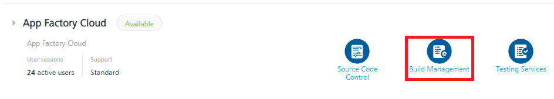

                         

Accessing the App Factory console
=================================

You can access the App Factory console from Volt MX Foundry, or from the direct console link. To access the App Factory console from Volt MX Foundry, follow these steps:

1.  Sign-in to the [VoltMX Foundry Console](https://manage.hclvoltmx.com/).
2.  From the left panel, click **Environments**.
3.  For the App Factory environment that you want to use, click **Build Management**.
    
    > **_Note:_** Based on the authentication settings, you may need to sign-in to the App Factory Console.
    
    
    

> **_Note:_** If you do not have an environment of type **App Factory Cloud**, but you are certain that your account has one, contact your account’s administrator to request access. If your account does not have an App Factory Environment provisioned, the account owner can request for one.

From the App Factory console, you can configure and run the jobs that are required to build, test, distribute and deploy your multi-experience applications.

If you use Jenkins, you will recognize that the App Factory Console is a re-branded and somewhat modified Jenkins web console. Jenkins is one of the many best-of-breed technologies that App Factory is built on. However, it should be noted that unlike bare-bones Jenkins, App Factory is not meant to manage your Jenkins cluster or script your own jobs. App Factory is meant to get you up and running to build and test projects that are built specifically on the Volt MX platform, with virtually no lead team and no prior skills in DevOps tools.
