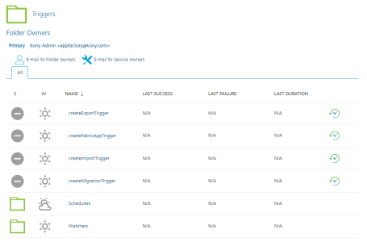
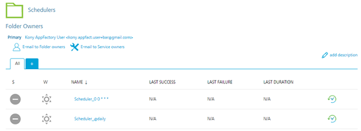

                         

Scheduling a Build
==================

App Factory provides the ability to create triggers, which are specialized jobs that are used to automate and run tasks for your projects.

Consider a scenario in which a developer wants to implement a nightly build system. The administrator can create a scheduler that runs the build jobs for the app at a specified time (such as 12AM) everyday.

Every App Factory project contains a folder called **Triggers** in the **Foundry** sub-folder. The Triggers folder contains a job called **createFoundryAppTrigger**, and two sub-folders called **schedulers** and **watchers** (to store the created jobs).

> **_Important:_** HCL recommends that you use the **createFoundryAppTrigger** job to create scheduler jobs.  
  
Other Trigger jobs such as **createExportTrigger**, **createImportTrigger**, and **createMigrationTrigger** will be deprecated soon. The functionality of these triggers is available in the **createFoundryAppTrigger** job.

Configuring a Scheduler Job in App Factory
------------------------------------------

1.  From the **Foundry** folder of your project, navigate to **Triggers**.  
    
2.  In the **Triggers** folder, click the **build** icon for the **createFoundryAppTrigger** job.  
    Alternatively, select the **createFoundryAppTrigger** job, and then select the **Build with Parameters** option from the left panel.
3.  For the CRON\_SCHEDULE parameter, type a Cron expression that corresponds to the time at which the build job must be triggered.  
    For information about cron expressions, refer to [Cron](https://en.wikipedia.org/wiki/Cron).
4.  Configure the other parameters based on the build settings that you want to configure for the scheduler or nightly build. For more information about the parameters, refer to [Building Volt MX Foundry App](BuildingFoundryApp.md).
5.  After you configure the parameters, click **BUILD**.

The **createFoundryAppTrigger** job then creates a scheduler job in the **Schedulers** folder. The job is launched based on the time that is set by the CRON\_SCHEDULE expression with the usual flow of [Building a Volt MX Foundry App](BuildingFoundryApp.md).

