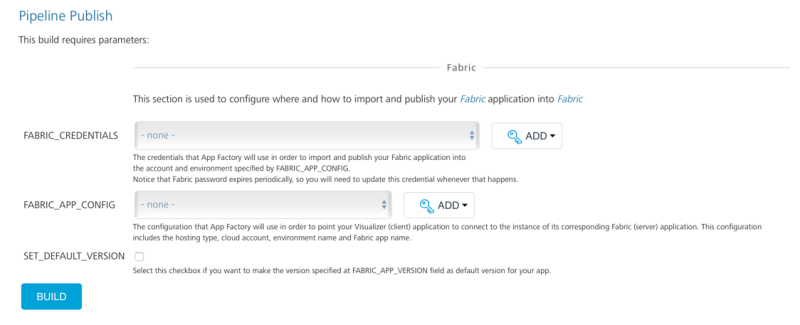
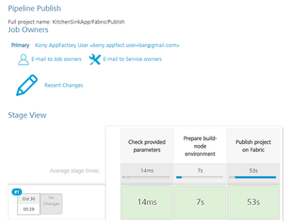
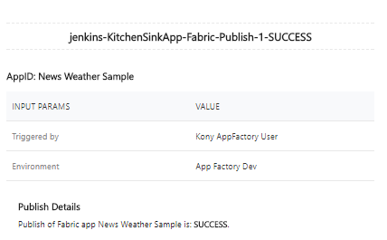
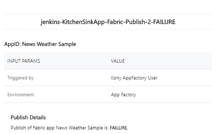

                          

Publish a Foundry app
--------------------

> **_Important:_** The **Publish** job is deprecated. HCL recommends using the **buildFoundryApp** job from the `Foundry/Builds` folder to achieve similar functionality. You can opt in to the **IMPORT** and **PUBLISH** options while configuring the build job to achieve the same functionality as the Publish job.

Publish job is responsible for publishing the existing Volt MX Foundry application to a specific environment.

### Configuration

The following parameters appear when a user selects build with parameters job action.

Publish job uses only Volt MX Foundry group of job parameters with one additional parameter:

1.  **VoltMX FOUNDRY RELATED**
    
    *   **FOUNDRY\_CREDENTIALS** - Volt MX Foundry credentials.
    *   **FOUNDRY\_APP\_CONFIG** \- Configuration of the Volt MX Foundry App.
        *   **Environment Name** - Foundry Environment on which the app is published.
        *   **Application Name** - An application ID from Volt MX Foundry (in most of the cases it is same as application name).
        *   **Application Version** - The version of the Volt MX Foundry app. The default version is 1.0.
        *   **Account Id** - Volt MX Foundry account ID.
        *   **Console URL** - Publicly accessible URL of your Volt MX Foundry Console (without the context path). Only relevant for on-premise installation.  
            For example, `http://10.10.12.34:8080`
        *   **Identity URL** - Publicly accessible URL of your Volt MX Identity Services (without the context path). Only relevant for on-premise installation.  
            For example, `http://10.10.12.34:8081`
    *   **SET\_DEFAULT\_VERSION** - Click the checkbox to make the version specified at **Foundry\_App\_Version** field as a default version for your app.
    
    
    

### Publishing

Once all the parameters are set, trigger publish using **BUILD** button. Publishing process contains the following stages:

*   Prepare the build node environment
*   Publish Volt MX Foundry application
*   Notify on Import status by email

On successful import, the designated user receives an email alert with the success details.

On unsuccessful import, the designated user receives an email alert with failure details.

