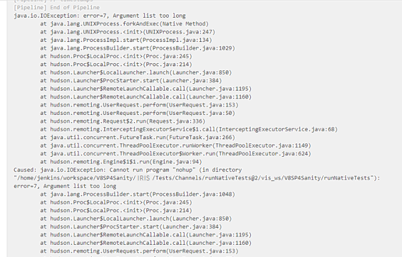

                          

Known Issues
============

*   Creation of **Custom Hooks** view at Jenkins level is not supported.
*   If you run the test on both android and iOS devices in a single build, you may get the following error due to the jenkins limitation. Try to run the test in separate builds, one for android and one for iOS, to resolve the issue.
    
    
    
*   Upgrading an older project that contains Foundry jobs to V9 ServicePack 1 causes duplication of the Foundry jobs in the **Foundry** and **FoundryTasks** sub-folders of the project.  
    To use features of Foundry V9 ServicePack 1, HCL recommends that you create a new project for Foundry jobs. For more information, refer to [Create a New App Factory Project](Setup.md).

Limitations
===========

*   In AWS Device farm we have a limitation of 150 minutes for test execution. If the execution time exceeds this limit, the remaining tests are skipped
*   V8 SP3 features are not displayed on existing projects in App Factory Console. To make use of the new features, you must create a new project from this console.
*   Currently, App Factory is not supporting wild card provisioning profiles.
*   Due to internal tool dependency, App Factory Foundry does not allow migrating to a different version or creating a new version (that does not exist in Project zip/MF Console app).
*   With new XCODE 11, when you trigger an iOS build using an Apple ID, by default, the iPhone Certificates are generated instead of Apple Certificates. There will not be any affect on the functionality of the application and it will continue to work as usual.
*   Currently, App Factory Foundry does not support renaming of existing App Factory projects. If needed, please create a new App Factory project.
*   App Factory Foundry does not support Git 2 Factor Authentication.
*   Due to technical dependencies, the **Rebuild** screen does not allow proper modifications to a few parameters.  
    For example:
    *   New credentials cannot be added by using the **Add** button or by using credential type parameters such as CLOUD\_CREDENTIALS\_ID/FOUNDRY\_CREDENTIALS\_ID or FOUNDRY\_APP\_CONFIG.  
        These credentials can only be added at a Global scope (Jenkins scope) by an Admin.
    *   For parameters such as BUILD\_MODE or IOS\_DISTRIBUTION\_TYPE, the screen displays a text box. Improperly editing the text box can lead to failures due to invalid options during the build phase.
