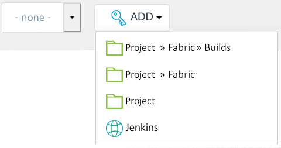
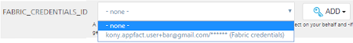
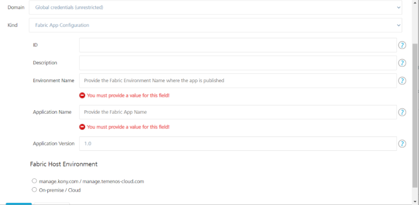
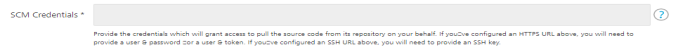
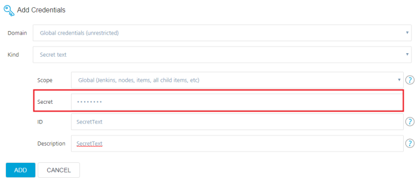

                           

Managing Credentials
====================

The following sections explain the different types of credentials that can be added to App Factory. You can add new credentials, edit existing credentials, and also delete existing credentials.

Adding New Credentials
----------------------

Adding New Volt MX Cloud Credentials

A Iris project connects to Volt MX Foundry to create and publish back-end services. To use Volt MX Foundry, you need to add the Volt MX Cloud credentials to your project.

To add Volt MX Cloud credentials to your project, follow these steps.

1.  From the **Volt MX Iris & Foundry** section in the **buildIrisApp** job, next to the **FOUNDRY\_CREDENTIALS\_ID** parameter, click **ADD**. A drop-down list appears.
2.  From the drop-down list, select the scope at which you want to add the new credentials.
        
    
    > **_Note:_** As HCL typically provides only one set of these credentials per customer, HCL recommends that you store this credential type in the **Jenkins** scope to share it across projects and to avoid creating unnecessary duplicates.  
    
    
3.  In the **Add Credentials** window, from the **Kind** list, select **Username and Password**.
    
    > **_Note:_** In the Domain field, make sure that the **Global Credentials (Unrestricted)** domain is selected.
      
    ]

4.  Configure the parameters that appear on the Add Credentials window. For more information about the parameters, refer to the following table.
    ]
    
    <table style="width: 80%;mc-table-style: url('Resources/TableStyles/Basic.css');" class="TableStyle-Basic" cellspacing="0"><colgroup><col class="TableStyle-Basic-Column-Column1" style="width: 30%;"><col class="TableStyle-Basic-Column-Column1" style="width: 50%;"></colgroup><tbody><tr class="TableStyle-Basic-Body-Body1"><th class="TableStyle-Basic-BodyE-Column1-Body1">Parameter</th><th class="TableStyle-Basic-BodyD-Column1-Body1">Description</th></tr><tr class="TableStyle-Basic-Body-Body1"><td class="TableStyle-Basic-BodyE-Column1-Body1">Scope</td><td class="TableStyle-Basic-BodyD-Column1-Body1">Specifies the level at which the credentials are used. Contains the following options:<b>System</b>: The credentials are available to the associated object. Credentials with a System scope are used for email, authentication, slave connection, and scenarios in which the Jenkins instance uses the credentials.<b>Global</b>: The credentials are available to the associated object and also to the child objects. The credentials with a global scope are typically used for the additional requirements of a job.<b><i>Note: </i></b>For Cloud credentials, select <b>Global</b>.</td></tr><tr class="TableStyle-Basic-Body-Body1"><td class="TableStyle-Basic-BodyE-Column1-Body1">Username</td><td class="TableStyle-Basic-BodyD-Column1-Body1">Specifies the Username of your Volt MX Cloud instance.</td></tr><tr class="TableStyle-Basic-Body-Body1"><td class="TableStyle-Basic-BodyE-Column1-Body1">Password</td><td class="TableStyle-Basic-BodyD-Column1-Body1">Specifies the Password of your Volt MX Cloud instance.</td></tr><tr class="TableStyle-Basic-Body-Body1"><td class="TableStyle-Basic-BodyE-Column1-Body1">ID</td><td class="TableStyle-Basic-BodyD-Column1-Body1">Specifies the unique identifier that jobs and other configurations use to identify the credentials.<b><i>Note: </i></b>HCL strongly recommends that you specify an ID that you can easily recognize.If this field is left blank, an ID is automatically generated, which you may not be able to recognize later.</td></tr><tr class="TableStyle-Basic-Body-Body1"><td class="TableStyle-Basic-BodyB-Column1-Body1">Description</td><td class="TableStyle-Basic-BodyA-Column1-Body1">Specifies the details about the credentials. This is an optional field.HCL recommends that you provide a unique description so that you can easily distinguish the credentials while triggering a build.</td></tr></tbody></table>
    
5.  After you configure the parameters, click **Add**.
6.  On the **buildIrisApp** job, from the FOUNDRY\_CREDENTIALS\_ID list, select the credentials that you added.

Adding new Volt MX Foundry App Config

A Volt MX Foundry App configuration connects to the specified back-end services while building a Iris app. In the FOUNDRY\_APP\_CONFIG parameter, you can specify the details of your app such as the host URL, app name, environment, and app version. The details are used to fetch the app services document, binding the app to an environment, and publish the app to the environment.

To add a Foundry app configuration, follow these steps:

1.  From the **Volt MX Iris & Foundry** section in the **buildIrisApp** job, next to the **FOUNDRY\_APP\_CONFIG** parameter, click **ADD**. A drop-down list appears.
2.  From the drop-down list, select the scope at which you want to add the new credentials.  
    
    
    
    > **_Note:_** As HCL typically provides only one set of these credentials per customer, HCL recommends that you store this credential type in the **Jenkins** scope to share it across projects and to avoid creating unnecessary duplicates.  
    
    
3.  In the **Add Credentials** window, from the **Kind** list, select **Foundry App Configuration**.
    
    > **_Note:_** In the Domain field, make sure that the **Global Credentials (Unrestricted)** domain is selected.
    
    
    
4.  Configure the parameters that appear on the **Add Credentials** window. For more information about the parameters, refer to the following table.
    
    <table style="mc-table-style: url('Resources/TableStyles/Basic.css');width: 80%;" class="TableStyle-Basic" cellspacing="0"><colgroup><col class="TableStyle-Basic-Column-Column1" style="width: 20%;"><col class="TableStyle-Basic-Column-Column1" style="width: 50%;"></colgroup><tbody><tr class="TableStyle-Basic-Body-Body1"><th class="TableStyle-Basic-BodyE-Column1-Body1">Parameter</th><th class="TableStyle-Basic-BodyD-Column1-Body1">Description</th></tr><tr class="TableStyle-Basic-Body-Body1"><td class="TableStyle-Basic-BodyE-Column1-Body1">ID</td><td class="TableStyle-Basic-BodyD-Column1-Body1">Specifies the unique identifier that jobs and other configurations use to identify the credentials.<b><i>Note: </i></b>HCL strongly recommends that you specify an ID that you can easily recognize.If this field is left blank, an ID is automatically generated, which you may not be able to recognize later.</td></tr><tr class="TableStyle-Basic-Body-Body1"><td class="TableStyle-Basic-BodyE-Column1-Body1">Description</td><td class="TableStyle-Basic-BodyD-Column1-Body1">Specifies the details about the credentials. This is an optional field.HCL recommends that you provide a unique description so that you can easily distinguish the credentials while triggering a build.</td></tr><tr class="TableStyle-Basic-Body-Body1"><td class="TableStyle-Basic-BodyE-Column1-Body1">Environment Name</td><td class="TableStyle-Basic-BodyD-Column1-Body1">Specifies the Volt MX Foundry name to which you want to publish the Foundry app.</td></tr><tr class="TableStyle-Basic-Body-Body1"><td class="TableStyle-Basic-BodyE-Column1-Body1">Application Name</td><td class="TableStyle-Basic-BodyD-Column1-Body1">Specifies the name of the Foundry app that you want to bind to the project.</td></tr><tr class="TableStyle-Basic-Body-Body1"><td class="TableStyle-Basic-BodyE-Column1-Body1">Application Version</td><td class="TableStyle-Basic-BodyD-Column1-Body1">Specifies the version of the Foundry app that you want to bind to the project.</td></tr><tr class="TableStyle-Basic-Body-Body1"><td class="TableStyle-Basic-BodyE-Column1-Body1">Foundry Host Environment</td><td class="TableStyle-Basic-BodyD-Column1-Body1">Specifies the location of the Foundry server on which the cloud environment is hosted.Contains the following options:<b>manage.hclvoltmx.com</b>/<b>manage.hcl.com</b>This check box specifies that the Foundry environment is hosted on the HCL AWS Cloud.When you select this check box, the <b>Account ID</b>&nbsp;parameter appears.<b>On-Premise/Cloud</b>This check box specifies that the Foundry environment is hosted on-premises or on other clouds (such as Azure).When you select this check box, the <b>Console URL</b> and <b>Identity URL</b> parameters appear.</td></tr><tr class="TableStyle-Basic-Body-Body1"><td class="TableStyle-Basic-BodyE-Column1-Body1">Account ID</td><td class="TableStyle-Basic-BodyD-Column1-Body1">Specifies the account ID of the cloud on which the Foundry environment is hosted.The default account ID&nbsp;for this field is for the cloud that is linked to your App Factory environment. If you want link the project to a different cloud, type the account ID in the text box.This parameter is applicable only if <b>manage.hclvoltmx.com</b>/<b>manage.hcl.com</b> is selected as the <b>Foundry Host Environment</b>.</td></tr><tr class="TableStyle-Basic-Body-Body1"><td class="TableStyle-Basic-BodyE-Column1-Body1">Console URL</td><td class="TableStyle-Basic-BodyD-Column1-Body1">Specifies the IP address (or the DNS) and port of the Foundry Console server. For example: <code class="codefirst">http://1.2.10.20:8080</code>This parameter is applicable only if <b>On-Premise/Cloud</b> is selected as the <b>Foundry Host Environment</b>.
<i>Note: </i></b>"><b><i>Note: </i></b>The Foundry Console server must be accessible from the App Factory build environment.If the Foundry Console is behind a firewall, make sure that the IP address is white-listed.If the Foundry Console is on a local on-premise setup, make sure that you enable public IP.
</td></tr><tr class="TableStyle-Basic-Body-Body1"><td class="TableStyle-Basic-BodyB-Column1-Body1">Identity URL</td><td class="TableStyle-Basic-BodyA-Column1-Body1">Specifies the IP address (or the DNS) and port of the Foundry identity server. For example: <code class="codefirst">http://1.3.10.30:8080</code>This parameter is applicable only if <b>On-Premise/Cloud</b> is selected as the <b>Foundry Host Environment</b>.
<i>Note: </i></b>"><b><i>Note: </i></b>The Foundry identity server must be accessible within the App Factory build environment.If the Foundry identity server is behind a firewall, make sure that the IP address is white-listed.If the Foundry identity server is on a local on-premise setup, make sure that you enable public IP.
</td></tr></tbody></table>
    
5.  Validate the details that you entered for the parameters, and then click **ADD**.
6.  On the **buildIrisApp** job, from the FOUNDRY\_APP\_CONFIG list, select the credentials that you added.

Adding a Sonar Token

A Sonar token is used to sign-in to your SonarQube cloud. To add a Sonar token as credentials, follow these steps:

1.  From the **SonarQube** section in the **Iris Project Settings**, next to the **Login Token** setting, click **ADD**. A drop-down list appears.
2.  From the drop-down list, select the scope at which you want to add the new credentials.
3.  In the **Add Credentials** window, from the **Kind** list, select **Sonar Token**.
    
    > **_Note:_** In the Domain field, make sure that the **Global Credentials (Unrestricted)** domain is selected.
    
4.  Configure the parameters that appear on the **Add Credentials** window. For more information about the parameters, refer to the following table.
    
    <table style="mc-table-style: url('Resources/TableStyles/Basic.css');width: 80%;" class="TableStyle-Basic" cellspacing="0"><colgroup><col class="TableStyle-Basic-Column-Column1" style="width: 20%;"><col class="TableStyle-Basic-Column-Column1" style="width: 60%;"></colgroup><tbody><tr class="TableStyle-Basic-Body-Body1"><th class="TableStyle-Basic-BodyE-Column1-Body1">Parameter</th><th class="TableStyle-Basic-BodyD-Column1-Body1">Description</th></tr><tr class="TableStyle-Basic-Body-Body1"><td class="TableStyle-Basic-BodyE-Column1-Body1">ID</td><td class="TableStyle-Basic-BodyD-Column1-Body1">Specifies the unique identifier that jobs and other configurations use to identify the credentials.<b><i>Note: </i></b>HCL strongly recommends that you specify an ID that you can easily recognize.If this field is left blank, an ID is automatically generated, which you may not be able to recognize later.</td></tr><tr class="TableStyle-Basic-Body-Body1"><td class="TableStyle-Basic-BodyE-Column1-Body1">Description</td><td class="TableStyle-Basic-BodyD-Column1-Body1">Specifies the details about the credentials. This is an optional field.HCL recommends that you provide a unique description so that you can easily distinguish the credentials while triggering a build.</td></tr><tr class="TableStyle-Basic-Body-Body1"><td class="TableStyle-Basic-BodyB-Column1-Body1">Sonar Token</td><td class="TableStyle-Basic-BodyA-Column1-Body1">Specifies the authentication token that is used to login to the SonarQube server.</td></tr></tbody></table>
    
5.  After you configure all the parameters, click **Add**.
6.  In the **Project Settings**, from the **Login Token** list, select the credentials that you added.

Adding New Source Control Repository Credentials

App Factory signs-in to your repository to check-out and build the Iris project. To build a Iris app, you need to add the source code repository credentials to your project.

> **_Note:_** If your repository is protected with 2FA (two-factor authentication) in GitHub, you need to add the GitHub credentials to your project. For more information, refer to [GitHub 2FA](Prerequisites.md#GitHub_2FA).

To add source code repository credentials, follow these steps.

1.  In the **Source Control** section of the **Iris Project Settings** or **Foundry Project Settings**, next to the **SCM Credentials** setting, click **ADD**. A drop-down list appears.
2.  From the drop-down list, select the scope at which you want to add the new credentials.
    
    > **_Note:_** As developers typically use the different GitHub accounts for different projects, HCL recommends that you store this credential type at the project level scope to keep it local to the project.  
    ](Resources/Images/projectSettings_credentials_Jenkins.png)
    
3.  In the **Add Credentials** window, from the **Kind** list, select **Username and Password**.
4.  Configure the parameters that appear on the Add Credentials window. For more information about the parameters, refer to the following table.  
    
    
    <table style="width: 80%;mc-table-style: url('Resources/TableStyles/Basic.css');" class="TableStyle-Basic" cellspacing="0"><colgroup><col class="TableStyle-Basic-Column-Column1" style="width: 30%;"><col class="TableStyle-Basic-Column-Column1" style="width: 50%;"></colgroup><tbody><tr class="TableStyle-Basic-Body-Body1"><th class="TableStyle-Basic-BodyE-Column1-Body1">Parameter</th><th class="TableStyle-Basic-BodyD-Column1-Body1">Description</th></tr><tr class="TableStyle-Basic-Body-Body1"><td class="TableStyle-Basic-BodyE-Column1-Body1">Scope</td><td class="TableStyle-Basic-BodyD-Column1-Body1">Specifies the level at which the credentials are used. Contains the following options:<b>System</b>: The credentials are available to the associated object. Credentials with a System scope are used for email, authentication, slave connection, and scenarios in which the Jenkins instance uses the credentials.<b>Global</b>: The credentials are available to the associated object and also to the child objects. The credentials with a global scope are typically used for the additional requirements of a job.</td></tr><tr class="TableStyle-Basic-Body-Body1"><td class="TableStyle-Basic-BodyE-Column1-Body1">Username</td><td class="TableStyle-Basic-BodyD-Column1-Body1">Specifies the user name of your SCM credentials.<b><i>Note: </i></b>If your repository is protected with 2FA (two-factor authentication) on GitHub, then the <b>Username</b> is your <b>GitHub user name</b>. For more information, refer to <a href="Prerequisites.html#GitHub_2FA" target="_blank">GitHub 2FA</a>.</td></tr><tr class="TableStyle-Basic-Body-Body1"><td class="TableStyle-Basic-BodyE-Column1-Body1">Password</td><td class="TableStyle-Basic-BodyD-Column1-Body1">Specifies the password of your SCM credentials.<b><i>Note: </i></b>If your repository is protected with 2FA (two-factor authentication) on GitHub, then the <b>Password</b> is the <b>GitHub personal access token</b>. For more information, refer to <a href="Prerequisites.html#GitHub_2FA" target="_blank">GitHub 2FA</a>.</td></tr><tr class="TableStyle-Basic-Body-Body1"><td class="TableStyle-Basic-BodyE-Column1-Body1">ID</td><td class="TableStyle-Basic-BodyD-Column1-Body1">Specifies the unique identifier that jobs and other configurations use to identify the credentials.<b><i>Note: </i></b>HCL strongly recommends that you specify an ID that you can easily recognize.If this field is left blank, an ID is automatically generated, which you may not be able to recognize later.</td></tr><tr class="TableStyle-Basic-Body-Body1"><td class="TableStyle-Basic-BodyB-Column1-Body1">Description</td><td class="TableStyle-Basic-BodyA-Column1-Body1">Specifies the details about the credentials. This is an optional field.HCL recommends that you provide a unique description so that you can easily distinguish the credentials while triggering a build.</td></tr></tbody></table>
    
5.  After you configure the parameters, click **Add**.
6.  In the **Source Control** section in the Project Settings, from the SCM Credentials list, select the credentials that you added.  
    

Add SSH Key Credentials

If the source code URL for your project is an SSH URL, you need to add the SSH key credentials that act as the source code repository credentials for the project.

> **_Note:_** You need to generate and add the SSH key to your GitHub account before you add the key in App Factory. For more information, refer to [Generating a New SSH key](https://help.github.com/en/enterprise/2.17/user/authenticating-to-github/generating-a-new-ssh-key-and-adding-it-to-the-ssh-agent) and [Adding the New SSH key to your GitHub Account](https://help.github.com/en/enterprise/2.17/user/authenticating-to-github/adding-a-new-ssh-key-to-your-github-account).

To add new SSH key credentials to your project, follow these steps.

1.  In the **Source Control** section of the **Iris Project Settings** or **Foundry Project Settings**, next to the **SCM Credentials** setting, click **ADD**. A drop-down list appears.
2.  From the drop-down list, select the scope at which you want to add the new credentials.
    
    > **_Note:_** As developers typically use the different GitHub accounts for different projects, HCL recommends that you store this credential type at the project level scope to avoid potential security concerns.  
    
    
3.  In the **Add Credentials** window, from the **Kind** list, select **SSH Username with private key**.
4.  Configure the parameters that appear on the Add Credentials window. For more information about the parameters, refer to the following table.  
      
    
    <table style="width: 80%;mc-table-style: url('Resources/TableStyles/Basic.css');" class="TableStyle-Basic" cellspacing="0"><colgroup><col class="TableStyle-Basic-Column-Column1" style="width: 30%;"><col class="TableStyle-Basic-Column-Column1" style="width: 50%;"></colgroup><tbody><tr class="TableStyle-Basic-Body-Body1"><th class="TableStyle-Basic-BodyE-Column1-Body1">Parameter</th><th class="TableStyle-Basic-BodyD-Column1-Body1">Description</th></tr><tr class="TableStyle-Basic-Body-Body1"><td class="TableStyle-Basic-BodyE-Column1-Body1">ID</td><td class="TableStyle-Basic-BodyD-Column1-Body1">Specifies the unique identifier that jobs and other configurations use to identify the credentials.<b><i>Note: </i></b>HCL strongly recommends that you specify an ID that you can easily recognize.If this field is left blank, an ID is automatically generated, which you may not be able to recognize later.</td></tr><tr class="TableStyle-Basic-Body-Body1"><td class="TableStyle-Basic-BodyE-Column1-Body1">Description</td><td class="TableStyle-Basic-BodyD-Column1-Body1">Specifies the details about the credentials. This is an optional field.HCL recommends that you provide a unique description so that you can easily distinguish the credentials while triggering a build.</td></tr><tr class="TableStyle-Basic-Body-Body1"><td class="TableStyle-Basic-BodyE-Column1-Body1">Username</td><td class="TableStyle-Basic-BodyD-Column1-Body1">Specifies the user name that is used to identify the SSH key. This parameter is optional.<b><i>Note: </i></b>If your repository is protected with 2FA (two-factor authentication) on GitHub, then the <b>Username</b> is your <b>GitHub user name</b>. For more information, refer to <a href="Prerequisites.html#GitHub_2FA" target="_blank">GitHub 2FA</a>.</td></tr><tr class="TableStyle-Basic-Body-Body1"><td class="TableStyle-Basic-BodyE-Column1-Body1">Private Key</td><td class="TableStyle-Basic-BodyD-Column1-Body1">Specifies the Private Key that is related to the Public Key that is linked to GitHub.To configure a Private Key, select <b>Enter Directly</b>, and then click <b>Add</b>.Select the <b>Enter Directly</b> option and click <b>Add</b> to provide the Private key of the related Public Key which is linked in GitHub.</td></tr><tr class="TableStyle-Basic-Body-Body1"><td class="TableStyle-Basic-BodyB-Column1-Body1">Passphrase</td><td class="TableStyle-Basic-BodyA-Column1-Body1">Specifies the passphrase that is configured while generating the SSH key.</td></tr></tbody></table>
    
5.  After you configure the parameters, click **Add**.
6.  From the **Source Control** section in the Project Settings, from the **SCM Credentials** list, select the credentials that you added.  
    

Adding New Database Credentials

App Factory signs-in to your database to run scripts and commands. To run SQL or Flyway scripts on your database, you need to add the database credentials to your project.

To add the database credentials, follow these steps.

1.  While configuring parameters for the **Flyway** job, next to the **DB\_CREDENTIALS** parameter, click **ADD**.  
    A drop-down list appears.
2.  From the drop-down list, select the scope at which you want to add the new credentials.
    
    > **_Note:_** As developers typically have unique database credentials, HCL recommends that you store this credential type at the project level scope to avoid potential security concerns.  
    
    
3.  In the **Add Credentials** window, from the **Kind** list, select **Username and Password**.
    
    > **_Note:_** In the Domain field, make sure that the **Global Credentials (Unrestricted)** domain is selected.
    
      
    ]
4.  Configure the parameters that appear on the Add Credentials window. For more information about the parameters, refer to the following table.  
    
    <table style="width: 80%;mc-table-style: url('Resources/TableStyles/Basic.css');" class="TableStyle-Basic" cellspacing="0"><colgroup><col class="TableStyle-Basic-Column-Column1" style="width: 30%;"><col class="TableStyle-Basic-Column-Column1" style="width: 50%;"></colgroup><tbody><tr class="TableStyle-Basic-Body-Body1"><th class="TableStyle-Basic-BodyE-Column1-Body1">Parameter</th><th class="TableStyle-Basic-BodyD-Column1-Body1">Description</th></tr><tr class="TableStyle-Basic-Body-Body1"><td class="TableStyle-Basic-BodyE-Column1-Body1">Scope</td><td class="TableStyle-Basic-BodyD-Column1-Body1">Specifies the level at which the credentials are used. Contains the following options:<b>System</b>: The credentials are available to the associated object. Credentials with a System scope are used for email, authentication, slave connection, and scenarios in which the Jenkins instance uses the credentials.<b>Global</b>: The credentials are available to the associated object and also to the child objects. The credentials with a global scope are typically used for the additional requirements of a job.</td></tr><tr class="TableStyle-Basic-Body-Body1"><td class="TableStyle-Basic-BodyE-Column1-Body1">ID</td><td class="TableStyle-Basic-BodyD-Column1-Body1">Specifies the unique identifier that jobs and other configurations use to identify the credentials.<b><i>Note: </i></b>HCL strongly recommends that you specify an ID that you can easily recognize.If this field is left blank, an ID is automatically generated, which you may not be able to recognize later.</td></tr><tr class="TableStyle-Basic-Body-Body1"><td class="TableStyle-Basic-BodyE-Column1-Body1">Description</td><td class="TableStyle-Basic-BodyD-Column1-Body1">Specifies the details about the credentials. This is an optional field.HCL recommends that you provide a unique description so that you can easily distinguish the credentials while triggering a build.</td></tr><tr class="TableStyle-Basic-Body-Body1"><td class="TableStyle-Basic-BodyE-Column1-Body1">DB_URL</td><td class="TableStyle-Basic-BodyD-Column1-Body1">Specifies the URL at which the database is hosted. The URL must be in the JDBC format.For example:<code class="codefirst" style="font-size: 11pt;">jdbc:mysql://host1:3060</code><code class="codefirst" style="font-size: 11pt;">jdbc:mysql://host1:3060/sampledb</code></td></tr><tr class="TableStyle-Basic-Body-Body1"><td class="TableStyle-Basic-BodyE-Column1-Body1">DB_USERNAME</td><td class="TableStyle-Basic-BodyD-Column1-Body1">Specifies the username that is used to access your database.Make sure that the user has permissions to write and update schemas.</td></tr><tr class="TableStyle-Basic-Body-Body1"><td class="TableStyle-Basic-BodyB-Column1-Body1">DB_PASSWORD</td><td class="TableStyle-Basic-BodyA-Column1-Body1">Specifies the password that is used to access your database.</td></tr></tbody></table>
    
5.  After you configure the parameters, click **Add**.

> **_Note:_** To validate the credentials, click **TEST CONNECTION**.

7.  In the Flyway job, from the **DB\_CREDENTIALS** list, select the credentials that you added.

Adding New Apple ID credentials

App Factory uses credentials of the Apple Developer account to generate signing certificates for iOS apps. If you want to generate certificates by using your Apple Developer account, you need to add the Apple ID credentials to your project.

To add Apple ID credentials to your project, follow these steps.

1.  While configuring parameters for the **buildIrisApp** job, next to the **APPLE\_ID** parameter, click **ADD**.  
    A drop-down list appears.  
    
2.  From the drop-down list, select the scope at which you want to add the new credentials.
    
    > **_Note:_** As developers typically have unique Apple ID credentials, HCL recommends that you store this credential type at the project level scope to avoid potential security concerns.  
    
    
3.  In the **Add Credentials** window, from the **Kind** list, select **Username and Password**.
    
    > **_Note:_** In the Domain field, make sure that the **Global Credentials (Unrestricted)** domain is selected.
    
      
    
4.  Configure the parameters that appear on the Add Credentials window. For more information about the parameters, refer to the following table.  
    
    
    <table style="width: 80%;mc-table-style: url('Resources/TableStyles/Basic.css');" class="TableStyle-Basic" cellspacing="0"><colgroup><col class="TableStyle-Basic-Column-Column1" style="width: 30%;"><col class="TableStyle-Basic-Column-Column1" style="width: 50%;"></colgroup><tbody><tr class="TableStyle-Basic-Body-Body1"><th class="TableStyle-Basic-BodyE-Column1-Body1">Parameter</th><th class="TableStyle-Basic-BodyD-Column1-Body1">Description</th></tr><tr class="TableStyle-Basic-Body-Body1"><td class="TableStyle-Basic-BodyE-Column1-Body1">Scope</td><td class="TableStyle-Basic-BodyD-Column1-Body1">Specifies the level at which the credentials are used. Contains the following options:<b>System</b>: The credentials are available to the associated object. Credentials with a System scope are used for email, authentication, slave connection, and scenarios in which the Jenkins instance uses the credentials.<b>Global</b>: The credentials are available to the associated object and also to the child objects. The credentials with a global scope are typically used for the additional requirements of a job.</td></tr><tr class="TableStyle-Basic-Body-Body1"><td class="TableStyle-Basic-BodyE-Column1-Body1">Username</td><td class="TableStyle-Basic-BodyD-Column1-Body1">Specifies the user name of your Apple Developer account.</td></tr><tr class="TableStyle-Basic-Body-Body1"><td class="TableStyle-Basic-BodyE-Column1-Body1">Password</td><td class="TableStyle-Basic-BodyD-Column1-Body1">Specifies the password of your Apple Developer account.</td></tr><tr class="TableStyle-Basic-Body-Body1"><td class="TableStyle-Basic-BodyE-Column1-Body1">ID</td><td class="TableStyle-Basic-BodyD-Column1-Body1">Specifies the unique identifier that jobs and other configurations use to identify the credentials.<b><i>Note: </i></b>HCL strongly recommends that you specify an ID that you can easily recognize.If this field is left blank, an ID is automatically generated, which you may not be able to recognize later.</td></tr><tr class="TableStyle-Basic-Body-Body1"><td class="TableStyle-Basic-BodyB-Column1-Body1">Description</td><td class="TableStyle-Basic-BodyA-Column1-Body1">Specifies the details about the credentials. This is an optional field.HCL recommends that you provide a unique description so that you can easily distinguish the credentials while triggering a build.</td></tr></tbody></table>
    
5.  After you configure the parameters, click **Add**.
6.  In the **buildIrisApp** job, from the APPLE\_ID list, select the credentials that you added.  
    

Adding a new signing certificate

App Factory uses certificates to sign the iOS binaries (`.ipa`). If you want to upload the signing certificates manually, you need to add the certificates to your project.

To add signing certificates to your project, follow these steps.

1.  While configuring parameters for the **buildIrisApp** job, next to the **APPLE\_SIGNING\_CERTIFICATES** parameter, click **ADD**. A drop-down list appears.  
    
2.  From the drop-down list, select the scope at which you want to add the new credentials.
    
    > **_Note:_** As developers typically have unique Apple ID credentials, HCL recommends that you store this credential type at the project level scope to avoid potential security concerns.  
    
    
3.  In the **Add Credentials** window, from the **Kind** list, select **Apple Signing Certificates**.
    
    > **_Note:_** In the Domain field, make sure that the **Global Credentials (Unrestricted)** domain is selected.
    
      
    
4.  Configure the parameters that appear on the Add Credentials window. For more information about the parameters, refer to the following table.  
      
    
    <table style="width: 80%;mc-table-style: url('Resources/TableStyles/Basic.css');" class="TableStyle-Basic" cellspacing="0"><colgroup><col class="TableStyle-Basic-Column-Column1" style="width: 30%;"><col class="TableStyle-Basic-Column-Column1" style="width: 50%;"></colgroup><tbody><tr class="TableStyle-Basic-Body-Body1"><th class="TableStyle-Basic-BodyE-Column1-Body1">Parameter</th><th class="TableStyle-Basic-BodyD-Column1-Body1">Description</th></tr><tr class="TableStyle-Basic-Body-Body1"><td class="TableStyle-Basic-BodyE-Column1-Body1">Scope</td><td class="TableStyle-Basic-BodyD-Column1-Body1">Specifies the level at which the credentials are used. Contains the following options:<b>System</b>: The credentials are available to the associated object. Credentials with a System scope are used for email, authentication, slave connection, and scenarios in which the Jenkins instance uses the credentials.<b>Global</b>: The credentials are available to the associated object and also to the child objects. The credentials with a global scope are typically used for the additional requirements of a job.</td></tr><tr class="TableStyle-Basic-Body-Body1"><td class="TableStyle-Basic-BodyE-Column1-Body1">ID</td><td class="TableStyle-Basic-BodyD-Column1-Body1">Specifies the unique identifier that jobs and other configurations use to identify the credentials.<b><i>Note: </i></b>HCL strongly recommends that you specify an ID that you can easily recognize.If this field is left blank, an ID is automatically generated, which you may not be able to recognize later.</td></tr><tr class="TableStyle-Basic-Body-Body1"><td class="TableStyle-Basic-BodyE-Column1-Body1">Description</td><td class="TableStyle-Basic-BodyD-Column1-Body1">Specifies the details about the credentials. This is an optional field.HCL recommends that you provide a unique description so that you can easily distinguish the credentials while triggering a build.</td></tr><tr class="TableStyle-Basic-Body-Body1"><td class="TableStyle-Basic-BodyE-Column1-Body1">Provision Certificate</td><td class="TableStyle-Basic-BodyD-Column1-Body1">Specifies the certificate that is used to sign the iOS binaries (<code class="file_names" style="font-size: 11pt;">.ipa</code>).</td></tr><tr class="TableStyle-Basic-Body-Body1"><td class="TableStyle-Basic-BodyE-Column1-Body1">Password</td><td class="TableStyle-Basic-BodyD-Column1-Body1">Specifies the password for the Provision Certificate that you uploaded.</td></tr><tr class="TableStyle-Basic-Body-Body1"><td class="TableStyle-Basic-BodyB-Column1-Body1">Mobile Provisioning Profile</td><td class="TableStyle-Basic-BodyA-Column1-Body1">Specifies the provisioning profiles that are used to install the app on specific devices.You can select and upload a <b>Single Profile</b> or <b>Multiple Profiles</b>.<b>Single Profile</b>You need to upload a mobile provision file<b>Multiple Profiles</b>You need to upload a zip archive that contains multiple mobile provision files<b><i>Note: </i></b>Wild card provisioning profiles are not supported.</td></tr></tbody></table>
    
5.  After you configure the parameters, click **Add**.
6.  In the **buildIrisApp** job, from the APPLE\_SIGNING\_CERTIFICATES list, select the credentials that you added.  
    

> **_Important:_** Make sure that the signing certificates and provisioning profiles have not expired. Otherwise, the build fails and an error occurs.

Adding New Android\_KeyStore Credentials

The keystore file stores the key that is used to sign the Android binary. To build a Visualize app for Android, you need to add an Android\_Keystore file and an Android\_KeyStore password to your project.

> **_Important:_** Make sure that you add Android\_Keystore password credentials for every Android\_Keystore file.

#### Creating a New Android\_KeyStore File

1.  While configuring the build parameters for the **buildIrisApp** job, next to ANDROID\_KEYSTORE\_FILE, click **ADD**. A drop-down list appears.  
    
2.  From the drop-down list, select the scope at which you want to add the credentials.
    
    > **_Note:_** If you use the same keystore for multiple apps, you can add the keystore file at the **Jenkins** scope to use it across different projects. If you use different keystores for different apps, you can add the keystore file at the project level scope.  
    
    
3.  In the **Add Credentials** window, from the **Kind** list, select **Secret File**.
    
    > **_Note:_** In the Domain field, make sure that the **Global Credentials (Unrestricted)** domain is selected.
    
      
    
4.  Configure the parameters that appear on the Add Credentials window. For more information about the parameters, refer to the following table.  
    
    
    <table style="width: 80%;mc-table-style: url('Resources/TableStyles/Basic.css');" class="TableStyle-Basic" cellspacing="0"><colgroup><col class="TableStyle-Basic-Column-Column1" style="width: 30%;"><col class="TableStyle-Basic-Column-Column1" style="width: 50%;"></colgroup><tbody><tr class="TableStyle-Basic-Body-Body1"><th class="TableStyle-Basic-BodyE-Column1-Body1">Parameter</th><th class="TableStyle-Basic-BodyD-Column1-Body1">Description</th></tr><tr class="TableStyle-Basic-Body-Body1"><td class="TableStyle-Basic-BodyE-Column1-Body1">Scope</td><td class="TableStyle-Basic-BodyD-Column1-Body1">Specifies the level at which the credentials are used. Contains the following options:<b>System</b>: The credentials are available to the associated object. Credentials with a System scope are used for email, authentication, slave connection, and scenarios in which the Jenkins instance uses the credentials.<b>Global</b>: The credentials are available to the associated object and also to the child objects. The credentials with a global scope are typically used for the additional requirements of a job.</td></tr><tr class="TableStyle-Basic-Body-Body1"><td class="TableStyle-Basic-BodyE-Column1-Body1">File</td><td class="TableStyle-Basic-BodyD-Column1-Body1">Specifies the Keystore file that is used to sign the Android binaries.</td></tr><tr class="TableStyle-Basic-Body-Body1"><td class="TableStyle-Basic-BodyE-Column1-Body1">ID</td><td class="TableStyle-Basic-BodyD-Column1-Body1">Specifies the unique identifier that jobs and other configurations use to identify the credentials.<b><i>Note: </i></b>HCL strongly recommends that you specify an ID that you can easily recognize.If this field is left blank, an ID is automatically generated, which you may not be able to recognize later.</td></tr><tr class="TableStyle-Basic-Body-Body1"><td class="TableStyle-Basic-BodyB-Column1-Body1">Description</td><td class="TableStyle-Basic-BodyA-Column1-Body1">Specifies the details about the credentials. This is an optional field.HCL recommends that you provide a unique description so that you can easily distinguish the credentials while triggering a build.</td></tr></tbody></table>
    
5.  After you configure the parameters, click **Add**.
6.  In the **buildIrisApp** job, from the ANDROID\_KEYSTORE\_FILE list, select the credentials that you added.

#### Creating a New Android\_KeyStore Password

1.  While configuring the build parameters for the **buildIrisApp** job, next to ANDROID\_KEYSTORE\_PASSWORD, click **ADD**. A drop-down list appears.  
    
2.  From the drop-down list, select the scope at which you want to add the credentials.
    
    > **_Note:_** If you use the same keystore for multiple apps, you can add the keystore file at the **Jenkins** scope to use it across different projects. If you use different keystores for different apps, you can add the keystore file at the project level scope.  
    
    
3.  In the **Add Credentials** window, from the **Kind** list, select **Secret Text**.
    
    > **_Note:_** In the Domain field, make sure that the **Global Credentials (Unrestricted)** domain is selected.
    
      
    
4.  Configure the parameters that appear on the Add Credentials window. For more information about the parameters, refer to the following table.  
    
    
    <table style="width: 80%;mc-table-style: url('Resources/TableStyles/Basic.css');" class="TableStyle-Basic" cellspacing="0"><colgroup><col class="TableStyle-Basic-Column-Column1" style="width: 30%;"><col class="TableStyle-Basic-Column-Column1" style="width: 50%;"></colgroup><tbody><tr class="TableStyle-Basic-Body-Body1"><th class="TableStyle-Basic-BodyE-Column1-Body1">Parameter</th><th class="TableStyle-Basic-BodyD-Column1-Body1">Description</th></tr><tr class="TableStyle-Basic-Body-Body1"><td class="TableStyle-Basic-BodyE-Column1-Body1">Scope</td><td class="TableStyle-Basic-BodyD-Column1-Body1">Specifies the level at which the credentials are used. Contains the following options:<b>System</b>: The credentials are available to the associated object. Credentials with a System scope are used for email, authentication, slave connection, and scenarios in which the Jenkins instance uses the credentials.<b>Global</b>: The credentials are available to the associated object and also to the child objects. The credentials with a global scope are typically used for the additional requirements of a job.</td></tr><tr class="TableStyle-Basic-Body-Body1"><td class="TableStyle-Basic-BodyE-Column1-Body1">Secret</td><td class="TableStyle-Basic-BodyD-Column1-Body1">Specifies password for the Keystore file that you uploaded.</td></tr><tr class="TableStyle-Basic-Body-Body1"><td class="TableStyle-Basic-BodyE-Column1-Body1">ID</td><td class="TableStyle-Basic-BodyD-Column1-Body1">Specifies the unique identifier that jobs and other configurations use to identify the credentials.<b><i>Note: </i></b>HCL strongly recommends that you specify an ID that you can easily recognize.If this field is left blank, an ID is automatically generated, which you may not be able to recognize later.</td></tr><tr class="TableStyle-Basic-Body-Body1"><td class="TableStyle-Basic-BodyB-Column1-Body1">Description</td><td class="TableStyle-Basic-BodyA-Column1-Body1">Specifies the details about the credentials. This is an optional field.HCL recommends that you provide a unique description so that you can easily distinguish the credentials while triggering a build.</td></tr></tbody></table>
    
5.  After you configure the parameters, click **Add**.
6.  In the **buildIrisApp** job, from the ANDROID\_KEYSTORE\_PASSWORD list, select the credentials that you added.

Adding Keys for Protected Mode Build

App Factory provides an option to build protected binaries for both Android and iOS platform by using Volt MX Iris. To build an app in protected mode, you need to add keys to your project.

To add protected mode keys to your project, follow these steps.

1.  While configuring the build parameters for the **buildIrisApp** job, from the **Protected Build** section, next to PROTECTED\_KEYS, click **ADD**. A drop-down list appears.  
    
2.  From the drop-down list, select the scope at which you want to add the credentials.
    
    > **_Note:_** As teams typically use one set of protected mode keys across multiple apps, HCL recommends that you store this credential type in the **Jenkins** scope to share it across projects and to avoid creating unnecessary duplicates.  
    
    
3.  In the **Add Credentials** window, from the **Kind** list, select **Protected Mode Build Keys**.  
    
    > **_Note:_** The **Domain** field displays **Global Credentials (Unrestricted)**.
    
      
    
4.  Configure the parameters that appear on the Add Credentials window. For more information about the parameters, refer to the following table.  
    
    
    <table style="width: 80%;mc-table-style: url('Resources/TableStyles/Basic.css');" class="TableStyle-Basic" cellspacing="0"><colgroup><col class="TableStyle-Basic-Column-Column1" style="width: 30%;"><col class="TableStyle-Basic-Column-Column1" style="width: 50%;"></colgroup><tbody><tr class="TableStyle-Basic-Body-Body1"><th class="TableStyle-Basic-BodyE-Column1-Body1">Parameter</th><th class="TableStyle-Basic-BodyD-Column1-Body1">Description</th></tr><tr class="TableStyle-Basic-Body-Body1"><td class="TableStyle-Basic-BodyE-Column1-Body1">Scope</td><td class="TableStyle-Basic-BodyD-Column1-Body1">Specifies the level at which the credentials are used. Contains the following options:<b>System</b>: The credentials are available to the associated object. Credentials with a System scope are used for email, authentication, slave connection, and scenarios in which the Jenkins instance uses the credentials.<b>Global</b>: The credentials are available to the associated object and also to the child objects. The credentials with a global scope are typically used for the additional requirements of a job.</td></tr><tr class="TableStyle-Basic-Body-Body1"><td class="TableStyle-Basic-BodyE-Column1-Body1">Public Key</td><td class="TableStyle-Basic-BodyD-Column1-Body1">Specifies the public key that is used for encryption and to protect the app.</td></tr><tr class="TableStyle-Basic-Body-Body1"><td class="TableStyle-Basic-BodyE-Column1-Body1">Private Key</td><td class="TableStyle-Basic-BodyD-Column1-Body1">Specifies the private key that is used for encryption and to protect the app.</td></tr><tr class="TableStyle-Basic-Body-Body1"><td class="TableStyle-Basic-BodyE-Column1-Body1">Fin Keys</td><td class="TableStyle-Basic-BodyD-Column1-Body1">Specifies the fin keys that you want to use for the app.Fin Keys must be uploaded in a zip archive. The key files must be at the root of the zip archive, which must not have any sub-folder within the zip.<b><i>Note: </i></b>For versions V8 ServicePack 3 or later. uploading Fin Keys is optional.</td></tr><tr class="TableStyle-Basic-Body-Body1"><td class="TableStyle-Basic-BodyE-Column1-Body1">ID</td><td class="TableStyle-Basic-BodyD-Column1-Body1">Specifies the unique identifier that jobs and other configurations use to identify the credentials.<b><i>Note: </i></b>HCL strongly recommends that you specify an ID that you can easily recognize.If this field is left blank, an ID is automatically generated, which you may not be able to recognize later.</td></tr><tr class="TableStyle-Basic-Body-Body1"><td class="TableStyle-Basic-BodyB-Column1-Body1">Description</td><td class="TableStyle-Basic-BodyA-Column1-Body1">Specifies the details about the credentials. This is an optional field.HCL recommends that you provide a unique description so that you can easily distinguish the credentials while triggering a build.</td></tr></tbody></table>
    
5.  After you configure the parameters, click **Add**.
6.  In the **buildIrisApp** job, from the PROTECTED\_KEYS list, select the credentials that you added.  
    

Adding Secure JS properties

App Factory provides an option to protect web applications as part of the automated build by obfuscating their Javascript logic. To build a web app in protected mode, follow these steps.

1.  In the **Volt MX Iris & Foundry** section of the **buildIrisApp** job, from the **BUILD\_MODE** list, select **release-protected**.  
    
2.  From the **Web Protection** section in the **buildIrisApp** job, next to the **OBFUSCATION\_PROPERTIES** parameter, click **ADD**. A drop-down list appears.
3.  From the drop-down list, select the scope at which you want to add the new credentials.  
    
    
    
    > **_Note:_** As HCL typically provides only one set of these credentials per customer, HCL recommends that you store this credential type in the **Jenkins** scope to share it across projects and to avoid creating unnecessary duplicates.  
    
    
4.  In the **Add Credentials** window, from the **Kind** list, select **Secure JS Properties**.  
    
    > **_Note:_** In the Domain field, make sure that the **Global Credentials (Unrestricted)** domain is selected.
    
    
    
5.  Configure the parameters that appear on the Add Credentials window. For more information about the parameters, refer to the following table.  
    
    <table style="width: 80%;mc-table-style: url('Resources/TableStyles/Basic.css');" class="TableStyle-Basic" cellspacing="0"><colgroup><col class="TableStyle-Basic-Column-Column1" style="width: 30%;"><col class="TableStyle-Basic-Column-Column1" style="width: 50%;"></colgroup><tbody><tr class="TableStyle-Basic-Body-Body1"><th class="TableStyle-Basic-BodyE-Column1-Body1">Parameter</th><th class="TableStyle-Basic-BodyD-Column1-Body1">Description</th></tr><tr class="TableStyle-Basic-Body-Body1"><td class="TableStyle-Basic-BodyE-Column1-Body1">Scope</td><td class="TableStyle-Basic-BodyD-Column1-Body1">Specifies the level at which the credentials are used. Contains the following options:<b>System</b>: The credentials are available to the associated object. Credentials with a System scope are used for email, authentication, agent connection, and scenarios in which the Jenkins instance uses the credentials.<b>Global</b>: The credentials are available to the associated object and also to the child objects. The credentials with a global scope are typically used for the additional requirements of a job.</td></tr><tr class="TableStyle-Basic-Body-Body1"><td class="TableStyle-Basic-BodyE-Column1-Body1">ID</td><td class="TableStyle-Basic-BodyD-Column1-Body1">Specifies the unique identifier that jobs and other configurations use to identify the credentials.<b><i>Note: </i></b>HCL strongly recommends that you specify an ID that you can easily recognize.If this field is left blank, an ID is automatically generated, which you may not be able to recognize later.</td></tr><tr class="TableStyle-Basic-Body-Body1"><td class="TableStyle-Basic-BodyE-Column1-Body1">Description</td><td class="TableStyle-Basic-BodyD-Column1-Body1">An optional free text field.</td></tr><tr class="TableStyle-Basic-Body-Body1"><td class="TableStyle-Basic-BodyE-Column1-Body1">Consumer Key</td><td class="TableStyle-Basic-BodyD-Column1-Body1">Specifies the consumer identifier that is used to invoke protection API calls (on your behalf) to obfuscate your web app.This is the value of the <code class="file_names" style="font-weight: bold; font-size: 11pt;">ci</code> property in the <code class="file_names" style="font-size: 11pt;">securejs.properties</code> file that you must request from the Support team.</td></tr><tr class="TableStyle-Basic-Body-Body1"><td class="TableStyle-Basic-BodyE-Column1-Body1">Consumer Secret</td><td class="TableStyle-Basic-BodyD-Column1-Body1">Specifies the consumer secret that is used to invoke protection API calls (on your behalf) to obfuscate your web app.This is the value of the <code class="file_names" style="font-weight: bold; font-size: 11pt;">cs</code> property in the <code class="file_names" style="font-size: 11pt;">securejs.properties</code> file that you must request from the Support team.</td></tr><tr class="TableStyle-Basic-Body-Body1"><td class="TableStyle-Basic-BodyB-Column1-Body1">Encryption Key</td><td class="TableStyle-Basic-BodyA-Column1-Body1">Specifies the base64-encoded symmetric encryption key, which is itself encrypted with your RSA public key.This is the value of the <code class="file_names" style="font-size: 11pt; font-weight: bold;">id</code> property in the <code class="file_names" style="font-size: 11pt;">securejs.properties</code> file that you must request from the Support team.</td></tr></tbody></table>
    
6.  After you configure the parameters, click **Add**. In the **buildIrisApp** job, from the OBFUSCATION\_PROPERTIES list, select the credentials that you added.  
    

Deleting Credentials
--------------------

1.  On the left pane of the **App Factory Console**, click **Credentials** . A list of credentials appears.  
    
2.  Select the credentials that you want to delete. The details page of the credentials appears.
    
      
    
3.  On the left pane, click **Delete**. A confirmation message is displayed.
    
    
    
4.  On the confirmation message, click **Yes**.
    
    
    

> **_Important:_**

The following credentials are system driven credentials. Do not delete these credentials.

*   jenkins\_github\_ssh-certificates
*   jenkins\_github\_ssh-voltmx-common
*   jenkins\_github\_ssh-voltmx-jenkins-job-DSL

