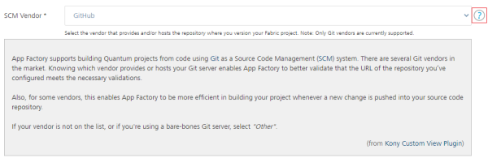

                          

Project Settings
================

Every project in App Factory contains a **Project Settings** page, which contains configurations such as Source Control parameters, Quality (SonarQube) related settings, and Notification related parameters.

To access the Project Settings page, open your App Factory project, and then select **Project Settings** from the left panel. The Project Settings link is available at every folder level of your project. The settings are only applicable for the selected project. You need to configure the project settings before you run a build. You can edit the settings at any time by opening the **Project Settings** page.

For more information about the project settings, refer to the following sections:

*   [Iris Project Settings](#iris-project-settings)
*   [Foundry Project Settings](#foundry-project-settings)

> **_Note:_**  

*   Parameters that are marked with an asterisk (**\***) are mandatory.
    
*   To view additional information about a setting, click the help icon (question mark) for the setting.  
    
    

Iris Project Settings
---------------------------

Source Control

> **_Note:_** Make sure that you configure the mandatory parameters (marked with an asterisk) before you run the [buildIrisApp job](BuildingAnApp.md).

<table style="mc-table-style: url('Resources/TableStyles/Basic.css');width: 70%;" class="TableStyle-Basic" cellspacing="0"><colgroup><col class="TableStyle-Basic-Column-Column1" style="width: 25%;"> <col class="TableStyle-Basic-Column-Column1" style="width: 45%;"></colgroup><tbody><tr class="TableStyle-Basic-Body-Body1"><th class="TableStyle-Basic-BodyE-Column1-Body1">Parameter</th><th class="TableStyle-Basic-BodyD-Column1-Body1">Description</th></tr><tr class="TableStyle-Basic-Body-Body1"><td class="TableStyle-Basic-BodyE-Column1-Body1"><b>SCM Vendor *</b></td><td class="TableStyle-Basic-BodyD-Column1-Body1">Specifies the Git&nbsp;vendor that hosts your repository. Select the option that matches your Git server. App Factory supports <b>GitHub</b>, <b>Bitbucket</b>, and <b>AWS CodeCommit</b>. If your Git vendor is not in the list, or if you're using a bare-bones Git server, select <b>Other</b>.</td></tr><tr class="TableStyle-Basic-Body-Body1"><td class="TableStyle-Basic-BodyE-Column1-Body1"><b>Repository URL *</b></td><td class="TableStyle-Basic-BodyD-Column1-Body1">Specifies the Git repository URL based on the location of the Iris project. The URL can be an HTTPS URL or an SSH URL. The format for an HTTPS URL is <code class="codefirst" style="font-size: 11pt;">https://git-vendor.com/username/reponame.git</code> The format for SSH&nbsp;URL is<code class="codefirst" style="font-size: 11pt;">git@git-vendor.com:username/reponame.git</code> Typically, a repository URL can be found by clicking a <b>Code</b> or <b>Clone</b> button.</td></tr><tr class="TableStyle-Basic-Body-Body1"><td class="TableStyle-Basic-BodyE-Column1-Body1"><b>SCM&nbsp;Credentials *</b></td><td class="TableStyle-Basic-BodyD-Column1-Body1">Specifies the SCM credentials that App Factory uses to fetch the Iris project from the repository.
<i>Important: </i></b>"><b><i>Important: </i></b>You must provide the Git credentials based on the Git clone URL format. If the Git clone URL has an <b>https</b> protocol type, you need to add the Username and Password for the Git account. For more information, refer to <a href="ManagingCredentials.html#Adding" target="_blank">Adding New Source Code Repository Credentials</a>. If the Git clone URL has the <b>ssh</b> protocol type, you need to add the SSH keys credentials. For more information, refer to <a href="ManagingCredentials.html#Add" target="_blank">Add SSH Key Credentials</a>.
<b><i>Note: </i></b>If your repository is protected with 2FA (two-factor authentication) in GitHub, you need to add the GitHub credentials to your project. For more information, refer to <a href="Prerequisites.html#GitHub_2FA" target="_blank">GitHub 2FA</a>.</td></tr><tr class="TableStyle-Basic-Body-Body1"><td class="TableStyle-Basic-BodyB-Column1-Body1"><b>Project Path</b></td><td class="TableStyle-Basic-BodyA-Column1-Body1">Specifies the path from the root that contains the Iris project. If your project is at the root of the repository, leave the field blank. Otherwise, type the path relative to the root of the repository, for example, <code class="codefirst" style="font-size: 11pt;">path/to/FooApp</code>. The depth of the sub-folder is not limited, but Windows has a limitation of 256 characters for the relative path.</td></tr></tbody></table>

Internationalization

<table style="mc-table-style: url('Resources/TableStyles/Basic.css');width: 70%;" class="TableStyle-Basic" cellspacing="0"><colgroup><col class="TableStyle-Basic-Column-Column1" style="width: 25%;"> <col class="TableStyle-Basic-Column-Column1" style="width: 45%;"></colgroup><tbody><tr class="TableStyle-Basic-Body-Body1"><th class="TableStyle-Basic-BodyE-Column1-Body1">Parameter</th><th class="TableStyle-Basic-BodyD-Column1-Body1">Description</th></tr><tr class="TableStyle-Basic-Body-Body1"><td class="TableStyle-Basic-BodyB-Column1-Body1">Default Locale</td><td class="TableStyle-Basic-BodyA-Column1-Body1">Specifies the ISO 693-1 language code for the default locale of the app. For example: <b>en</b> The specified language is used when the client app is launched.</td></tr></tbody></table>

Quality

SonarQube

SonarQube is an open-source platform that provides features to maintain code quality and security.

> **_Note:_** App Factory supports SonarQube only for the Iris code of your project.

As an admin, you can also restrict users from modifying the settings. You can exclude auto-generated files from the code analysis, and also choose to abort the build process if the quality threshold is not achieved.

> **_Important:_** App Factory does not support analysis of Java code for Iris projects. Make sure that you use the **Sources** and **Exclusions** parameters to exclude Java code. Otherwise, the analysis fails.

For more information about the SonarQube settings, refer to the following table.

<table style="mc-table-style: url('Resources/TableStyles/Basic.css');width: 70%;" class="TableStyle-Basic" cellspacing="0"><colgroup><col class="TableStyle-Basic-Column-Column1" style="width: 25%;"> <col class="TableStyle-Basic-Column-Column1" style="width: 45%;"></colgroup><tbody><tr class="TableStyle-Basic-Body-Body1"><th class="TableStyle-Basic-BodyE-Column1-Body1">Parameter</th><th class="TableStyle-Basic-BodyD-Column1-Body1">Description</th></tr><tr class="TableStyle-Basic-Body-Body1"><td class="TableStyle-Basic-BodyE-Column1-Body1"><b>Enable SonarQube Analysis</b></td><td class="TableStyle-Basic-BodyD-Column1-Body1">Enables or disables the SonarQube analysis for your App Factory project.</td></tr><tr class="TableStyle-Basic-Body-Body1"><td class="TableStyle-Basic-BodyE-Column1-Body1"><b>Scanner Version</b></td><td class="TableStyle-Basic-BodyD-Column1-Body1">Specifies the version of the Sonar Scanner that you want to use for code analysis.</td></tr><tr class="TableStyle-Basic-Body-Body1"><td class="TableStyle-Basic-BodyE-Column1-Body1"><b>Server URL</b></td><td class="TableStyle-Basic-BodyD-Column1-Body1">Specifies the URL of the SonarQube server that you want to use for code analysis. Make sure that the Server URL is accessible from the App Factory Cloud Environment.</td></tr><tr class="TableStyle-Basic-Body-Body1"><td class="TableStyle-Basic-BodyE-Column1-Body1"><b>Login Token</b></td><td class="TableStyle-Basic-BodyD-Column1-Body1">Specifies the Sonar token (authentication token) that is used to sign-in to the SonarQube server. For information on how to add Sonar token credentials, refer to <a href="ManagingCredentials.html#Sonar" target="_blank">Adding New Credentials → Sonar Token</a>.</td></tr><tr class="TableStyle-Basic-Body-Body1"><td class="TableStyle-Basic-BodyE-Column1-Body1"><b>Iris Project Key</b></td><td class="TableStyle-Basic-BodyD-Column1-Body1">Specifies the ID of the Iris project. The ID is passed as the <b>projectKey</b> parameter to the SonarQube server. Make sure that you use the same project key for every run of code analysis. Otherwise, the results for the same app will be shown separately for every project key. HCL recommends that you use the name of your Iris app as the project key.</td></tr><tr class="TableStyle-Basic-Body-Body1"><td class="TableStyle-Basic-BodyE-Column1-Body1"><b>Base Directory</b></td><td class="TableStyle-Basic-BodyD-Column1-Body1">Specifies the path to the Iris project. If your Iris project is at the root of your repository, leave this field blank. Otherwise, specify the path to the sub-directory that contains the project, for example, <code class="codefirst" style="font-size: 11pt;">path/to/FooApp</code>.</td></tr><tr class="TableStyle-Basic-Body-Body1"><td class="TableStyle-Basic-BodyE-Column1-Body1"><b>Sources</b></td><td class="TableStyle-Basic-BodyD-Column1-Body1">Specifies the directories that contain the source files that must be analyzed. You can use this field to specify additional modules that are not part of the standard Iris project structure. You can specify multiple directories by separated them with commas. For example: <code class="codefirst" style="font-size: 11pt;">controllers, modules, userwidgets</code> Absolute paths and paths that are outside the source code are ignored during the SonarQube run.</td></tr><tr class="TableStyle-Basic-Body-Body1"><td class="TableStyle-Basic-BodyE-Column1-Body1"><b>Exclusions</b></td><td class="TableStyle-Basic-BodyD-Column1-Body1">Specifies the files that must be excluded from the code analysis. You need to use glob patterns or shell patterns to specify the files. You can specify multiple exclusions by separating them with commas. For example: <code class="codefirst" style="font-size: 11pt;">**/*.java, **/*.json, jssrc/**, actions/**, models/**, **/*ControllerActions.js, node_modules/**</code> HCL recommends that you exclude auto-generated code and third-party libraries from the SonarQube analysis.</td></tr><tr class="TableStyle-Basic-Body-Body1"><td class="TableStyle-Basic-BodyE-Column1-Body1"><b>Additional Analysis Properties</b></td><td class="TableStyle-Basic-BodyD-Column1-Body1">Specifies a list of additional parameters (-D parameters) that are sent to the SonarQube server. You can specify multiple parameters by separating them with a blank space. For example: <code class="codefirst" style="font-size: 11pt;">-Dsonar.organization=exploring -Dsonar.c.file.suffixes=- -Dsonar.cpp.file.suffixes=-</code></td></tr><tr class="TableStyle-Basic-Body-Body1"><td class="TableStyle-Basic-BodyE-Column1-Body1"><b>Abort if quality gateway is not met</b></td><td class="TableStyle-Basic-BodyD-Column1-Body1">Specifies whether the build must fail if the SonarQube quality threshold is not met in the code analysis.</td></tr><tr class="TableStyle-Basic-Body-Body1"><td class="TableStyle-Basic-BodyB-Column1-Body1"><b>Debug mode</b></td><td class="TableStyle-Basic-BodyA-Column1-Body1">Specifies whether the SonarQube scanner must run in debug mode for the code analysis.</td></tr></tbody></table>

Notifications

<table style="width: 80%;mc-table-style: url('Resources/TableStyles/Basic.css');" class="TableStyle-Basic" cellspacing="0"><colgroup><col class="TableStyle-Basic-Column-Column1" style="width: 30%;"> <col class="TableStyle-Basic-Column-Column1" style="width: 50%;"></colgroup><tbody><tr class="TableStyle-Basic-Body-Body1"><th class="TableStyle-Basic-BodyE-Column1-Body1">Parameter</th><th class="TableStyle-Basic-BodyD-Column1-Body1">Description</th></tr><tr class="TableStyle-Basic-Body-Body1"><td class="TableStyle-Basic-BodyB-Column1-Body1"><b>Recipients</b></td><td class="TableStyle-Basic-BodyA-Column1-Body1">Specifies the list of recipients that receive the email notifications from the Iris build pipeline. You can specify multiple email addresses by separating them with a comma.</td></tr></tbody></table>

Foundry Project Settings
-----------------------

Source Control

> **_Note:_** Make sure that you configure the mandatory parameters (marked with an asterisk) before you run the [buildFoundryApp job](BuildingFoundryApp.md).

<table style="mc-table-style: url('Resources/TableStyles/Basic.css');width: 70%;" class="TableStyle-Basic" cellspacing="0"><colgroup><col class="TableStyle-Basic-Column-Column1" style="width: 25%;"> <col class="TableStyle-Basic-Column-Column1" style="width: 45%;"></colgroup><tbody><tr class="TableStyle-Basic-Body-Body1"><th class="TableStyle-Basic-BodyE-Column1-Body1">Parameter</th><th class="TableStyle-Basic-BodyD-Column1-Body1">Description</th></tr><tr class="TableStyle-Basic-Body-Body1"><td class="TableStyle-Basic-BodyE-Column1-Body1"><b>SCM Vendor *</b></td><td class="TableStyle-Basic-BodyD-Column1-Body1">Specifies the Git&nbsp;vendor that hosts your repository. Select one of the options that match your git server. App Factory supports <b>GitHub</b>, <b>Bitbucket</b>, and <b>AWS CodeCommit</b>. If your Git vendor is not in the list, or if you're using a bare-bones Git server, select <b>Other</b>.</td></tr><tr class="TableStyle-Basic-Body-Body1"><td class="TableStyle-Basic-BodyE-Column1-Body1"><b>Repository URL *</b></td><td class="TableStyle-Basic-BodyD-Column1-Body1">Specifies the Git repository URL based on the location of the Foundry project. The URL can be an HTTPS URL or an SSH URL. The format for an HTTPS URL is <code class="codefirst" style="font-size: 11pt;">https://git-vendor.com/username/reponame.git</code> The format for SSH&nbsp;URL is<code class="codefirst" style="font-size: 11pt;">git@git-vendor.com:username/reponame.git</code> Typically, a repository URL can be found by clicking a <b>Code</b> or <b>Clone</b> button.</td></tr><tr class="TableStyle-Basic-Body-Body1"><td class="TableStyle-Basic-BodyE-Column1-Body1"><b>SCM&nbsp;Credentials *</b></td><td class="TableStyle-Basic-BodyD-Column1-Body1">Specifies the SCM credentials that App Factory uses to fetch the Foundry project from the repository.
<i>Important: </i></b>"><b><i>Important: </i></b>You must provide the Git credentials based on the Git clone URL format. If the Git clone URL has an <b>https</b> protocol type, you need to add the Username and Password for the Git account. For more information, refer to <a href="ManagingCredentials.html#Adding" target="_blank">Adding New Source Code Repository Credentials</a>. If the Git clone URL has the <b>ssh</b> protocol type, you need to add the SSH keys credentials. For more information, refer to <a href="ManagingCredentials.html#Add" target="_blank">Add SSH Key Credentials</a>.
<b><i>Note: </i></b>If your repository is protected with 2FA (two-factor authentication) in GitHub, you need to add the GitHub credentials to your project. For more information, refer to <a href="Prerequisites.html#GitHub_2FA" target="_blank">GitHub 2FA</a>.</td></tr><tr class="TableStyle-Basic-Body-Body1"><td class="TableStyle-Basic-BodyB-Column1-Body1"><b>Project Path</b></td><td class="TableStyle-Basic-BodyA-Column1-Body1">Specifies the path from the root that contains the Foundry project. If your project is at the root of the repository, leave the field blank. Otherwise, type the path relative to the root of the repository, for example, <code class="codefirst" style="font-size: 11pt;">path/to/FooApp</code>. The depth of the sub-folder is not limited, but Windows has a limitation of 256 characters for the relative path.</td></tr></tbody></table>

Notifications

<table style="width: 80%;mc-table-style: url('Resources/TableStyles/Basic.css');" class="TableStyle-Basic" cellspacing="0"><colgroup><col class="TableStyle-Basic-Column-Column1" style="width: 30%;"> <col class="TableStyle-Basic-Column-Column1" style="width: 50%;"></colgroup><tbody><tr class="TableStyle-Basic-Body-Body1"><th class="TableStyle-Basic-BodyE-Column1-Body1">Parameter</th><th class="TableStyle-Basic-BodyD-Column1-Body1">Description</th></tr><tr class="TableStyle-Basic-Body-Body1"><td class="TableStyle-Basic-BodyB-Column1-Body1"><b>Recipients</b></td><td class="TableStyle-Basic-BodyA-Column1-Body1">Specifies the list of recipients that receive the email notifications from the Foundry build pipeline. You can specify multiple email addresses by separating them with a comma.</td></tr></tbody></table>

