                          

Publish a Web App
-----------------

A developer can build and publish Web App (SPA) to Volt MX Cloud. Web App is hosted in AWS based Volt MX Cloud, accessible by the link given during publishing. Following instructions helps to configure, build and publish Web App.

### Prerequisites

A Web App need to be published manually, before configuration of the **buildIrisApp** job with SPA related parameters. The following steps help to publish SPA manually.

1.  Launch Iris and import the KichenSink Application.

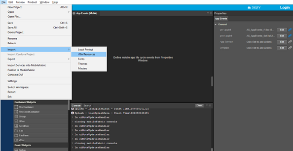

3.  Launch Iris and click on **Login** button to sign-in into Volt MX Foundry.
    
    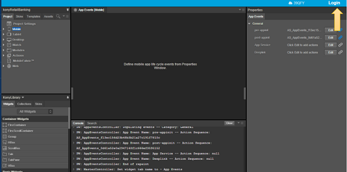
    
4.  Enter Username and password. Upon successful login, you can see the default cloud along side your Username.
5.  If you have access to multiple clouds. Click on setting ->Click on Foundry Tab >>Choose desired cloud and environment.

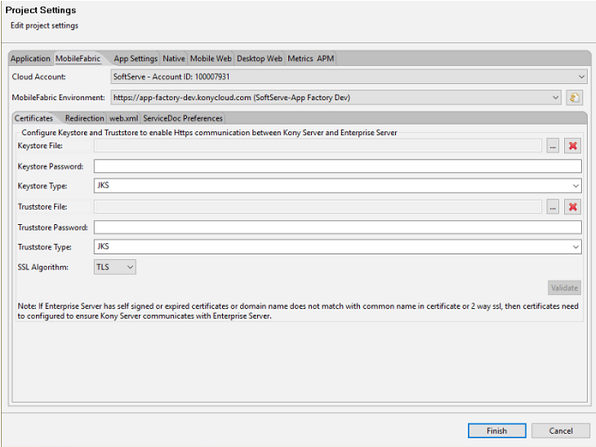

7.  Click on Volt MX Foundry and choose **Use Existing** button, if an app already exists in MF. If not, click **Create** button and can create MF app.

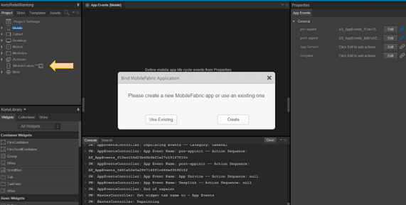

9.  Choose the app you need and click on **ASSOCIATE** button.

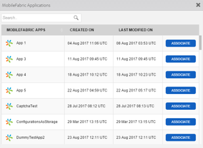

11.  Once that is done, build the SPA build.

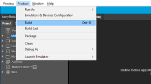

13.  Upon successful build, go to file -> Publish to Volt MX Foundry.

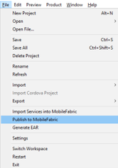

15.  MF console opens in Iris. Select **Publish** tab, and click **Publish**.

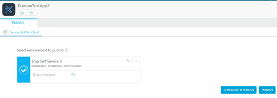

### Adding New Credentials

Perform the following steps to add new credentials for the **buildIrisApp** job. Credentials are given in the format of Username, password and id/description if necessary.

1.  Press Add button.

3.  Choose **Credential provider** from the list. It varies from the level at which entered credentials are visible. Select project root folder, for example **KitchenSinkApp**

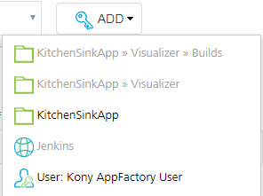

5.  Enter **Username** and **Password** and click **Add**.

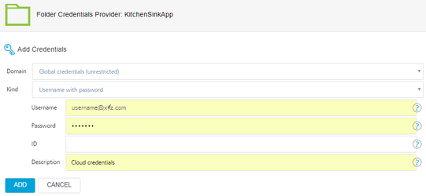

7.  Select from the list the credentials that are created just now.

9.  Check the selected credentials

### Configuration

A developer want to build and publish a Web App. For that reason he/she needs to configure the **buildIrisApp** job. Perform the following steps to configure Web App build and publish parameters.

1.  Open an app project folder and navigate to **Iris/Builds/buildIrisApp**.

3.  Launch the **buildIrisApp** job using **Build with parameters** action.

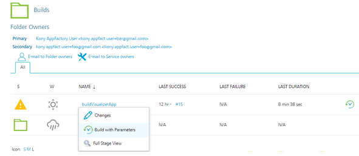

5.  Set Web App related parameters. See **[Building an Iris app](BuildingAnApp.md)** section for more details on each parameter. Parameters should be set accordingly to Configuration of the **buildIrisApp** job.

### Publishing

When all parameters are set, click **BUILD** to build and publish a Web App (SPA). Build starts and you can see progress as shown in the screenshot below.

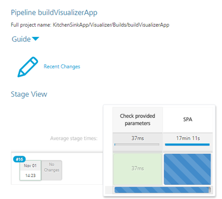

Once build is completed successfully, e-mail notification is sent. In addition, the following e-mail is sent by Volt MX Support on publishing results.

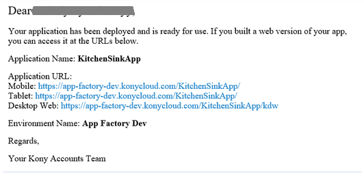

Take Mobile Application URL and open it in browser selecting specific device model.

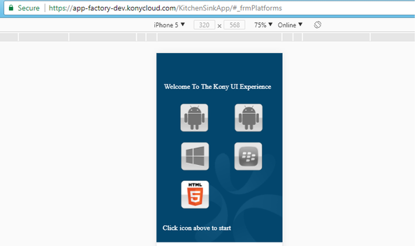

Now the Web App is published to your environment.
