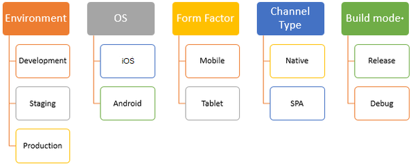
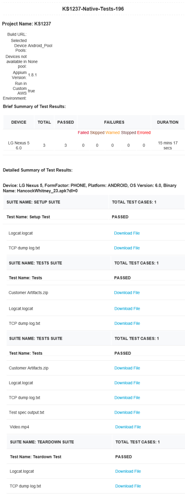

                           

Iris projects in App Factory
==================================

In App Factory, you can enable the CI/CD process for the source code of a Volt MX Iris app by creating a Iris project. You can then use appropriate jobs to build an app, publish an app, and also test the app code. After every stage, an [email notification](#build-results-notification) is sent to the project team. The emails contain information about the status of a stage, and also contain assets such as build or tests artifacts, or test results.

Iris project folder
-------------------------

The following section contains information about how to run, build, and deploy a Iris app by using the App Factory CI/CD process. After the build is completed, an email notification is sent about the build result with information about the build artifacts, changelog from the Git tool, and build settings.

To run jobs for a Iris app, open the project folder from the App Factory console, and then open the **Iris** folder. The Iris folder contains three nested folders.

*   Builds
*   Tests
*   Triggers

Builds
------

The build folder contains **buildIrisApp** job, which orchestrates the build and test logic for different channels of a Iris app.

The **buildIrisApp** job initiates the Iris project build stage which depends on (but is not limited to) the following parameters:

*   The Volt MX Foundry Environment is used to build a Iris app and then publishing it. You can use different Foundry environments to split the release stages into three phases: **Development**, **Staging**, and **Production**.
    *   Developers or testers use a development environment to test the features that are developed into a particular development branch
    *   Developers or testers use a staging environment to test features that are developed in a sprint or a release
    *   An administrator uses a production environment to deploy the features that are developed in a sprint or a release
*   The Operating System (OS) can be iOS or Android.
*   The Form Factor can be Mobile or a Tablet. Desktop is not supported.
*   The Channel type can be a native app or a web app
    *   A Native build is generated by Xcode (for Apple) or by the Android SDK
    *   A Single Page Application (SPA) build generates a WAR file that can be used to deploy the project as a web app
*   The Build mode\* specifies the type of binaries that are produced after a build: release or debug. The debug mode is used during the development phase to test the builds. The Release mode is used to build the binaries for production. The binaries that are built in the Release mode must be signed accordingly.

The **buildIrisApp** job can be divided into the following logical stages:

The Build stage executes the build of the project from the specified repository. It consists of the following stages:

*   Build
*   Publish artifacts to S3
*   Notify on build status by e-mail

The Test stage executes the tests of the project from the specified repository. It consists of the following stages:

*   Build Tests
*   Notify on build tests status by e-mail
*   Run Tests
*   Notify on tests run status by e-mail

Build Results Notification
--------------------------

After a build is completed, an email is sent to the distribution list that is selected by the administrator. The email contains generic information about the build and the list of artifacts with corresponding links to the S3 bucket. The details in the successful and unsuccessful App Factory build notification emails are available in three sections. Every section contains the following information:

### Build Details

This section contains the following build related information:

*   **Project**: The name of App Factory project
*   **Triggered By**: The email ID of the user who triggered the build
*   **Project Branch**: The name of the project source code branch that is used for the build
*   **Build URL**: A link that redirects to the corresponding App Factory project build console log
*   **Build Number**: Displays the App Factory build number
*   **Build Mode**: Displays the mode in which the binaries are built
*   **Date of Build**: Displays the date and time on which the project was built
*   **Build Duration**: Displays the total time that was taken to complete the build
*   **Environment Name**: Displays the Foundry app config that was selected for the build that points out to respective backend services.

### Build Information

This section provides the details about the build status and the version with respect to each channel in a tabular format. The table contains the following information:

*   **Channel**: The type of platform for which the build is applicable
*   **Installer**: If the corresponding channel build is successful, this section contains the binaries along with the binary extension type. If the build fails, then the status of the build is **Failed**, and a different email is sent that contains the failure logs for every channel.

> **Note:**  
For the iOS channel, you will get the following types of extension binaries:  
    
*   **IPA**: A link to download the iOS binary on your system.  
*   **KAR**: An intermediate file that is generated by Iris. The KAR file can be converted to an iOS app, or used to debug the app locally for any issues of the IPA file.  
*   **PLIST**: An OTA link to download and install the binary on your device.  

*   **App Version**: The app version that is selected for the specified channel.

### Source Code Details

This section provides details about the source code repository (such as commit-ID and change logs) in a table. The table contains the following information:

*   **Channel**: The type of platform for which the build is applicable
*   **Commit ID**: The first seven characters of the ID of a Git push that starts the build process. It is a link that can track down the changes that were picked for the build. The link redirects to Git (hosted link GitHub, Git server, bitbucket, Azure DevOps) and points to the page where all the notable file changes are visible.

> **_Note:_** If you have checked-in new changes in between or during the build process, there can be multiple Commit IDs for each channel. Appfactory assigns a build to a node, therefore the channel builds are run in parallel, and every build will check-out the branch separately.

*   **Commit Logs**: It displays the list of files that were modified, added, or deleted from the project during the build along with its status.

> **Note:**  
*   Only top ten lines of change log are printed. To display more change logs, use the compare feature from the Git web server. The details in the commit logs section are shown only when there is a previous build. The following table shows different messages that are shown with respect to each scenario:  
    

<table style="width: 100%;mc-table-style: url('Resources/TableStyles/Basic.css');" class="TableStyle-Basic" cellspacing="0"><colgroup><col style="width: 390px;" class="TableStyle-Basic-Column-Column1"><col class="TableStyle-Basic-Column-Column1"></colgroup><tbody><tr class="TableStyle-Basic-Body-Body1"><th style="text-align: center;background-color: #dcdcdc;padding-left: 5px;padding-right: 5px;padding-top: 5px;padding-bottom: 5px;border-left-style: solid;border-left-width: 1px;border-left-color: #fff;border-right-style: solid;border-right-width: 1px;border-right-color: #fff;border-top-style: solid;border-top-width: 1px;border-top-color: #fff;border-bottom-style: solid;border-bottom-width: 1px;border-bottom-color: #bbb;" class="TableStyle-Basic-BodyE-Column1-Body1"><b>Message</b></th><th style="text-align: center;background-color: #dcdcdc;padding-left: 5px;padding-right: 5px;padding-top: 5px;padding-bottom: 5px;border-left-style: solid;border-left-width: 1px;border-left-color: #fff;border-right-style: solid;border-right-width: 1px;border-right-color: #fff;border-top-style: solid;border-top-width: 1px;border-top-color: #fff;border-bottom-style: solid;border-bottom-width: 1px;border-bottom-color: #bbb;" class="TableStyle-Basic-BodyD-Column1-Body1"><b>Scenario</b></th></tr><tr class="TableStyle-Basic-Body-Body1"><td style="background-color: #ffffff;padding-left: 5px;padding-right: 5px;padding-top: 5px;padding-bottom: 5px;border-left-style: solid;border-left-width: 1px;border-left-color: #fff;border-right-style: solid;border-right-width: 1px;border-right-color: #fff;border-top-style: solid;border-top-width: 1px;border-top-color: #fff;border-bottom-style: solid;border-bottom-width: 1px;border-bottom-color: #bbb;" class="TableStyle-Basic-BodyE-Column1-Body1">Previous build is unavailable to fetch the diff</td><td style="background-color: #ffffff;padding-left: 5px;padding-right: 5px;padding-top: 5px;padding-bottom: 5px;border-left-style: solid;border-left-width: 1px;border-left-color: #fff;border-right-style: solid;border-right-width: 1px;border-right-color: #fff;border-top-style: solid;border-top-width: 1px;border-top-color: #fff;border-bottom-style: solid;border-bottom-width: 1px;border-bottom-color: #bbb;" class="TableStyle-Basic-BodyD-Column1-Body1">If previous build does not exist.</td></tr><tr class="TableStyle-Basic-Body-Body1"><td style="background-color: #ffffff;padding-left: 5px;padding-right: 5px;padding-top: 5px;padding-bottom: 5px;border-left-style: solid;border-left-width: 1px;border-left-color: #fff;border-right-style: solid;border-right-width: 1px;border-right-color: #fff;border-top-style: solid;border-top-width: 1px;border-top-color: #fff;border-bottom-style: solid;border-bottom-width: 1px;border-bottom-color: #bbb;" class="TableStyle-Basic-BodyE-Column1-Body1">No diff is available</td><td style="background-color: #ffffff;padding-left: 5px;padding-right: 5px;padding-top: 5px;padding-bottom: 5px;border-left-style: solid;border-left-width: 1px;border-left-color: #fff;border-right-style: solid;border-right-width: 1px;border-right-color: #fff;border-top-style: solid;border-top-width: 1px;border-top-color: #fff;border-bottom-style: solid;border-bottom-width: 1px;border-bottom-color: #bbb;" class="TableStyle-Basic-BodyD-Column1-Body1">If there are no change in the available logs.</td></tr><tr class="TableStyle-Basic-Body-Body1"><td style="background-color: #ffffff;padding-left: 5px;padding-right: 5px;padding-top: 5px;padding-bottom: 5px;border-left-style: solid;border-left-width: 1px;border-left-color: #fff;border-right-style: solid;border-right-width: 1px;border-right-color: #fff;border-top-style: solid;border-top-width: 1px;border-top-color: #fff;border-bottom-style: solid;border-bottom-width: 1px;border-bottom-color: #bbb;" class="TableStyle-Basic-BodyB-Column1-Body1">Unable to fetch diff, your previous build is on a different branch</td><td style="background-color: #ffffff;padding-left: 5px;padding-right: 5px;padding-top: 5px;padding-bottom: 5px;border-left-style: solid;border-left-width: 1px;border-left-color: #fff;border-right-style: solid;border-right-width: 1px;border-right-color: #fff;border-top-style: solid;border-top-width: 1px;border-top-color: #fff;border-bottom-style: solid;border-bottom-width: 1px;border-bottom-color: #bbb;" class="TableStyle-Basic-BodyA-Column1-Body1">If the branch name of the current build does not match with the previous build.</td></tr></tbody></table>

*   To avoid duplication and reduce the size of the table, channels with the same commit-ID are grouped and the corresponding change logs are displayed.
    

### AWS Custom Environment Run

*   Logcat.logcat
*   TCP dump log.txt
*   Test spec output.txt
*   Video.mp4
*   Customer Artifacts.zip

The **Customer Artifacts.zip** file contains the test output contents. The **Test spec output.txt** file contains the AWS console output of the tests run on the Custom Environment.

