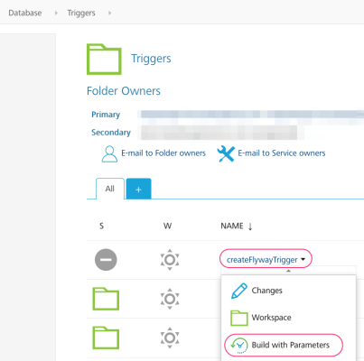
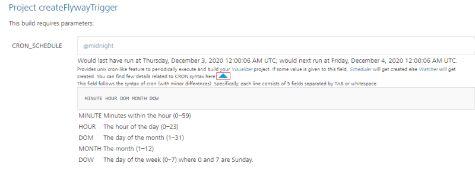
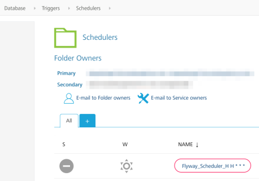

                         

Scheduling a Flyway job
=======================

In App Factory, you can execute your Flyway job periodically (based on a schedule) by creating a **Scheduler**.

Consider a scenario in which you want to run weekly migration of your database. You can create a scheduler that runs the build job at the specified day and time, for example: every Friday at 8pm.

Every project contains a sub-folder called **Triggers** in the **Databases** folder. The Triggers folder contains a job called **createFlywayTrigger** (to create triggers), and a sub-folder called **schedulers**, which contains triggers that run periodically based on a schedule.

Configuring a Scheduler Job in App Factory
------------------------------------------

1.  From the **Database** folder of your project, navigate to the **Triggers** sub-folder.
2.  In the **Triggers** folder, click the **build** icon for the **createFlywayTrigger** job.  
    Alternatively, open the drop-down menu for the **createFlywayTrigger** job, and then select **Build with Parameters**.  
    
3.  Use the CRON\_SCHEDULE parameter to specify the schedule on which the build job must be triggered. For information about cron expressions, refer to [Cron](https://en.wikipedia.org/wiki/Cron).  
    Some shorthand expressions are supported, for example: `@midnight`. For more information, click the chevron (arrow) icon next to the parameter description.  
    

> **_Note:_** If a **Cron** schedule is not specified, the trigger will be a **watcher** instead.

The remaining parameters are the same as the parameters for the [Flyway job](RunningFlywayJobs.md). You can use different build parameters for different schedules or branches. Jobs that are triggered on a schedule are stored in the **Schedulers** folder.

You can tell what schedule each scheduler job runs on by the Cron expression that is appended to the job name.

