                          

Troubleshooting
===============

This section contains about troubleshooting issues in the build and test process in the App Factory console by using Jenkins interface. For more information, refer to the following sections.

Downloading Log Files
---------------------

When a build fails, App Factory gathers the required logs and environment details in a zip file. To get help in resolving the build issues, you can download the log files and raise a support ticket with the Volt MX Support team. With the logs files and details, the Volt MX Support team can debug the problem and provide a solution.

Alternatively, you can extract the zip file to look for the captured data and find the reason for the build failures.

To download the log files, follow these steps.

1.  From the **Iris** folder of your project, navigate to the **Builds** sub-folder.
2.  Select the **buildIrisApp** job.
    
    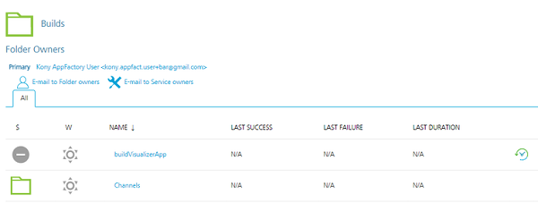
    
3.  From the **buildIrisApp** page, navigate to the failed stage.
    
    You can view the status of the build from the **Build History** section in the left pane.
    
    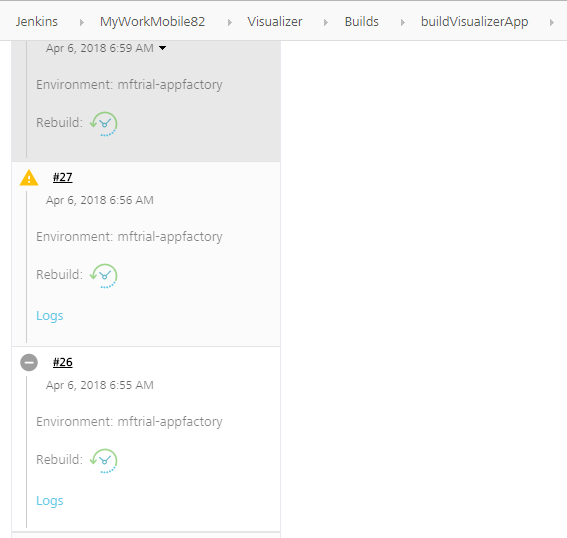
    
4.  For the failed build, click **Logs**. A zip file is generated and downloaded on to your local system.
5.  Extract the zip file and view the logs that are generated for the job.

The individual logs that are related to the channel builds are part of the parent zip file (buildIris). You can view the following build logs that resulted in the failure of the job.

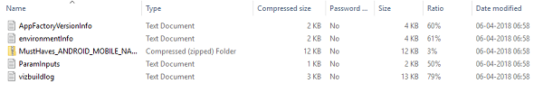

The **MustHaves** zip file in the folder is the channel on which the project is built. The zip contains the following log files.

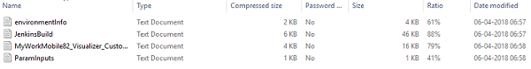

> **_Note:_** All the sensitive information (such as passwords) is displayed as \*.

Debugging Build Failure
-----------------------

As an administrator, you can view the build stages and find the cause for the build failure. You can then review the parameters or take appropriate action to recover the build.

For example, to debug a build failure by using the stage view, follow these steps.

1.  From the **Iris** folder of your project, navigate to the **Builds** sub-folder.
2.  Select the **buildIrisApp** job.


4.  On the **buildIrisApp** job page, navigate to the failed stage.
    
    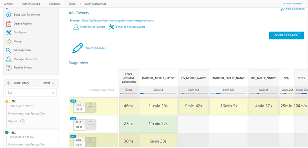
    
5.  Point to the failed stage, and then click **Logs**.

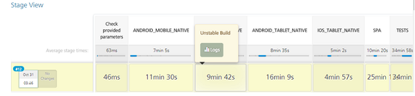

7.  Navigate to the **Building KitchenSinkApp** link.

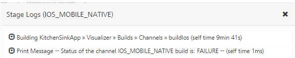

9.  Expand the **Building KitchenSinkApp** group, and then navigate to the failed build job.

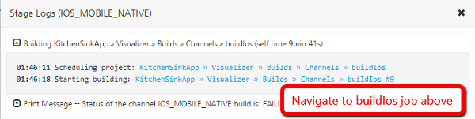

11.  For the selected job, find the stage that failed.

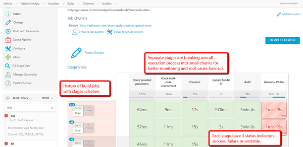

13.  Point to the failed stage, and then click **Logs**.

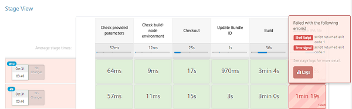

15.  Explore the log details and find the reason for failure.

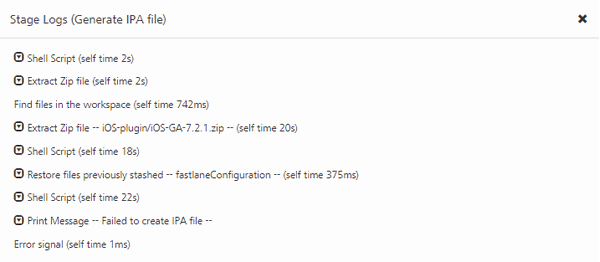

17.  Find the error message that is printed. For example:  
```
01:55:50 Failed to create IPA file - Navigate to the step above and expend it to look for error of IPA generation
```
    
    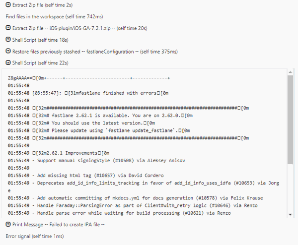
    
18.  Based on the error, take the appropriate action.

In case, if the error message does not show excessive information, an administrator can navigate to raw console log of a job that fails. There are several options to display **Console Output**. At first, the administrator can navigate to a job and select **Console Output** from drop-down menu under specific job id.

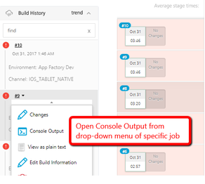

Administrator can now pick the specific job to open and select Console Log form the left panel.

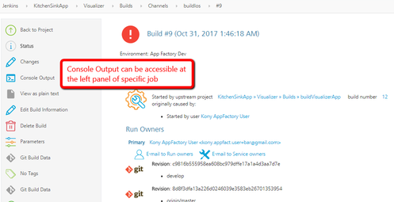

After the Console Output in the last buildIrisApp job is run, administrator can scroll down to the status of jobs were launched by the buildIrisApp job. There are two failed jobs for iOS Mobile and Tablet natives. An administrator can open Console Output of any of jobs listed in the log below by hovering mouse over job id and opening Console Output in the drop-down menu.

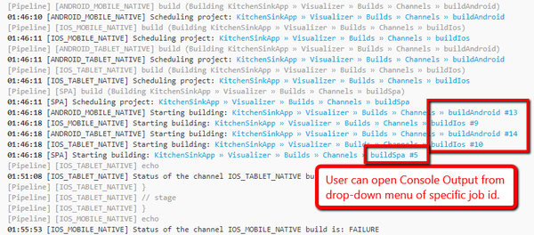

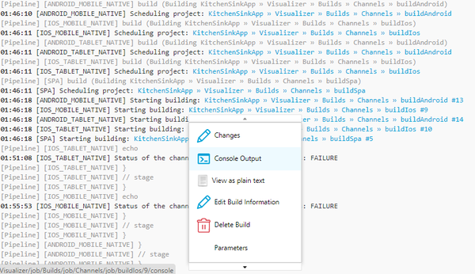

When the administrator opens Console Output, he/she may look for failure and warning messages related to a stage and a step particular in the build log.

Debugging Build Failure (Alternative Option)
--------------------------------------------

1.  From the Iris folder, navigate to Facade job.


3.  Select the build that is unstable or has failed.
4.  From the context-based options, select the **Pipeline Steps**.

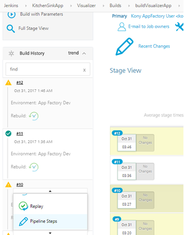

6.  Scroll down and find the unstable or failed stage.

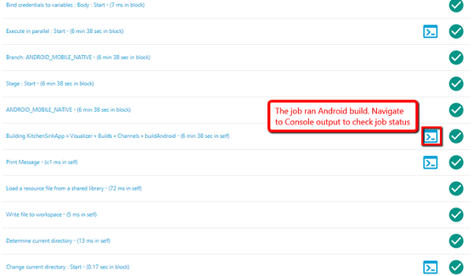

8.  Open the Log console, and then click the **Starting building** link.

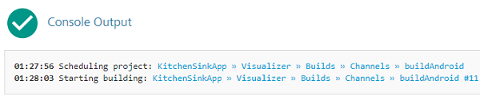

10.  From the left panel, select **Pipeline Steps**.

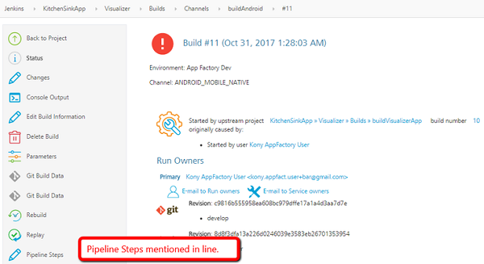

12.  Find the failed stage.

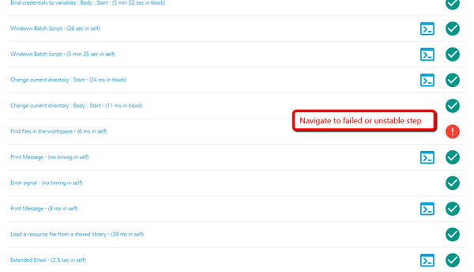

14.  Open the Console Log, and then find the reason for failure.

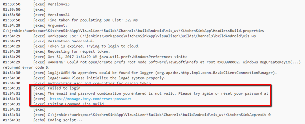

16.  Based on the error, take appropriate actions.
