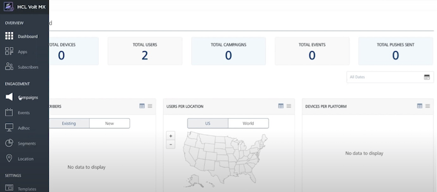
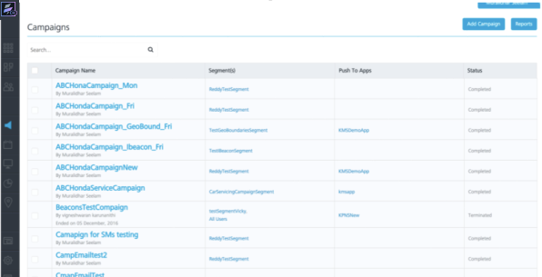
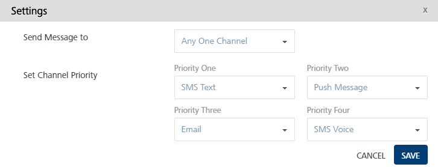
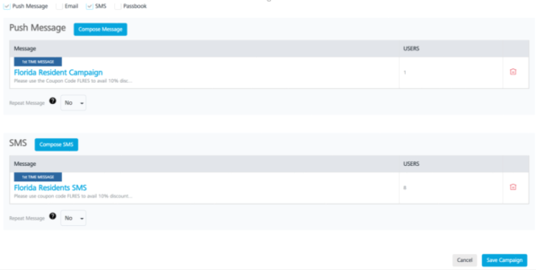
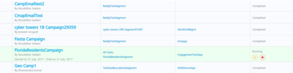

Introduction to Engagement Campaigns and Events: Introduction to Campaigns in Engagement

# Introduction to Campaigns using Segments

In this chapter, we will cover the campaigns feature of the Engagement Server. We will explain what campaigns are and show you the creation of campaigns using the segments that were created earlier.

It is assumed that you already have access to trial account of Volt MX Foundry, which has Engagement provisioned. It is also highly recommended that you finish all the chapters of the beginner’s track and also all the previous chapters of this track before you continue with this chapter.

## Introduction to Campaigns in Engagement

A campaign in the Engagement Server is a scheduled notification mechanism that sends notifications to users in a segment. Campaigns have start and end times associated with them. A segment as you may recall from the earlier chapter, is a subset of users that are contained in the Engagement Server. Segments can be created based on the user attributes or based on the location of the user. Location based segments use geolocations and beacons.

Once the campaigns are created and saved, they run at the scheduled start times and send the various notification messages using the push, email, SMS and passes mechanisms. You can also define a channel priority for the messages that are sent from the campaigns. This ensures that the message can be delivered using the lower priority mechanism, if the higher priority channel does not works. For example, you can have a campaign set up to send notifications using the push and SMS notification channels. Further, you can choose the push mechanism to be of higher priority than the SMS. In this situation, an attempt will be made to deliver the message using push first and, if it fails the message will be delivered using the SMS.

## Campaign Creation in the Engagement Server

This section details the steps that are needed to create a campaign in the Engagements Server. We will walk you through the creation of the campaign using the segment that was created earlier in the previous chapter.

### Creation of Campaign using a Segment

1.  Log in to your Volt MX Foundry and open the Engagement Server console. From the left panel,under the **Engagement** category, click **Campaigns** . This will open the **Campaigns** screen.

    

2.  Click **Add Campaign** to begin the creation of the campaign.

    

3.  Enter the name of the campaign and the campaign end date. We will call our campaign as **FloridaResidentCampaign**. The **StartDate** and **Owner** will be prepopulated. Select the campaign end date. Choose the time zone where you are running the campaign. In this example, we chose EST.
4.  Click **Select Users** to select a segment with the users.

    

5.  Choose **Push** and **SMS** as message channels. Click **Compose Message** of the Push to configure the push message.
6.  Choose **Standard Push** as message type. Type **Florida Resident Campaign** as the message name and message title. Enter the message to be sent. Also since this is a push message, you will need to choose the application name. Choose **EngagementTestApp** from the drop-down list. Click **Save** to save the push message.
7.  Click **Compose SMS** to enter the SMS message to be sent when the campaign is triggered.
8.  Enter the message name in the **SMS Message Name** field. Enter the SMS message in the message box. Click **Save** to save the SMS message.
9.  Now the push message and the SMS message are defined and saved, click **Settings** to set up the channel priority.
10. From the **Send Message to** drop-down list, choose **Any One Channel** as the option. Choose the priority one as the Push message and the priority two as the SMS. This means that the message will be sent using the push message first if that fails an attempt will be made to send the message via SMS. Click **Save** to save the settings.

    

11. Click **Save Campaign** to save the campaign and have it started.

    

12. The next screen will display the full list of campaigns. You will notice that the **FloridaResidentsCampaign** is successfully set up and running.

    

13. You have successfully created and saved your first campaign.

> **_Important:_** For more information, refer to the following video:

<iframe src="https://www.youtube.com/embed/69wxwhDQYXU" allowfullscreen=""></iframe>

