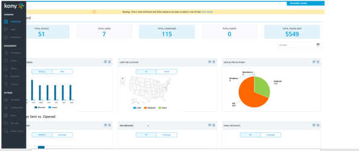
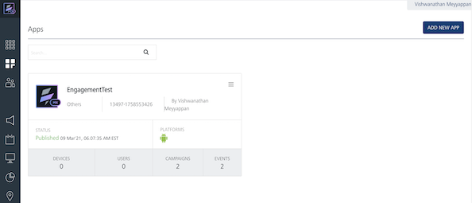
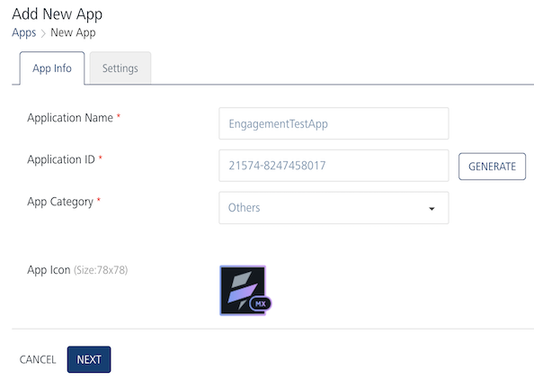
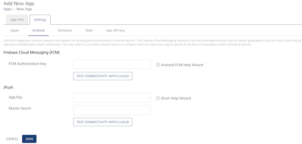
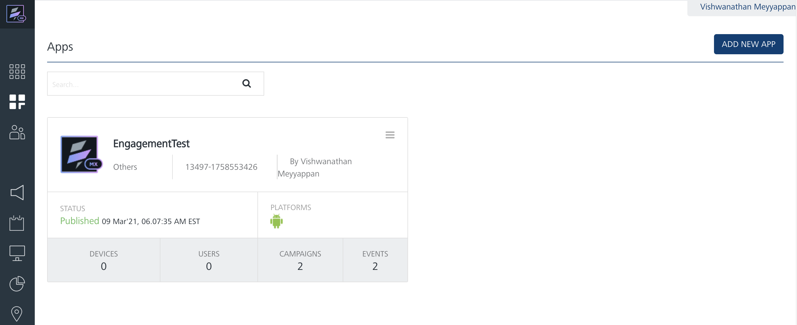
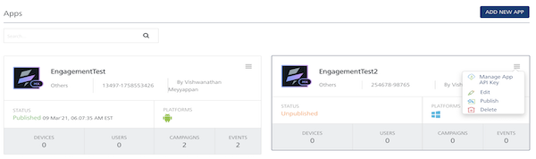

<!-- ---
layout: "documentation"
category: "voltmx_foundry_intro_eng"
---
                           

Creation and Configuration of the Test App
==========================================

In this chapter, we will take you through the creation and configuration of the sample application in your Engagement Server. We will also walk you through the configuration steps that are needed to configure the SMS and Email provider information. Once the application is configured you will be able to receive email, SMS, and push notifications on your device. Note that this chapter will walk you through the steps for the application configuration that are needed to receive Android push notifications only.

It is assumed that you already have access to a trial account of Volt MX Foundry which has Engagement provisioned.

Creation and Configuration of Sample Application in Volt MX Engagement Server
--------------------------------------------------------------------------

In this section, we will take you thru the creation of a sample app in your Engagement Server. We will also walk you through the configuration steps that are needed to receive the push notifications on your Android device.

An application in the Engagement Server is needed for the subscriptions to be created. A subscription enables a push message to be sent and is associated with an application and a device combination. So, for one application you could have multiple device subscriptions.

Before you configure the application in the Engagement Server, you need to create the FCM key that needs to be associated with the client side application. Do refer the document below to create an FCM key. The FCM key is needed to send the push notifications to Android devices.

[VoltMX Foundry Engagement Services Quick Start Guide - (Building a Sample App - Android)](../../../Foundry/vmf_msg_quick_start_guide_build_sample_app_android/Content/Introduction.md)

Follow the steps below:

1.  Login into Volt MX Engagement Services console. After the successful login, you will see the screen as below and the **Dashboard** option is selected by default.
    
    
    
2.  Click the **Apps** tab from the left pane. This will display all the current apps that are installed in your Engagement Server and also provides an option to create and configure a new application. Click **Add New App** to begin the creation of a new application.
    
    
    
3.  In the **Application Name** field, enter the name of the application. As an example, it could be `EngagementTestApp`. You can enter an `ApplicationId` or can generate one by clicking the **Generate** option. Choose the **App Category** as **Others**. An **App Icon** can be uploaded but is not needed. Click **Next** to configure the application.
    
    
    
4.  In the **Settings** section, click **Android**. In the **FCM Authentication Key** field, enter the FCM key that was created in the beginning of this section. After the key is entered, you can click **Test Connectivity with Cloud** to check if the key entered is valid. Click **Save** to save the application configuration.
    
    
    
5.  Once the application is saved it will be displayed in the list of applications in the Engagement Server as shown below. You will notice that the app is in unpublished state. The application needs to be in the published state to receive subscriptions.
    
    Click the hamburger menu next to the app to publish the app.
    
    
    
6.  Choose **Publish** from the hamburger menu to publish the application. This will publish the application with the status as published.
    
    
    

That’s it! This completes the configuration of the application in the Engagement Server. -->
