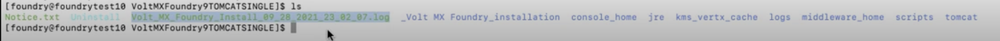
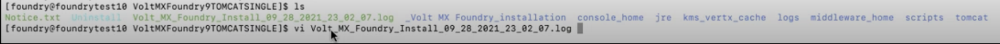
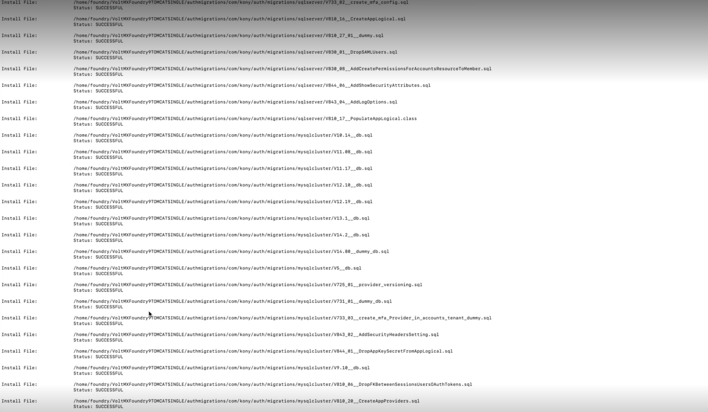
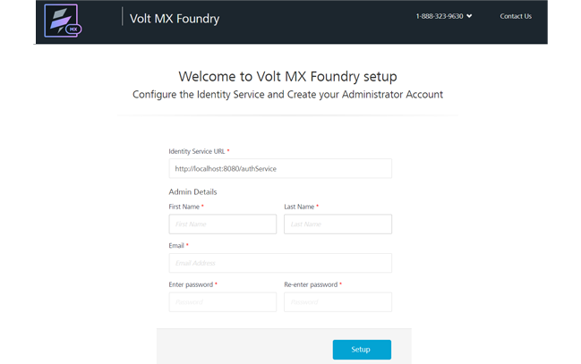

# Volt MX Foundry Installation on JBoss Domain Mode (Multinode)

This section of the document provides you with the instructions for installing and configuring the Volt MX Foundry Console on multinode.

The **\<Install Location\>** directory contains the log files logging each invocation of the installer. To make problem identification easier, provide these log files to Volt MX when reporting an issue.

Accessing the live installation logs while the installation is running

<ul>
<li><blockquote><b><em>Note:</em></b> "tmp" directory is available inside <b>JBoss_Home</b> location.</blockquote></li>
<li>During the installation, all the live logs will be created in the "tmp" directory, with the file name prefixed as "lax-" followed by timestamp. These are the two installation log files:
<ul>
<li>lax-12347050814474460129-out.tmp</li>
<li>lax-24487050814400678962-err.tmp</li>
</ul>
</li>
<li><blockquote><b><em>Note:</em></b> These two files are important if there is any interruption to the installation, and due to which these files will not be merged into a single log file.</blockquote></li>
<li>Tailing live log files during installation: 

To tail the live log files during installation, run the following command:
 
<code>tail -f lax-12347050814474460129-out.tmp</code>   
</li>
<li>Once installation is done, these two log files will be merged and stored in the installation directory, with the file name prefixed as "Volt_MX_Foundry_Install_" followed by timestamp. </li>
<li>Reading log files once installation is completed: 

To read the log files once installation is completed, run the following command:
 
<code>vi Volt_MX_Foundry_Install_09_28_2021_23_02_07.log</code>     
</li>
</ul>

 

To install Volt MX Foundry Console using the installer, follow these steps:

1.  Switch to the user that you created by executing the following command:

\# su - username

3.  Press **Enter**. The system prompts you to enter the password.
4.  Enter the password and press **Enter**.
5.  Unzip the `VoltMXFoundrySetup.tar.gz` file, and navigate to the folder _**VoltMXFoundry_Installer_Linux**_.
6.  Start the **./VoltMXFoundryInstaller-x.x.x.x.GA.bin** file by executing the following command:
7.  Preparing to install...  
    Extracting the JRE from the installer archive...  
    Unpacking the JRE...  
    Extracting the installation resources from the installer archive...  
    Configuring the installer for this system's environment...
    Launching installer...
    \===============================================================================  
    Volt MX Foundry (created with InstallAnywhere)  
    \-------------------------------------------------------------------------------  
    Preparing CONSOLE Mode Installation...  
    \===============================================================================  
    Introduction  
    \------------  
    This installer will install a new or upgrade an existing instance of Volt MX Foundry.
    Volt MX Foundry is a set of enterprise-grade mobile infrastructure services that makes it easy to build amazing apps that integrate and support all of your backend systems. With open, standards-based development, scalable and secure services, and exceptional agility, enterprises can dramatically reduce the cost and complexity of enterprise mobility projects.
    To proceed with installation, please confirm that the following prerequisites have been met -
    1\. Database server for installation. MySQL, MariaDB, Oracle, MS SQL Server are the          
        supported databases. MariaDB is supported for Tomcat/JBoss only.  
     2. Corresponding database user should exist and that user should have all required       
        privileges as per the documentation.  
     3. If you want to use your existing SSL certificate then please have the SSL certificate  
        mapped to the domain name you want to use.  
    4\. If you want to install with JBoss as an option for application    
        server, then have the application server preconfigured. Please note that single node  
        JBoss is also bundled as part of the installer, in case you want to install afresh.
    To change input, type 'back' to go back to the previous step.  
    To cancel the installation, type 'quit' at any time.
    For troubleshooting & help on the installation, use [Troubleshooting & Installation](../../../Foundry/resources/installer.md)
    For getting started on Volt MX Foundry, refer [documentation](http://community.hclvoltmx.com/documentation)
    For upgrading Foundry, refer [online documentation](../../../Foundry/voltmx_foundry_linux_install_guide/Content/Upgrading_VoltMX_Foundry_on_Linux.md).
    If you have more questions or feedback, you can join our [http://community.hclvoltmx.com/](http://community.hclvoltmx.com/) or, raise a [http://support.voltmx.com/](http://support.voltmx.com/).
    \->1- Continue with Installation.  
       2- Abort Installation.
    ENTER THE NUMBER OF THE DESIRED CHOICE, OR PRESS <ENTER> TO ACCEPT THE DEFAULT:
8.  Press **Enter**. The Software _License Agreement_  details appear.

    \========================================================================  
    License Agreement  
    \-----------------  
    Installation and Use of Volt MX Foundry Console Requires Acceptance of the Following License Agreement:

    VOLTMX, INC.  
    SOFTWARE LICENSE AGREEMENT

    THE TERMS AND CONDITIONS CONTAINED HEREIN CONSTITUTE A LEGAL AGREEMENT.

    THIS AGREEMENT ("AGREEMENT") CONTAINS THE ENTIRE AGREEMENT BETWEEN YOU ("LICENSEE") AND VOLTMX, INC. ("VOLTMX") WITH RESPECT TO THE TERMS AND CONDITIONS DESCRIBED HEREIN. READ THIS AGREEMENT CAREFULLY BEFORE YOU CLICK THE "I ACCEPT" BUTTON BELOW. BY CLICKING ON THE "I ACCEPT" BUTTON, YOU ACKNOWLEDGE THAT (1) YOU ARE AUTHORIZED TO ENTER THIS AGREEMENT FOR AND ON BEHALF OF YOUR COMPANY, AND ARE DOING SO, AND (2) YOU HAVE READ AND UNDERSTAND AND AGREE THAT YOU AND THE COMPANY SHALL BE BOUND BY THESE TERMS AND CONDITIONS AND ALL MODIFICATIONS AND ADDITIONS PROVIDED FOR. IF YOU DO NOT AGREE WITH THESE TERMS AND CONDITIONS, CLICK ON THE "I DO NOT ACCEPT" BUTTON BELOW AND INSTALLATION WILL TERMINATE.

    DO YOU ACCEPT THE TERMS OF THIS LICENSE AGREEMENT? (Y/N): Y

9.  Press **Y** to accept the agreement. The _Installation Type_ details appear.

    The following installation types are supported for new installation:

    - **Development** for single machine instance.
    - **Non-Production** for larger environments like QA or UAT.
    - **Production** for the production instance.

    \===============================================================================  
    Installation Type  
    \-----------------

    Please select whether to perform a new installation or upgrade an existing installation.

    \->1- New Installation  
       2- Upgrade an existing installation

    ENTER THE NUMBER FOR YOUR CHOICE, OR PRESS <ENTER> TO ACCEPT THE DEFAULT::

10. Press **Enter** to continue with new installation.

    \===============================================================================
    Licensing Type
    \--------------

    Installation environment is set to Development by default. Please select the appropriate type based on your license.
    Select Development for single machine instance, Non-Production for larger environments like QA or UAT and Production for the production instance.

    1- Development
         2- Non-Production
       ->3- Production

    ENTER THE NUMBER FOR YOUR CHOICE, OR PRESS <ENTER> TO ACCEPT THE DEFAULT::

11. Enter your choice and press **Enter.** The _Send Usage Data Anonymously_ details appear. Allows HCL to collect product usage information to make your Volt MX Foundry experience better. HCL does not save any of your private or application data.

    \===============================================================================
    Send Usage Data Anonymously
    \-------------- ------------

    Help us make your Volt MX Foundry experience better by allowing us to collect product usage information. We will not save any of your private or application data.

    Send usage data anonymously.

    ->1- Yes
         2- No

    ENTER THE NUMBER FOR YOUR CHOICE, OR PRESS <ENTER> TO ACCEPT THE DEFAULT::

12. Enter your choice and press **Enter.** The _Install Components_ details appear:

    \=======================================================================
    Install Components
    \------------------
    Please select Volt MX Foundry components to install.
    The Console is the administrative interface to manage your apps, environments and users.
    The Identity Services helps you to use a single gateway for all your authentication and authorization requests.
    The Integration Services helps you connect with any enterprise or third-party system to expose, transform and orchestrate your data as APIs.
    The API Developer Portal is a console that enables partner teams to discover, test and consume APIs.
    Engage your app users over sms, email and push using segmentation, location, campaigns and event driven messaging.
    A specialized component used to manage offline data synchronization between the backend system of record and the front-end app.
    Console, Identity and Integration Services are mandatory components of Volt MX Foundry.
    In a development scenario, all components can be installed on the same server. However, it is recommended to install these components on separate servers for a production environment.

    ->1- Console
      ->2- Identity Services
      ->3- Integration Services
      ->4- API Development Portal
      ->5- Engagement Services

    ENTER THE NUMBER FOR YOUR CHOICE, OR PRESS <ENTER> TO ACCEPT THE DEFAULT::

    - **Console** - To install Volt MX Foundry Console, type 1 and press **Enter**.
      The system creates the following databases: `<prefix>mfconsoledb<suffix>`, `<prefix>mfaccountsdb<suffix>`, and  `<prefix>mfreportsdb<suffix>`.
    - **Identity Services** - To install Volt MX Identity Services, type 2 and press **Enter**.
      The system creates the following database: `<prefix>idconfigdb<suffix>`.
    - **Integration Services** - To install Volt MX Foundry Integration, type 3 and press **Enter**.
      The system creates the following databases: `voltmxadmindb`  and  `mfreportsdb`.
    - **API Developer Portal** - To install developer portal, type 4 and press **Enter**.

      > **_Note:_** During installation if you have selected **API Developer Portal**, the **API Developer Portal** is created. You can directly access your [VoltMX Developer Portal](../../../Foundry/voltmx_foundry_user_guide/Content/VoltMXDevPortal.md) in Volt MX Foundry Console.

    - **Engagement Services** - To install Volt MX Foundry Engagement Services, type 5 and press **Enter**.
      The system creates the following database: `<prefix>vpnsdb<suffix>`.

    **Reports Database**

    The reports database is used for configuring reports.

    The Installer creates the `mfreportsdb` if you choose either Console or Integration Services:

    - **Console** without Integration Services (with or without Engagement Services)
    - **Console** and **Integration Services** (with or without Engagement Services)
    - **Integration Services** without Console (with or without Engagement Services)

    Reports Database for Integration on a Separate Node:

    While installing console and integration on separate nodes, the installer prompts you to point the reports database during the integration installation.

    For example:

    You have installed only Console on one node. The installer creates these three databases such as `<>mfreportsdb<>` along with the `<>mfconsoledb<>` and `<>mfaccountsdb<>`. For example, your report database name is `voltmxmfreportsdb1`

    When you install the integration with or without one or more components (identity, or Engagement Services) on a separate node, the installer displays the **Reports Database Name** field in the **Database Details** window. If the installer prompts you to enter the existing reports db, enter the reports database name (for example, `voltmxmfreportsdb1`) in the **Database Details window > Reports Database Name** field.

    Refer to [creating a reports database, for example, **<prefix>mfreports<suffix>**](#CreatingReportsDBMN).

13. Press **Enter** to continue the installation. The _Install Folder_ details appear.

    \=======================================================================
    Install Folder
    \---------------------
    Please choose a destination folder for this installation.

    NOTE: The installation path should not contain any special characters.

    Default Install Folder: /home/user1/VoltMXFoundry

    ENTER AN ABSOLUTE PATH, OR PRESS <ENTER> TO ACCEPT THE DEFAULT
    : : /root/mfdomainmode

    INSTALL FOLDER IS: /root/mfdomainmode

    IS THIS CORRECT? (Y/N): y

    > **_Note:_** By default, Volt MX Foundry is installed at the home directory of the user.

14. Press **Enter** to continue the installation. The _Application Server_ details appear.

    \===============================================================================
    Application Server
    \------------------

    Enter requested information
    \->1- Tomcat
       2- JBoss
    3- WebLogic

    ENTER THE NUMBER FOR YOUR CHOICE, OR PRESS <ENTER> TO ACCEPT THE DEFAULT::

15. In the **Application Server**, choose **2**.
16. Press **Enter** to continue the installation. The _Installation Mode_ details appear.

    \===============================================================================
    Installation Mode
    \-----------------
    Please select your required installation mode. Standalone mode is for single node deployment whereas domain mode is for multi node deployment in JBoss cluster. Please note that if you want to install in domain mode then JBoss cluster should be preconfigured.

    Note: If you are running JBoss in Domain node for a production setup, please procure appropriate licenses from Red Hat, Inc.

    ->1- Standalone Mode (Single Node)
       2- Standalone Mode (Existing)
       3- Domain Mode (Multi Node)

    ENTER THE NUMBER FOR YOUR CHOICE, OR PRESS <ENTER> TO ACCEPT THE DEFAULT::

    > **_Important:_** To install Volt MX Foundry on single-node on JBoss that is bundled with the Volt MX Foundry installer, choose **1-** **Standalone Mode** (**Single Node**). For more details, refer to [Installing Volt MX Foundry on JBoss - Single Node](Installing_VoltMX_Foundry_on_Linux.md).

    To install Volt MX Foundry on single node on JBoss that is installed on your machine, choose **2-** **Standalone Mode** (**Existing**). For more details, refer to refer to [Installing Volt MX Foundry on Existing JBoss - Single Node](Installing_Foundry_JBoss_existing.md).

17. In the Installation Mode, type 3 and press **Enter**. The _Application Server Details_ details appear. The **Application Server Details**  details will appear with the following details if have selected All Components or Volt MX Foundry Console at [Install Components](#installcomponents):

    \========================================================================
    Application Server Details
    \--------------------------
    Please enter the details of preconfigured JBoss cluster. The default value is IP address of this machine.

    Master node hostname/IP address should not be 127.0.0.1, 0.0.0.0 or localhost. It should be a public IP address or a fully qualified domain name (FQDN).

    Fully Qualified Public URL of Volt MX Foundry(Default: ): http://<IP address:port>

    Master Node Hostname/IP Address (Default: ): <IP address>

    Master Node Management Port (Default: 9999): 9999

    Master Node HTTP/HTTPs Port (Default:8080): 8081

    User (Default: master):

18. In the _Application Server Details_ details, do the following:

- **Fully Qualified Public URL of Volt MX Foundry**: Enter Load balancer URL to use public communication.
- **Master Node Hostname/IP Address**: Enter public Hostname/IP of JBoss master node. The master node should be accessible from your installation system.
- **Master Node Management Port**: Enter native port of JBoss master node.
- **Master Node HTTP/HTTPs Port**: Enter port of Volt MX Foundry Console.
- **User**: Enter user that you configured in master node of JBoss cluster.

20. Press Enter. The installer prompts for _JBoss Master Node User's Password_ details as follows:

    \========================================================================
    JBoss Master Node User's Password
    \---------------------------------
    Please enter the password:

21. Type the password that you configured in master node of JBoss cluster. The _Server Groups_  details appear.

    \===============================================================================
    Server Groups
    \-------------
    A server group is set of server instances that will be managed and configured as one. In a managed domain each application server instance is a member of a server group. Please select the server groups from below mentioned list of available server groups to which you would like to deploy this application.
    1\. main-server-group
    2\. other-server-group

    Enter comma separated server groups number you want to use (e.g.: 1,2 or all) (Default: all):

22. Enter server groups with a comma separated - for example, 1, 2, shown above.

    The Selected Server Group details appear.

    \===============================================================================
    Selected Server Group
    \---------------------
    You have selected below mentioned server groups.
    1\. main-server-group
    2\. other-server-group
    \->1- Continue with installation.
              2- Go back to select again.

    ENTER THE NUMBER OF THE DESIRED CHOICE, OR PRESS <ENTER> TO ACCEPT THE DEFAULT:

23. Press Enter. The installer prompts the _Database Choice_ details as follows:
24. \========================================================================  
    Database Choice  
    \-----------------------------------------  
    Please select the database provider of your choice.

    \->1- MySQL 5.7

    2- MySQL 5.7 Cluster - Group Replication

    3- Oracle 19c (19.3.0)

    4- SQL Server 2017

    5- MariaDB 10.3. 13

    ENTER THE NUMBER FOR YOUR CHOICE, OR PRESS <ENTER> TO ACCEPT THE DEFAULT::

25. In the _Database Choice_, choose the DB:

    - In the *Database Choice* if you select 1, the _MySQL Database Details_ appear.

      \========================================================================
      MySQL Database Details
      \-----------------------------------------

      Please enter MySQL database server details

      Database Server IP (DEFAULT: localhost): <IP address>

      Port (DEFAULT: 3306):

      Username (DEFAULT: ): root

      1.  Enter the following details:
          - **Database Server IP**: Enter the server Hostname/IP to be used to create a database of selected components of Volt MX Foundry. By default, the server Hostname/IP is set as localhost.
          - **Port**: Enter the database port of the MySQL Server. By default, this field is set to 3306 for MySQL.
          - **Username**: Enter the user name used while creating the database user - for example, dbclient.
      2.  Provide a password and press **Enter**.

          - If the database connection fails, the following error message displays.

            \===============================================================================
            Database Connection Failed
            \--------------------------
            Database connection failed.

            For the following reasons: Communications link failure

            The last packet sent successfully to the server was 0 milliseconds ago. The driver has not received any packets from the server.

            PRESS <ENTER> TO ACCEPT THE FOLLOWING (OK):

          - If the database server not compatible, the following error message displays:

            \===============================================================================
            Incompatible Database Server Version
            \------------------------------------
            Minimum requirement for MySQL database server is 5.7.

            PRESS <ENTER> TO ACCEPT THE FOLLOWING (OK):

    - In the *Database Choice* if you select 2, the _Oracle Database Details_ appear.

      \========================================================================
      Oracle Database Details
      \-----------------------------------------

      Please enter Oracle database server details.

      Database Server Hostname/IP (Default: 10.10.24.51): <Hostname/IP>

      Port (Default: 1521):

      Service ID / Service Name(Default: ):

      System Username (Default: ):

      1.  Enter the following details:

          - **Database Server IP**: Enter the server Hostname/IP to be used to create a database of selected components of Volt MX Foundry. By default, the server Hostname/IP is set as localhost.
          - **Port**: Enter the database port of the Oracle Server. By default, this field is set to 1521 for oracle.
          - **Service ID** **/ Service Name**: Enter Oracle service ID or service name. Service ID is unique alias given to an instance name of Oracle DB.

          - **System Username**: Enter the user name used while creating the database user.

      2.  Press **Enter**. The installer prompts for _Enter Password for Database User_ details as follows:

          \========================================================================
          Enter Password for Database User
          \-----------------------------------------
          Please enter the password:

      3.  Provide a password and press **Enter**.

          - If the database connection fails, the following error message displays.

            \===============================================================================
            Database Connection Failed
            \--------------------------
            Database connection failed.

            For the following reasons: Communications link failure

            The last packet sent successfully to the server was 0 milliseconds ago. The driver has not received any packets from the server.

            PRESS <ENTER> TO ACCEPT THE FOLLOWING (OK):

          - If the database server not compatible, the following error message displays:

            \===============================================================================
            Incompatible Database Server Version
            \------------------------------------

            PRESS <ENTER> TO ACCEPT THE FOLLOWING (OK):

      4.  Select the tablespace for Oracle database:

          > **_Important:_**  If tablespaces were already created, the DBA must grant quota (permissions) on these tablespaces to installer with admin option.

          The DBA also must include grant quota on the schemas from installer login.

          \========================================================================
          Tablespace Choice
          \-----------------------------------------

          Please select the Table Space type

          \->1- Default Tablespace
           2- User Defined Tablespace

          ENTER THE NUMBER FOR YOUR CHOICE, OR PRESS <ENTER> TO ACCEPT THE DEFAULT::

          - **Default Tablespace**: If selected, the database schema and SQL scripts migration happens automatically to the default tablespace - for example, `USERS`
          - **User Defined Tablespace**: If selected, enter the tablespaces for the following:

            \========================================================================
            Ask for the Tablespaces
            \-----------------------------------------

            Please enter the names of the Tablespaces

            Data Tablespace (Default: ): HCL123
            Index Tablespace (Default: ):
            LOB Table Space (Default: ):

            - **Data Tablespace**:
              Enter the name for Data tablespace.

              This is a mandatory field. If the Data tablespace field is empty, the installers displays the error message:

              \========================================================================
              TableSpace details not provided
              \---------------------------------------
              Please provide a valid Tablespace for at least the Data field for the installation wizard to proceed further. PRESS <ENTER> TO ACCEPT THE FOLLOWING (OK):

              If the Data tablespace (for example, HCL123) does not exist, the installers displays the error message:

              \========================================================================
              Invalid TableSpace Details
              \---------------------------------------
              Installation wizard is not able to access the HCL123 TableSpace provided with give credentials. Please verify the details again. PRESS <ENTER> TO ACCEPT THE FOLLOWING (OK):

            - **Index Tablespace**: Enter the name for Index tablespace.
              If input for Index Tablespace is not provided, then the value will be set to the provided Datatable space value.
            - **LOB Tablespace**: Enter the name for LOB tablespace.
              If input for LOB Tablespace is not provided, then the value will be set to the provided Datatable space value.

    - In the *Database Choice* if you select 3, the _SQL Server Database Details_ appear.

      \========================================================================
      SQLServer Database Details
      \-----------------------------------------

      Please enter SQL database server details.

      Database Server Hostname/IP (Default: 10.10.24.51): <Hostname/IP>

      Port (Default: 1433):

      Username 9Default: ):

      Instance Name (Optional) (Default: ):

      1.  Enter the following details:
          - **Database Server IP**: Enter the server Hostname/IP to be used to create a database of selected components of Volt MX Foundry. By default, the server Hostname/IP is set as localhost.
          - **Port**: Enter the database port of the SQL Server. By default, this field is set to 1433 for SQL.
          - **Username**: Enter the user name used while creating the database user - for example, dbclient.
          - **Instance Name (Optional)**: Enter the instance name for the database. This information is optional.
      2.  Press **Enter**. The installer prompts for _Enter Password for Database User_ details as follows:

          \========================================================================
          Enter Password for Database User
          \-----------------------------------------
          Please enter the password:

      3.  Provide a password and press **Enter**.

          - If the database connection fails, the following error message displays.

            \===============================================================================
            Database Connection Failed
            \--------------------------
            Database connection failed.

            For the following reasons: Communications link failure

            The last packet sent successfully to the server was 0 milliseconds ago. The driver has not received any packets from the server.

            PRESS <ENTER> TO ACCEPT THE FOLLOWING (OK):

          - If the database server not compatible, the following error message displays:

            \===============================================================================
            Incompatible Database Server Version
            \------------------------------------

            PRESS <ENTER> TO ACCEPT THE FOLLOWING (OK):

    - In the *Database Choice* if you select 5, the _MariaDB Database Details_ appear.

      \========================================================================
      MariaDB Database Details
      \-----------------------------------------

      Please enter MariaDB database server details.

      Database Server Hostname/IP (Default: 10.10.24.51): <Hostname/IP>

      Database Port (Default: 1433):

      Database Username (Default: ):

      Instance Name (Optional) (Default: ):

      1.  Enter the following details:
          - **Database Server IP**: Enter the server Hostname/IP to be used to create a database of selected components of Volt MX Foundry. By default, the server Hostname/IP is set as localhost.
          - **Database Port**: Enter the database port of the MariaDB Server. By default, this field is set to 3306 for MariaDB.
          - **Database Username**: Enter the user name used while creating the database user - for example, dbclient.
      2.  Press **Enter**. The installer prompts for _Enter Password for Database User_ details as follows:

          \========================================================================
          Enter Password for Database User
          \-----------------------------------------
          Please enter the password:

      3.  Provide a password and press **Enter**.

          - If the database connection fails, the following error message displays.

            \===============================================================================
            Database Connection Failed
            \--------------------------
            Database connection failed.

            For the following reasons: Communications link failure

            The last packet sent successfully to the server was 0 milliseconds ago. The driver has not received any packets from the server.

            PRESS <ENTER> TO ACCEPT THE FOLLOWING (OK):

          - If the database server not compatible, the following error message displays:

            \===============================================================================
            Incompatible Database Server Version
            \------------------------------------

            PRESS <ENTER> TO ACCEPT THE FOLLOWING (OK):

26. Press **Enter**. The  Database name prefix and suffix details appear. Enter the following details:

    \===============================================================================
    Database name prefix and suffix
    \-------------------------------

    Please enter database name prefix and suffix. Please provide existing prefix and suffix if you intend to upgrade to the new Volt MX Foundry Database.

    Database Name Prefix (Default: HCL): tomcat

    Database Name Suffix (Default: 1): 54

    - Database Name Prefix: Enter valid prefix databases - for example, HCL.
    - Database Name Suffix: Enter valid suffix for all databases - for example, 1.

27. Enter the prefix and suffix for the database and press **Enter**. The _Pre-Installation Summary_ details appear.

    \===============================================================================
    Pre-Installation Summary
    \------------------------
    Please review the following before continuing:

    Install Folder:
    /root/VoltMXFoundry

    Components:
    Console and Identity Services

    Installation Mode:
    Domain Mode

    Fully Qualified Public URL:
    https://<hostname>

    Master Node Hostname/IP Address:
    <hostname>

    Database Server:
    <IP address>

    Database Names:
    voltmxidconfigdb, voltmxmfconsoledb & voltmxmfaccountsdb

    PRESS <ENTER> TO CONTINUE:

28. Press **Enter**. The _Ready To Install_ details appear.

    \========================================================================
    Ready To Install
    \-----------------------------------------

    Installer is now ready to install Volt MX Foundry Console onto your system at the following location:

    /home/user1/VoltMXFoundry

    PRESS <ENTER> TO INSTALL:

29. Press **Enter**. The _Installing_ details appear.

    \========================================================================
    Installing...
    \-----------------------------------------

    \[==================|==================|==================|==================\] \[------------------|------------------|------------------|------------------\]

30. Press **Enter**. The _Installation Complete_ details appear.

    \========================================================================
    Installation Complete
    \-----------------------------------------

    Congratulations. Volt MX Foundry has been successfully installed to:

    /home/user1/VoltMXFoundry

    Console URL: https://00.00.00.00:port/mfconsole
    Identity Services URL: https://00.00.00.00:port/authService
    Integration Services URL: https://00.00.00.00:port/admin
    Engagement Services URL: http://00.00.00.000:port/vpns

    PRESS <ENTER> TO EXIT THE INSTALLER: \[user1@cnt6-01c downloads\]$

31. Press **Enter** to complete the installation. After the installation is completed, the installer creates logs in the install folder.

    > **_Important:_** When you are using a third party tool (for example, PuTTY) for installing Volt MX Foundry remotely, if any network connection issues occur at the end of the installation, the installer stops the installation and the installation log is not created.

> **_Important:_** After installing Volt MX Foundry, ensure that you import your SSL certificate in `<JAVA_HOME>/jre/lib/security/cacerts` of all nodes of the JBoss cluster.

If your SSL certificate is not configured, the system displays an error - for example, "peer not authenticated."

For details, refer to [Troubleshoot with SSL Certificate Issues](Troubleshooting.md#Service_Provider's_Certificate_Issues).

> **_Note:_** You can now access Volt MX Foundry Console by using the URLs. For more details, refer to [Accessing Volt MX Foundry Console - On-premises](../../../Foundry/voltmx_foundry_user_guide/Content/How_to_access_VoltMX_Foundry_Portal_on-Prem.md#how-to-get-started-with-foundry-console).

During installation if you have configured your super administrator account, you can directly [log in to Volt MX Foundry Console](../../../Foundry/voltmx_foundry_user_guide/Content/How_to_access_VoltMX_Foundry_Portal_on-Prem.md#how-to-log-in-to-foundry-console) by using the Console URL.

