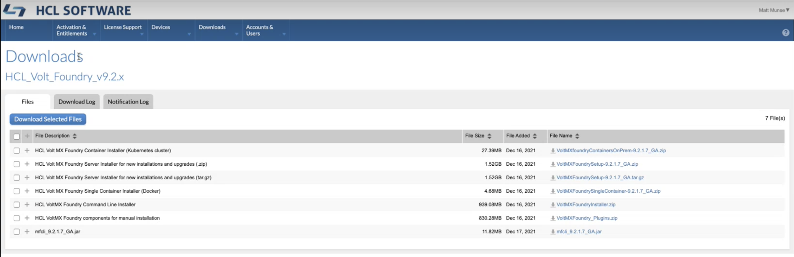

                         

You are here: Download Volt MX Foundry Installer

Pre-Installation Tasks
======================

Download Volt MX Foundry Installer  

------------------------------------

*   Download `VoltMXFoundrySetup.tar.gz` file from [downloads site](https://hclsoftware.flexnetoperations.com/flexnet/operationsportal/entitledDownloadFile.action?downloadPkgId=HCL_Volt_Foundry_v9.2.x&orgId=HCL&fromRecentFile=false&fromRecentPkg=true&fromDL=false) and extract the file. To download Volt MX Foundry installer from the community portal, follow these steps:
    1.   Log in to [Downloads](https://hclsoftware.flexnetoperations.com/flexnet/operationsportal/entitledDownloadFile.action?downloadPkgId=HCL_Volt_Foundry_v9.2.x&orgId=HCL&fromRecentFile=false&fromRecentPkg=true&fromDL=false). You can obtain a user name and password from your sales representative or partner.
           

    2.  Click the **Files** tab.

    3.  Click on the specific file name to download the Foundry Installer file. 
    <!-- 3.  Select the specific release version from the **VoltMX Foundry Installer (Consolidated Installer for all features)** drop-down list and then click on the specific release related files you want to download. For example, if you want to download `VoltMX Foundry 9.0.0.0 GA installer`, select the `9.0.0.0 GA` version from the drop-down list, and then click the **Installer\_Linux** link. . -->

    The `VoltMXFoundrySetup.tar.gz` file contains the following files:
        
    *   `VoltMXFoundryInstaller-x.x.x.x_GA.bin`
    *   `installer.properties` - This file is required for silent installation.
    *   `README.txt`

Steps before installing (or) upgrading Volt MX Foundry with the existing database
--------------------------------------------------------------------------------

Perform the following activities before installing (or) upgrading Volt MX Foundry with the existing database:

*   Take database backup
*   Make sure you have previously installed directory
*   Take a backup of applications deployed at the server level. (Post installation, take backup of the changes done to the binaries).
*   Post installation (or) upgrade process, replace old authService.key, workspaceService.key, and ACCOUNTS\_ENCRYPTION\_KEY (applicable only for identity and workspace components).

Create /tmp Folder
------------------

Volt MX  Foundry Installer required a `/tmp` folder in Linux environment to unpack installer. When the `/tmp` folder is not found, the Installer shows I/O exception at the time of unpack exception, shown below:

`This must specify in the pre-req of installation. Installation must required temp folder to unpack MF installer (either default / custom temp folder)`.

Install Memcached Server
------------------------

Memcached is a high-performance, distributed memory object caching system, generic in nature, but intended for use in speeding up dynamic web applications by alleviating database load.

libevent (memcached dependency)
-------------------------------

The `libevent` API provides a mechanism to execute a callback function when a specific event occurs on a file descriptor or after a timeout has been reached. Furthermore, libevent also support callbacks due to signals or regular timeouts.

`libevent` is meant to replace the event loop found in event driven network servers. An application just needs to call event\_dispatch() and then add or remove events dynamically without having to change the event loop. Refer to [http://libevent.org/](http://libevent.org/)

To install libevent (memcached dependency), follow these steps:

1.  First, check whether `libevent` is installed on your computer. To check, type the below command in your Linux  terminal:
    
    whereis libevent  
    
2.  If you do not find `libevent` on your system, download and install it. Download `libevent-1.4.8-stable.tar.gz`. Refer to [http://libevent.org/](http://libevent.org/)

1.  Extract the `libevent-1.4.8-stable`.
2.  In your Linux terminal, type the below command:
    
    `cd libevent-1.4.8-stable`  
      
    `./configure`  
      
    `make`  
      
    `make install`
    

1.  Type the below command to create a symlink to libevent
    
    `ln -s /usr/local/lib/libevent-1.4.so.2 /usr/lib`
    
    Now that you have installed the dependencies, install the memcahced server.
    

Memcached Server
----------------

To install Memcached Server, follow these steps:

1.  Download the memcached server.
2.  Extract the zip file.
3.  Open the Linux terminal.
4.  Go to `../memcache`  directory.
5.  Run the following command:
    
    `tar xfz memcached-1.2.6.tar.gz`  
      
    `cd memcached-1.2.6`  
      
    `./configure`  
      
    `make`  
      
    `make install`  
      
    `memcached -d -m 1024 -u root -l 127.0.0.1 -p 11211`
    
    > **_Important:_**  Run Memcached as a daemon (d = daemon, m = memory, u = user, l = IP to listen to, p = port)
    

Configure Load Balancers for Sending Host Information in Multinode
------------------------------------------------------------------

When user is installing Volt MX Foundry on multinode environment, the user should check whether the parameter: `proxypreserveHost` is set to `On` in the Loadbalancer configuration file to send host in the headers.

If the proxypreserveHost is not configured, the loadbalancer will not send host in the headers. Users cannot launch Volt MX Foundry Console.

The above configuration is based on the `loadbalancer`.

For example:

*   For **Apache**: preserveHost On
*   For **HAProxy**: preserve host flag is not required.

*   [Database Pre-Installation Tasks](DB_Pre-installation_Tasks.md)
*   [Application Servers Pre-Installation Tasks](Appser_Pre-installation_Tasks.md)
