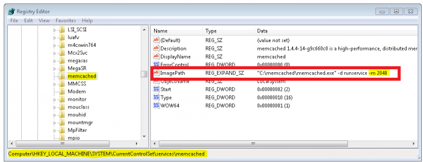
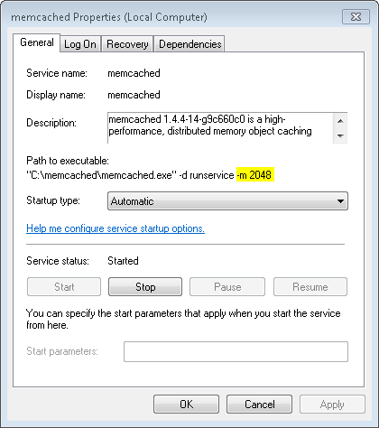

                            

Install Memcached Server - Windows
----------------------------------

Memcached is a high-performance, distributed memory object caching system, generic in nature, but intended for use in speeding up dynamic web applications by alleviating database load.

To install Memcached Server, follow these steps:

1.  Download the Memcached server.
2.  Extract the zip file.
3.  From the command prompt, go to the ` memcached`  directory.
4.  Run the following command:
    
    `memcached.exe -d install`
    
    For example, `c:/memcached/memcached.exe -d install`
    
5.  Start the server from the Services or by running one of the following commands:
    *    `c:/memcached/memcached.exe -d start`
    *   `net start memcached Server`
        
        Now your memcached server is installed and is listening on port 11211.
        
6.  By default, the server is set to 64MB memory limit, which is too small. To add the extra memory allocation, edit the registry to add the information. To increase the default memory size, in the **Windows Run** windows, type Regedit to display the **Registry Editor** window:
    
    
    
7.  In the **Registry Editor** window, go to the following key:
    
    `HKEY_LOCAL_MACHINE/SYSTEM/CurrentControlSet/Services/memcached Server`.
    
8.  In the key, change the **ImagePath** entry with the following:
    
    `C:/memcached/memcached.exe -d runservice -m 2048`
    
    This way you will use 512 MB memory limit for your server.
    
    If you now go back to the service section you should now see memcached installed, shown below:
    
    
    
    If you are not seeing the above result, restart your computer. You now have memcached running.
    

Install Memcached Server - Linux
--------------------------------

### libevent (memcached dependency) - Linux

The `libevent` API provides a mechanism to execute a callback function when a specific event occurs on a file descriptor or after a timeout has been reached. Furthermore, libevent also support callbacks due to signals or regular timeouts.

libevent is meant to replace the event loop found in event driven network servers. An application just needs to call event\_dispatch() and then add or remove events dynamically without having to change the event loop. For more details, refer to [http://libevent.org/](http://libevent.org/)

To install libevent (memcached dependency) on Linux, follow these steps:

1.  First, check whether libevent is installed on your computer. To check, type the below command in your Linux terminal:
    
    whereis libevent
    
2.  If you do not find libevent on your system, download and install it. Download `libevent-1.4.8-stable.tar.gz`. For more details, refer to [http://libevent.org/](http://libevent.org/)
3.  Extract the libevent-1.4.8-stable.
4.  In your Linux terminal, type the below command:
    
    cd libevent-1.4.8-stable  
      
    ./configure  
    make  
    make install
    

1.  Type the below command to create a symlink to libevent.
    
    ln -s /usr/local/lib/libevent-1.4.so.2 /usr/lib
    
    Now that you have installed the dependencies, install the memcahced server.
    
    ### Memcached Server - Linux
    
    To install Memcached Server on Linux, follow these steps:
    
    1.  Download the memcached server.
    2.  Extract the zip file.
    3.  Open the Linux terminal.
    4.  Go to `../memcache` directory.
    5.  Run the following command:
        
        tar xfz memcached-1.2.6.tar.gz  
        cd memcached-1.2.6  
        ./configure  
        make  
        make install  
        memcached -d -m 1024 -u root -l 127.0.0.1 -p 11211
        
        > **_Important:_** Run Memcached as a daemon (d = daemon, m = memory, u = user, l = IP to listen to, p = port)
