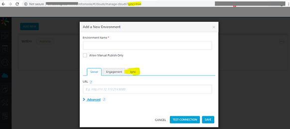

                          

Volt MX  Foundry V8 SP4 FP1 HF1
==========================

Enhancements
------------

### Installer

*   Upgraded Java version from 1.8.0 to JDK 11, which is an OpenJDK Runtime Environment for bundled app servers (Tomcat and JBoss)
*   Upgraded the Microsoft SQL JDBC connector jar from sqljdbc4-4.1.jar to mssql-jdbc-7.0.0.jre8.jar
*   Upgraded MariaDB JDBC connector jar to mariadb-java-client-2.4.0.jar in order to support JDK 11
*   Upgraded bundled JBoss server version from JBoss 7.0 to JBoss 7.1
*   Removed DB2 database support for Tomcat and JBoss servers

### Console

You can now register a Sync Server version 8.3 or earlier with Volt MX Foundry Installer version 8.4. Post installation or upgrade, follow these steps:

*   Login to Volt MX Foundry Console
*   From the left navigation pane, go to the Environments page.
*   At the end of the browser URL add sync=true. This will ensure that a Sync tab is displayed when you try to add/edit a Sync Server to a new/existing environment.

For more information regarding this feature refer to the [How to - Use Volt MX legacy Sync in On-Premise V8 SP4 and later](https://support.hcltechsw.com/csm?id=kb_article&sysparm_article=KB0083443) article.

Fixed Issues
------------

### Integration

*   Upgraded MongoDB driver to latest version (3.10.1).
*   Fixed an issue to invoke custom classes from custom servlet destroy method.
*   Fixed an issue with the HTTP Integrity check for request payload when it is enabled.
*   Optimized services.war startup by loading services asynchronously.
*   Fixed an issue with HTML content extraction in XML service output.
*   Fixed an issue of CPU monitoring page loading in admin console with AIX Operating System.
