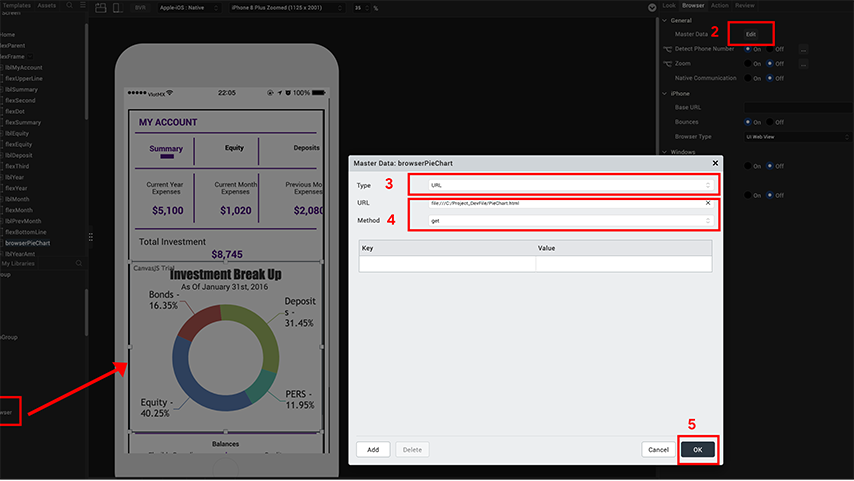

                          

Volt MX  Iris Tutorials

mobilefoundry integration
------------------------

<iframe src="https://www.youtube.com/embed/KUBPnZJOQ4g" allowfullscreen=""></iframe>

  
  

1\. Setup the browser widget to link a web URL
----------------------------------------------

1.  Widget Selection
    
    Drag the browser widget onto the design canvas.
    
2.  Widget Properties
    
    Navigate to the master data properties.
    
3.  HTML Content Selection
    
    Select the “URL” option to render remotely hosted web content.
    
4.  Widget Configuration
    
    Provide the URL of the web page and select the “get” method to retrieve information.
    
5.  Save Configurations
    
    Submit the configuration and save the design settings.
    

  

2\. Setup the browser widget to link a web URL
----------------------------------------------

1.  Widget Selection
    
    Drag the browser widget onto the design canvas.
    
2.  Widget Properties
    
    Navigate to the master data properties.
    
3.  HTML Content Selection
    
    Select the “URL” option to render remotely hosted web content.
    
4.  Widget Configuration
    
    Provide the URL of the web page and select the get method to retrieve information.
    
5.  Save Configurations
    
    Submit the configuration and save the design settings.
